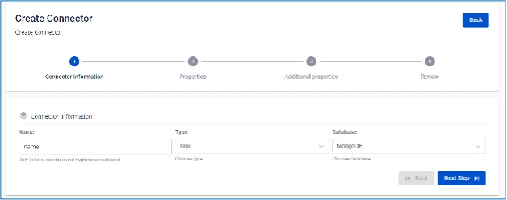
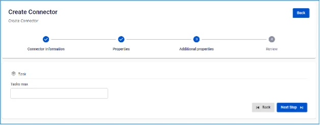

# MongoDB Sink Connector

**Create a connector with Type: sink, Database: MongoDB**

**Pre-condition:** CDC service status is healthy

## Steps to create a connector:

**Step 1:** From the menu bar, select **Data Platform** > select **Workspace Management** > select **Workspace name**

**Step 2:** Under **My services**, select **CDC service**

**Step 3:** On the **CDC service** detail screen > Select the **Connectors** tab > click **Create a connector** 

**Step 4:** Fill in the **Connector Information** screen:

  * **Name (required):** connector name

Note: The connector name may contain lowercase letters a-z or digits 0-9. Spaces are not allowed; use "-" as a separator instead.

  * **Type (required):** select sink

  * **Database (required):** select MongoDB 

**Step 5:** Click **Next** to proceed to the **Properties** screen

**Step 6:** Two options are available: From FPT Database Engine, Manual configuration

  * When **Manual configuration** is selected — fill in:

    * **Connection string** (required): MongoDB connection uri

    * **Database** (required): database name

Note: The database name may contain lowercase or uppercase letters or digits 1-9. Spaces are not allowed; use '-' or '_' as separators instead.

    * **Topics** (required): list of topics 
  * When **From FPT Database Engine** is selected — fill in:

    * **Connection string** (required): MongoDB connection uri

    * **Database** (required): database name

Note: The database name may contain lowercase or uppercase letters or digits 1-9. Spaces are not allowed; use '-' or '_' as separators instead.

    * **Topics** (required): list of topics
  * **Converter**

    * **Converter key**: select the key value for the converter

    * **Converter key schema enable**: select whether to use schema in the Converter key

    * **Converter value**: select the value for the converter

    * **Converter value schema enable**: select whether to use schema in the Converter value

**Step 7:** Click **Next** in the top-right corner to proceed to the **Additional Properties** screen

**Step 8:** Fill in the following information:

  * **Tasks max (required):** Number of tasks the connector can run concurrently, if the topics have more than 1 partition 

**Step 9**: Click **Next** to proceed to the **Review** screen 

**Step 10:** Review the information and click **Create** to complete the connector creation. 
