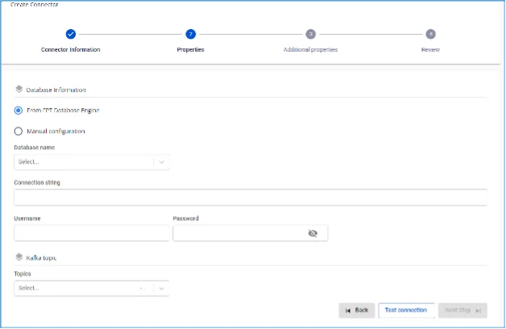
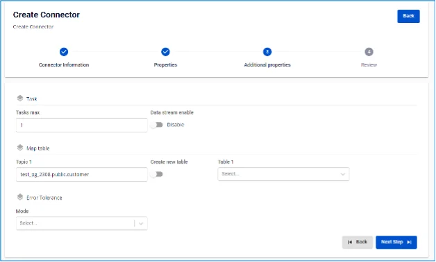

# OpenSearch Sink Connector

**Create a connector with Type: sink, Database: OpenSearch**

## Steps to create a connector:

**Step 1:** From the menu bar, select **Data Platform** > **Workspace Management** > **Workspace name**

**Step 2:** Under **My services**, select **CDC service**

**Step 3:** On the **CDC service** detail screen > Select the **Connectors** tab > Click **Create a connector** 

**Step 4:** Enter the information on the **Connector Information** screen:

  * **Name** (required): connector name

Note: The connector name may contain lowercase letters a-z or digits 0-9. Spaces are not allowed; use "-" instead of a space.

  * **Type** (required): select **sink**

  * **Database** (required): select **OpenSearch** 

**Step 5**: Click **Next** to proceed to the **Properties** screen

Enter the following information:

  * When selecting **From FPT Database Engine** - fill in the following fields:

    * **Database name** (required): Select Database

    * **Connection string** (required): OpenSearch host/hostname

    * **Password** (required): Password to connect to OpenSearch

    * **Topics**: List of topics 

  * When selecting **From FPT Database Engine** - fill in the following fields:

    * **Connection string** (required): OpenSearch connection URI

    * **Username** (required): Username to connect to OpenSearch

    * **Password** (required): Password to connect to OpenSearch

    * **Topics**: List of topics 

  * Click **Test connection** to verify the connection from the Workspace to the entered Database

  * **Converter**

    * **Converter key**: select the key value for the converter

    * **Converter key schema enable**: select whether or not to use a schema in the Converter key

    * **Converter value**: select the value for the converter

    * **Converter value schema enable**: select whether or not to use a schema in the Converter value

**Step 6:** Click **Next** to proceed to the **Additional Properties** screen

Enter the following information:

  * **Data streams enable:** disabled by default

  * **Task max:** The number of tasks the connector can run concurrently. If the topics have more than one partition, setting task max > 1 may cause messages to be consumed out of order (ensure message keys are functioning correctly so that messages with the same key are pushed to the same partition).

  * **Topic 1:** The topic name from which the Connector will consume and sink data into OpenSearch

  * **Table 1:** The table name listening for data changes from PostgreSQL

Note: If the user wants to create a new table, enable the create new table toggle.

  * **Mode (required):** The Connector's behavior when it cannot process a message

    * **None**: The Connector will skip messages that cannot be sunk to the database

    * **All**: Error messages will be sent to the specified topic 

**Step 7:** Click **Next** to proceed to the **Review** screen 

**Step 8:** Review the information and click **Create** to complete the connector creation 
