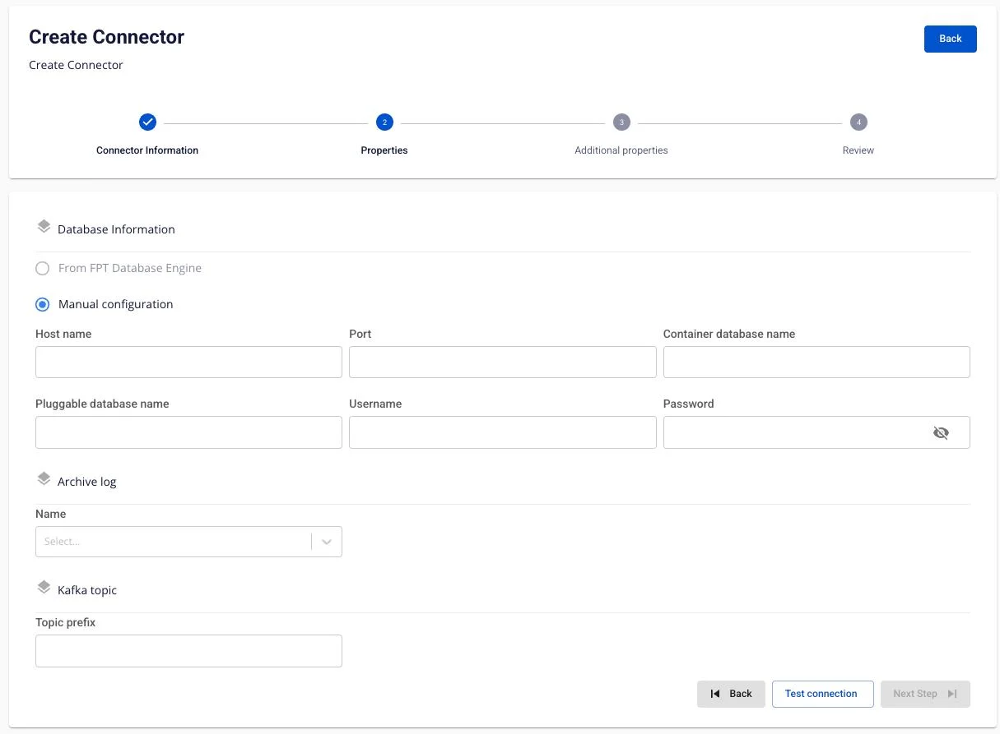
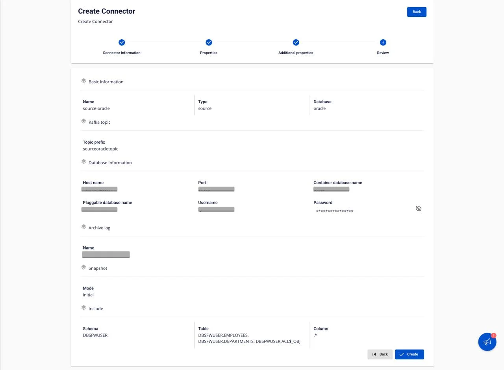

# Oracle Source Connector

### Create Oracle source connector
**Use case:** Type is **source**, Database is **Oracle**.

**Pre-condition:** CDC service status must be **healthy**.

The Oracle Source connector uses **Oracle LogMiner** to read redo logs and capture data changes (CDC). The connector supports 3 snapshot modes:

  * **initial**: Snapshot all existing data, then continue capturing changes.
  * **initial_only**: Snapshot existing data only, without capturing changes.
  * **no_data**: No snapshot; only capture changes from the time the connector starts.

#### Oracle Database Configuration (required before creating the connector)

**1\. Create an Oracle user for CDC:**

```
CREATE USER cdc_user IDENTIFIED BY <PASSWORD>;
```

**2\. The Oracle source connector requires the following permissions:**

```
GRANT CREATE SESSION TO cdc_user;
        GRANT SELECT ON V$DATABASE TO cdc_user;
        GRANT FLASHBACK ANY TABLE TO cdc_user;
        GRANT SELECT ANY TABLE TO cdc_user;
        GRANT SELECT_CATALOG_ROLE TO cdc_user;
        GRANT EXECUTE_CATALOG_ROLE TO cdc_user;
        GRANT SELECT ANY TRANSACTION TO cdc_user;
        GRANT LOGMINING TO cdc_user;
```

Or grant permissions on a specific schema:

```
GRANT SELECT ON <SCHEMA_NAME>.<TABLE_NAME> TO cdc_user;
```

**3\. Enable Archive Log Mode:** Check whether Archive Log is already enabled:

```
SELECT LOG_MODE FROM V$DATABASE;
```

The result must be: **ARCHIVELOG**. If the result is **NOARCHIVELOG**, enable Archive Log Mode:

```
SHUTDOWN IMMEDIATE;
        STARTUP MOUNT;
        ALTER DATABASE ARCHIVELOG;
        ALTER DATABASE OPEN;
```

Verify:

```
SELECT LOG_MODE FROM V$DATABASE;
```

**4\. Enable Supplemental Logging:**

Oracle CDC requires Supplemental Logging to capture complete change information.

Enable Supplemental Logging at the database level:

```
ALTER DATABASE ADD SUPPLEMENTAL LOG DATA;
```

Enable Supplemental Logging for each table that requires CDC:

```
ALTER TABLE <SCHEMA_NAME>.<TABLE_NAME> ADD SUPPLEMENTAL LOG DATA (ALL) COLUMNS;
```

Check Supplemental Logging:

```
SELECT SUPPLEMENTAL_LOG_DATA_MIN, SUPPLEMENTAL_LOG_DATA_PK,
        SUPPLEMENTAL_LOG_DATA_UI, SUPPLEMENTAL_LOG_DATA_FK,
        SUPPLEMENTAL_LOG_DATA_ALL
        FROM V$DATABASE;
```

**5\. Verify LogMiner permissions:**

Verify the user has access to LogMiner:

```
SELECT * FROM DBA_ROLE_PRIVS WHERE GRANTEE = 'CDC_USER';
```

Test LogMiner query:

```
SELECT * FROM V$LOGMNR_CONTENTS WHERE ROWNUM <= 10;
```

_**To create a connector, follow these steps:**_ **Step 1:** From the menu bar, select **Data Platform** > **Workspace Management** > Workspace name

**Step 2**: Under **My services**, select **CDC service**

**Step 3:** On the **CDC service** detail screen > Select the **Connectors** tab > Click **Create a connector**

**Step 4:** Enter the information on the **Connector Information** screen:


  * **Name** (required): connector name

_Note:_ The connector name may contain characters a-z, A-Z, 0-9, and hyphens "-". Special characters and spaces are not allowed.

  * **Type** (required): select source

  * **Database** (required): select Oracle

**Step 5:** Click **Next** to proceed to the **Properties** screen

Enter the Properties information:

**When selecting Manual configuration**



Fill in the following fields:

  * **Host name** (required): Hostname or IP of the Oracle Database

  * **Port** (required): Oracle server port, default: '1521'

  * **Container database name**: Container database name (CDB) - applicable for Oracle 12c and above with Multitenant architecture

  * **Pluggable database name** (required): Pluggable database name (PDB) - the actual database containing the data

  * **Username** (required): Username with LogMiner privileges (e.g., cdc_user)

  * **Password** (required): User password

  * **Archive log** (required): Select Archive Log mode (must be ARCHIVELOG)

  * **Topic prefix** (required): Prefix for Kafka topics. Topic format:

```
<topic_prefix>.<schema>.<table>
```

**Note:** After filling in all the information, you must click **Test connection** to verify the connection. You can only proceed to the next step after a successful connection test.

**Step 6:** Click **Next** to proceed to the **Additional properties** screen

Enter the Additional properties information:

  * **Mode** (required): Select snapshot mode

    * **initial**: The connector will snapshot all existing data in the tables, then continue capturing data changes via LogMiner

    * **initial_only**: The connector will snapshot all existing data in the tables only, then stop (no change capture)

    * **no_data**: The connector will not snapshot existing data; it will only capture changes from the time it starts

  * **Schema**: Select the database schema (multiple selections allowed)

  * **Table**: Select the tables for CDC (multiple selections allowed)

  * **Column**: Select the columns for CDC (default is all: .*)

Use the + button to add tables to the CDC list. Use the delete icon to remove tables from the list. **Step 7:** Click **Next** to proceed to the **Review** screen



The Review screen displays all configurations entered in the previous steps. Verify the information:

  * **Basic Information**: Name, Type, Database

  * **Database Information**: Host name, Port, Container database name, Pluggable database name, Username, Password

  * **Archive log**: Archive log mode

  * **Kafka topic**: Topic prefix

  * **Snapshot**: Mode

  * **Include**: Schema, Table, Column

If you need to make changes, click the **Back** button to return to the previous step.
