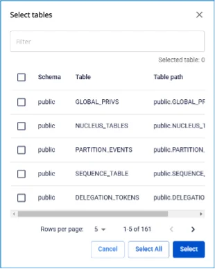
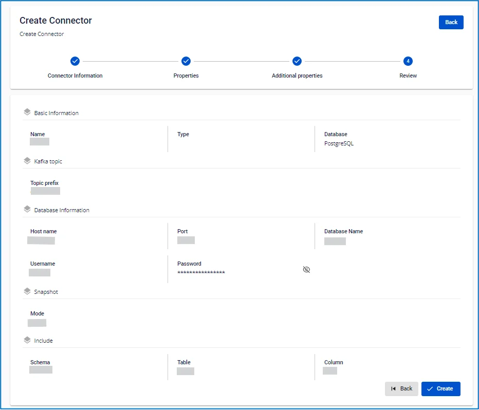

# PostgreSQL Source Connector

**Create a connector: Type is source, Database is PostgreSQL**

**Pre-condition:** CDC service status is Healthy.

## PostgreSQL Configuration

**1**. _pgoutput_ requires changing the _wal_level_ configuration of the Postgres cluster to logical. _CDC must also be performed on the primary, rather than_ hot _or_ warm replicas.

  * To check the configuration:

```
SHOW wal_level;
```

  * To apply the configuration change, run the following command on Postgres and restart the service after the change:

```
ALTER SYSTEM SET wal_level = 'logical';
```

**2**. **PostgreSQL source connector requires at minimum the REPLICATION role.**

  * If using a SuperUser account, proceed to step 5.
  * To check whether a user is a SuperUser:

```
SELECT rolsuper FROM pg_roles WHERE rolname = '<USER_NAME>';
```

  * Otherwise, create a user with the REPLICATION role:

```
CREATE USER <USER_NAME> WITH REPLICATION LOGIN PASSWORD '<PASSWORD>';
```

  3. **Create a Publication:**

     * **Note:** Perform the following operations with superuser privileges. For `<PUBLICATION_NAME>`, FPTCloud only accepts strings containing lowercase letters.
     * Create a Publication for all tables:

```
CREATE PUBLICATION <PUBLICATION_NAME> FOR ALL TABLES;
```

     * Check existing Publications:

```
SELECT * FROM pg_publication;
```

     * Create a Publication for specific tables:

```
CREATE PUBLICATION <PUBLICATION_NAME> FOR TABLE <SCHEMA1>.<TABLE1>, <SCHEMA2>.<TABLE2>, ...;
```

     * Add tables to the publication:

```
ALTER PUBLICATION <PUBLICATION_NAME> ADD TABLE <SCHEMA1>.<TABLE1>, <SCHEMA2>.<TABLE2>, ...;
```

     * Remove tables from the publication:

```
ALTER PUBLICATION <PUBLICATION_NAME> DROP TABLE <SCHEMA1>.<TABLE1>, <SCHEMA2>.<TABLE2>, ...;
```

     * Drop a Publication:

```
DROP PUBLICATION <PUBLICATION_NAME>;
```

  4. **Grant SELECT permissions on tables for the user being used:**

     * Grant SELECT on a single table:

```
GRANT SELECT ON TABLE '<SCHEMA_NAME>.<TABLE_NAME>' TO <USER_NAME>;
```

     * Or grant permissions for all tables in a schema:

```
DO $$
           DECLARE
            table_record RECORD;
           BEGIN
            FOR table_record IN
                SELECT table_name
                FROM information_schema.tables
                WHERE table_schema = '<SCHEMA_NAME>' AND table_type = 'BASE TABLE'
            LOOP
                EXECUTE 'GRANT SELECT ON TABLE <SCHEMA_NAME>."' || table_record.table_name || '" TO <USER_NAME>;';
            END LOOP;
           END $$;
```

  5. **Change the REPLICA IDENTITY level for tables that require Capture Data Change.**

     * This configuration change ensures that data change events contain complete information both before and after the change:

```
ALTER TABLE your_schema_name.your_table_name REPLICA IDENTITY FULL;
```

     * Or apply the change to all tables in a schema:

```
DO $$
           DECLARE
            table_record RECORD;
           BEGIN
            FOR table_record IN
                SELECT table_name
                FROM information_schema.tables
                WHERE table_schema = '<SCHEMA_NAME>' AND table_type = 'BASE TABLE'
            LOOP
                EXECUTE 'ALTER TABLE <SCHEMA_NAME>."' || table_record.table_name || '" REPLICA IDENTITY FULL;';
            END LOOP;
           END $$;
```

  6. **The Connector will automatically create or reuse an existing replication_slot with the slot.name value entered from the UI** , to listen to changes from the wal_log (write-ahead log).

     * Check the maximum number of replication_slots:

```
show max_replication_slots;
```

     * Check current replication_slots:

```
SELECT slot_name, plugin, slot_type, database, active FROM pg_replication_slots;
```

     * To remove an inactive replication_slot:

```
SELECT pg_drop_replication_slot('<REPLICATION_SLOT_NAME>');
```

  7. **When deleting a connector, remove its replication_slot and publication:**

     * Drop the replication_slot:

```
SELECT pg_drop_replication_slot('<REPLICATION_SLOT_NAME>');
```

     * Drop the publication:

```
DROP PUBLICATION <PUBLICATION_NAME>;
```

  8. **To change the max_replication_slots configuration** , modify this setting in the _postgres.conf_ file.

* * *

## Steps to create a connector:

To create a connector, follow these steps:

**Step 1:** From the menu bar, select **Data Platform > Workspace Management > Workspace name.**

**Step 2:** Under **My services**, select **CDC service**

**Step 3**. On the **CDC service** detail screen, select the _Connectors_ tab and click _Create a connector_. 

**Step 4** Enter the information on the **Connector Information** screen:

  * **Name (required):** Connector name. Note: The connector name may contain lowercase letters a-z or digits 0-9. Spaces are not allowed; use "-" instead of a space.

  * **Type (required):** Select _source_.

  * **Database (required):** Select _PostgreSQL_. 

**Step 5:** **Click Next to proceed to the Properties screen** and enter the following information:

  * When selecting **From FPT Database Engine:** - fill in the following fields:

    * **Database (required):** Select Database.

    * **Host Name (required):** Hostname or IP of the Postgres server.

    * **Port (required):** Postgres server port, default is 5432.

    * **Database name (required):** The database the Connector will listen to for data changes.

    * **Username (required):** Postgres user used by the Connector.

    * **Password (required):** Password.

    * **Topic prefix (required):** When data changes, change events will be produced to Kafka topics. Topic names follow the format [topic.prefix].[schema_name].[table_name]

Example: topic prefix: syncdata, schema: inventory, tables: customer, order, item. The Connector will record data changes to Kafka topics: syncdata.inventory.customer, syncdata.inventory.order, syncdata.inventory.item)

    * **Slot (required):** Replication slot used by the connector; value must contain only lowercase letters.

    * **Publication (required):** Publication used by the connector; value must contain only lowercase letters.

  * When selecting **Manual configuration** - fill in the following fields:

    * **Host Name (required):** Hostname or IP of the Postgres server

    * **Port (required):** Postgres server port, default is 5432

    * **Database name (required):** The database the Connector will listen to for data changes

    * **Username (required):** Postgres user used by the Connector

    * **Password (required):** Password

    * **Topic prefix (required):** When data changes, change events will be produced to Kafka topics. Topic names follow the format [topic.prefix].[schema_name].[table_name]. Example: topic prefix: syncdata, schema: inventory, tables: customer, order, item. The Connector will record data changes to Kafka topics: syncdata.inventory.customer, syncdata.inventory.order, syncdata.inventory.item)

    * **Slot (required):** Replication slot used by the connector; value must contain only lowercase letters

    * **Publication (required):** Publication used by the connector; value must contain only lowercase letters 

    * **Enable incremental snapshot** (optional): Checkbox to enable the incremental snapshot feature for the Connector

      * Only displayed for source connectors: **MySQL, MariaDB, PostgreSQL**
        * When this checkbox is checked and "Test connection" is clicked, the system will verify:
        * Whether the database has sufficient permissions to perform a snapshot (INSERT, CREATE TABLE permissions are required for PostgreSQL/MySQL)
        * If the database lacks permissions, a detailed error message will be displayed
        * If the database has sufficient permissions, "Test connection successfully" will be displayed
        * After the Connector is created successfully with this checkbox checked:
        * The Connector will have the incremental snapshot management feature
        * The "Snapshot Status" column will be displayed in the List Connector screen
        * The following operations can be performed: Execute, Pause, Resume, Stop snapshot via the Actions menu

Click **Test connection** to verify the connection from the **Workspace** to the entered Database

**Step 6:** Click Next to proceed to the **Additional Properties** screen and enter the following information:

  * **Mode (required):** Connector behavior. Select from the following modes:

    * **Initial (default):** The Connector will snapshot all existing data in the tables, then continue capturing data changes on these tables

    * **Initial_only:** The Connector will only snapshot all existing data in the tables, then stop listening to data change events on the tables

    * **No_data:** The Connector will not snapshot existing data in the tables; it will only listen to data change events on the tables 

Click '+' to retrieve schema and table information 

:::warning
Maximum selection limit is 100 tables
:::

**Step 7:** **Click Next to proceed to the Review screen** and verify the information. 

**Step 8:** Review the information and click **Create** to complete the connector creation.
