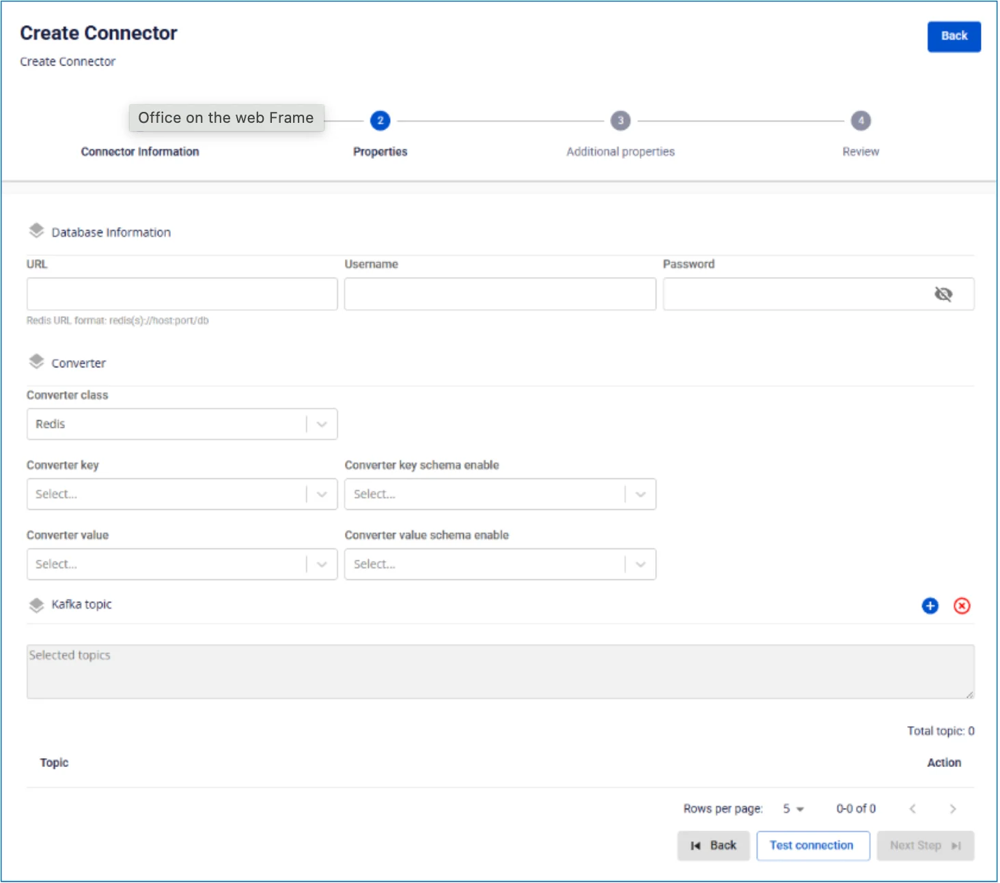

# Redis Sink Connector

Create a connector with Type: sink, Database: Redis

Pre-condition: CDC service status is healthy

**Step 1:** From the menu bar, select **Data Platform** > **Workspace Management** > **Workspace name**

**Step 2:** Under **My services**, select **CDC service**

**Step 3:** On the **CDC service** detail screen > Select the **Connectors** tab > Click **Create a connector**

**Step 4:** Enter the information on the **Connector Information** screen:

  * **Name** (required): connector name

Note: The connector name may contain lowercase letters a-z or digits 0-9. Spaces are not allowed; use "-" instead of a space.

  * **Type** (required): select **sink**

  * **Database** (required): select **Redis**

**Step 5**: Click **Next** to proceed to the **Properties** screen

Enter the following information:

  * **Database information**

    * **URL** (required): enter the database connection address

    * **Username** (required): username

    * **Password** (required): password

Click **Test connection** to verify the connection from the Workspace to the entered Database

  * **Converter**

    * **Converter key**: select the key value for the converter

    * **Converter key schema enable**: select whether or not to use a schema in the Converter key

    * **Converter value**: select the value for the converter

    * **Converter value schema enable**: select whether or not to use a schema in the Converter value

  * **Kafka topic**

    * **Topics** (required): select the topics from which data is sent by the source connector

**Step 6:** Click **Next** to proceed to the **Additional Properties** screen

Enter the following information:

  * **Number of tasks**: maximum number of tasks that can run in parallel

  * **Command**: select the command for storing data

  * **Mode**: The Connector's behavior when it cannot process a message

  * **None**: the connector will stop processing if an error occurs

**Step 7:** Click **Next** to proceed to the **Review** screen

**Step 8:** Review the information and click **Create** to complete the connector creation
