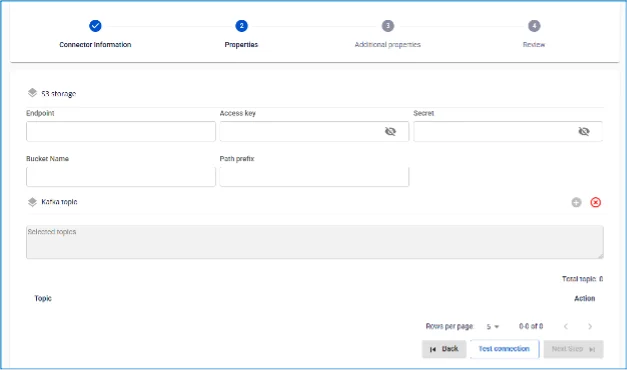
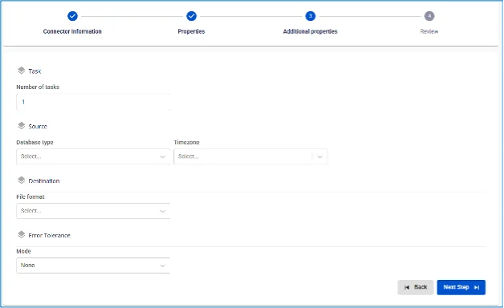
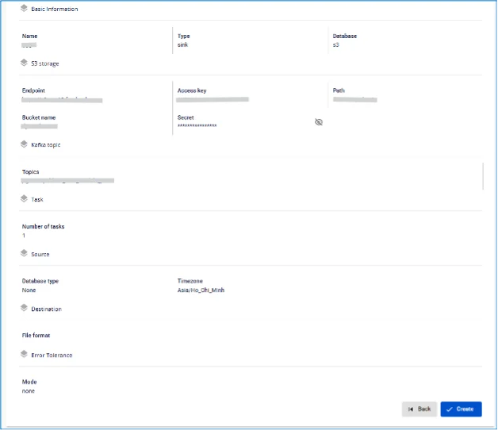

# S3 Sink Connector

Create a connector with Type: sink, Database: S3

**Pre-condition:** CDC service status is Healthy

## Steps to create a connector:

**Step 1:** From the menu bar, select **Data Platform** > **Workspace Management** > **Workspace name**

**Step 2:** Under **My services**, select **CDC service**

**Step 3:** On the **CDC service** detail screen > Select the **Connectors** tab > Click **Create a connector**

**Step 4:** Enter the information on the **Connector Information** screen:

  * **Name** (required): connector name

Note: The connector name may contain lowercase letters a-z or digits 0-9. Spaces are not allowed; use "-" instead of a space.

  * **Type** (required): select **sink**

  * **Database** (required): select **S3** 

**Step 5:** Click **Next** in the upper-right corner of the screen to proceed to the **Properties** screen

  * **S3 Storage**

Enter the **S3 storage** information:

    * **Endpoint:** S3 storage access address

    * **Access key:** access key

    * **Secret:** access secret

    * **Bucket name:** bucket name

    * **Path prefix:** path to the folder in storage

Click **Test Connection** to verify the connection from the Workspace to the entered S3

  * **Converter**

    * **Converter key**: select the key value for the converter

    * **Converter key schema enable**: select whether or not to use a schema in the Converter key

    * **Converter value**: select the value for the converter

    * **Converter value schema enable**: select whether or not to use a schema in the Converter value

  * **Kafka topic**

    * Click the '+' button to retrieve topic information

    * Note: maximum of 100 topics can be retrieved 

**Step 6**: Click **Next** to proceed to the **Additional Properties** screen

  * **Number of tasks**: maximum number of tasks that can run in parallel

  * **Database type**: select the type of source Database

  * **Timezone**: select timezone

  * **File format**: select file format

  * **Mode**: select mode 

**Step 7**: Click **Next** in the upper-right corner of the screen to proceed to the **Review** screen 

**Step 8**: Review the information, then click **Create** to complete the connector creation
