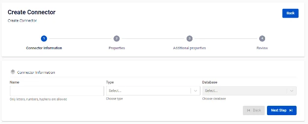
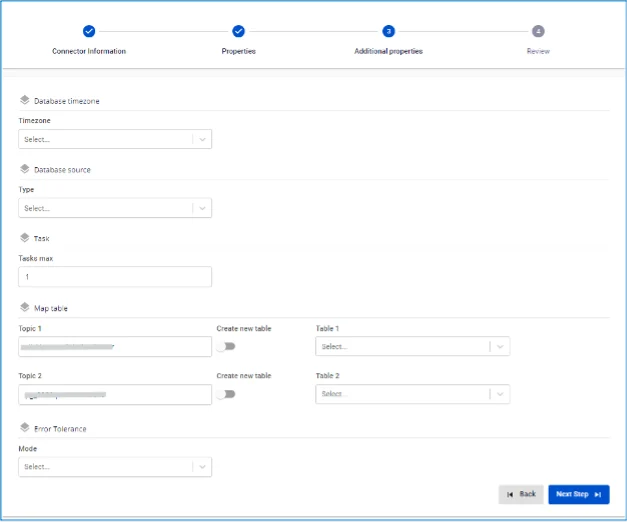
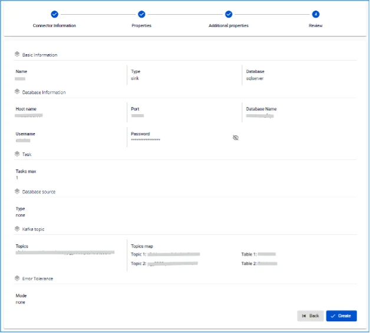

# SQL Server Sink Connector

**Create a connector with Type: sink, Database: SQL Server**

**Pre-condition:** CDC service status is healthy

## Steps to create a connector:

**Step 1:** From the menu bar, select **Data Platform** > **Workspace Management** > **Workspace name**

**Step 2:** Under **My services**, select **CDC service**

**Step 3:** On the **CDC service** detail screen > Select the **Connectors** tab > Click **Create a connector** 

**Step 4:** Enter the information on the **Connector Information** screen:

  * **Name (required):** connector name

Note: The connector name may contain lowercase letters a-z or digits 0-9. Spaces are not allowed; use "-" instead of a space.

  * **Type** **(required):** select sink

  * **Database (required):** select **SQL server** 

**Step 5**: Click **Next** to proceed to the **Properties** screen

Enter the **Properties** information

  * When selecting Manual configuration - fill in the following fields:

    * **Host Name** (required): Hostname or IP of SQL Server

    * **Port** (required): SQL Server port, default: `1433`.

    * **Database name** (required): Target database where the Connector will sink data

    * **Username** (required): Username used by the Connector

    * **Password** (required): Password used by the Connector

    * **Topics** (required): List of topics the Connector will consume and sink data to the target database, separated by "," 

  * When selecting **From Database Engine** - fill in the following fields:

    * **Database name** (required): Database name

    * **Host Name (required):** Hostname or IP of SQL Server

    * **Port (required):** SQL Server port, default: `1433`.

    * **Database name (required):** Target database where the Connector will sink data

    * **Username (required):** Username used by the Connector

    * **Password (required):** Password used by the Connector

    * **Topics (required):** List of topics the Connector will consume and sink data to the target database, separated by "," 

  * Click **Test connection** to verify the connection from the Workspace to the entered Database

  * **Converter**

    * **Converter key**: select the key value for the converter

    * **Converter key schema enable**: select whether or not to use a schema in the Converter key

    * **Converter value**: select the value for the converter

    * **Converter value schema enable**: select whether or not to use a schema in the Converter value

**Step 6:** Click **Next** to proceed to the **Additional Properties** screen

Enter the following information:

  * **Timezone:** select the appropriate timezone for the data from the source database

  * **Task max**: number of tasks to process simultaneously

  * **Type**: select the type of source Database

  * **Name**: schema name

  * **Topic 1**: topic name to listen to from the source connector

  * **Table 1:** table name listening for data changes from the source connector

  * **Mode** (required)**:** The Connector's behavior when it cannot process a message

    * **None**: The Connector will skip messages that cannot be sunk to the database

    * **All**: Error messages will be sent to the specified topic 

**Step 7**: Click **Next** to proceed to the **Review** screen 

**Step 8:** Review the information and click **Create** to complete the connector creation
