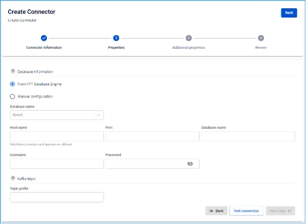

# SQL Server Source Connector

**Create a connector with Type: source, Database: SQL Server**

**Pre-condition:** CDC service status is healthy

The **SQL Server source connector** is based on the change data capture feature available in SQL Server 2016 and later, Standard or Enterprise edition.

## SQL Server Configuration

**Prerequisites:**

  * Perform tasks under sysadmin privileges.

  * Perform database tasks under db_owner privileges.

**1.** To perform **CDC with SQL Server**, you must first _enable_ the **SQL Server Agent**.

  * For details, refer to [Configure SQL Server Agent](<https://learn.microsoft.com/en-us/sql/ssms/agent/configure-sql-server-agent?view=sql-server-ver16#to-configure-sql-server-agent>) and [Install SQL Server Agent](<https://learn.microsoft.com/en-us/sql/linux/sql-server-linux-setup-sql-agent?view=sql-server-ver16&tabs=rhel>).

  * For FPTCloud services, contact Support for assistance.

**2.** Create a SQL Server user:

```
CREATE LOGIN <YOUR_USERNAME> WITH PASSWORD = '<YOUR_PASSWORD>';
        CREATE USER <YOUR_USERNAME> FOR LOGIN <YOUR_USERNAME>;
```

**3.** Optional - Create a role for CDC:

  * The Connector can use sysadmin or dbowner. However, for a higher level of security, you can create a new role for this user.

```
CREATE ROLE <YOUR_ROLE_NAME>;
```

  * Add user to Role:

```
ALTER ROLE <YOUR_ROLE_NAME> ADD MEMBER <YOUR_USERNAME>;
```

**4.** Configure CDC on the SQL Server database:

```
USE <YOUR_DATABASE_NAME>
        GO
        EXEC sys.sp_cdc_enable_db
        GO
```

**5.** Configure CDC on the table to listen for changes:

  * With the newly created role:

```
USE <YOUR_DATABASE_NAME>
        GO
        EXEC sys.sp_cdc_enable_table
        @source_schema = N'dbo',
        @source_name   = N'<YOUR_TABLE>',
        @role_name     = N'<YOUR_ROLE_NAME>',
        @supports_net_changes = 0;
        GO
```

  * With sysadmin or db_owner role only:

```
USE <YOUR_DATABASE_NAME>
        GO
        EXEC sys.sp_cdc_enable_table
        @source_schema = N'dbo',
        @source_name   = N'<YOUR_TABLE>',
        @role_name     = NULL,
        @supports_net_changes = 0;
        GO
```

**6.** Verify permissions for the CDC user. Note: Perform this operation with the user created above.

```
USE <YOUR_DATABASE_NAME>
        EXEC sys.sp_cdc_help_change_data_capture;
        GO
```

## Steps to create a connector:

To create a connector, follow these steps: **Step 1:** From the menu bar, select **Data Platform** > **Workspace Management** > **Workspace name**

**Step 2:** Under **My services**, select **CDC service**

**Step 3:** On the **CDC service** detail screen > Select the **Connectors** tab > Click **Create a connector** 

**Step 4:** Enter the information on the **Connector Information** screen:

  * **Name (required):** connector name

_Note: The connector name may contain lowercase letters a-z or digits 0-9. Spaces are not allowed; use "-" instead of a space._

  * **Type (required):** select source

  * **Database (required):** select SQL Server 

**Step 5:** Click Next to proceed to the **Properties** screen

Enter the **Properties** information

  * When selecting **Manual configuration** - fill in the following fields:

    * **Host name (required):** Hostname or IP of SQL Server

    * **Port (required):** SQL Server port, default: `1433`.

    * **Database name (required):** The database the Connector will listen to for data changes

    * **Username (required):** Username used by the Connector

    * **Password (required):** Password used by the Connector

    * **Topics (required):** List of topics the Connector will consume and sink data to the target database, separated by "," 

  * When selecting **From Database Engine** - fill in the following fields:

    * **Database name (required):** Database name

    * **Host name (required):** Hostname or IP of SQL Server

    * **Port (required):** SQL Server port, default: `1433`.

    * **Database name (required):** The database the Connector will listen to for data changes

    * **Username (required):** Username used by the Connector

    * **Password (required):** Password used by the Connector

    * **Topics (required):** List of topics the Connector will consume and sink data to the target database, separated by "," 

Click **Test connection** to verify the connection from the **Workspace** to the entered Database

**Step 6:** Click **Next** to proceed to the **Additional Properties** screen

  * Enter the following information:

    * **Mode (required):** **Connector** behavior - select from the following modes:

    * **Initial (default):** The Connector will snapshot all existing data in the tables, then continue capturing data changes on these tables

    * **Initial_only:** The Connector will only snapshot all existing data in the tables, then stop listening to data change events on the tables

    * **Never:** The Connector will not snapshot existing data in the tables; it will only listen to data change events on the tables

    * **Schema (optional):** A namespace used to group tables with common characteristics for easier management.

    * **Table (optional):** Name of a table within the schema

    * **Column (optional):** Name of a data column to retrieve from the table 

**Step 7:** Click **Next** to proceed to the **Review** screen 

**Step 8:** Review the information and click **Create** to complete the connector creation
