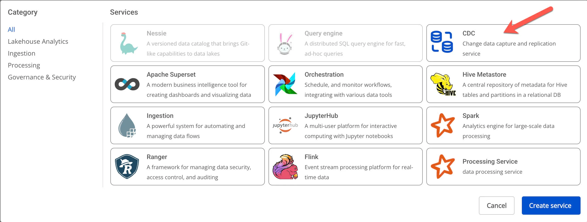
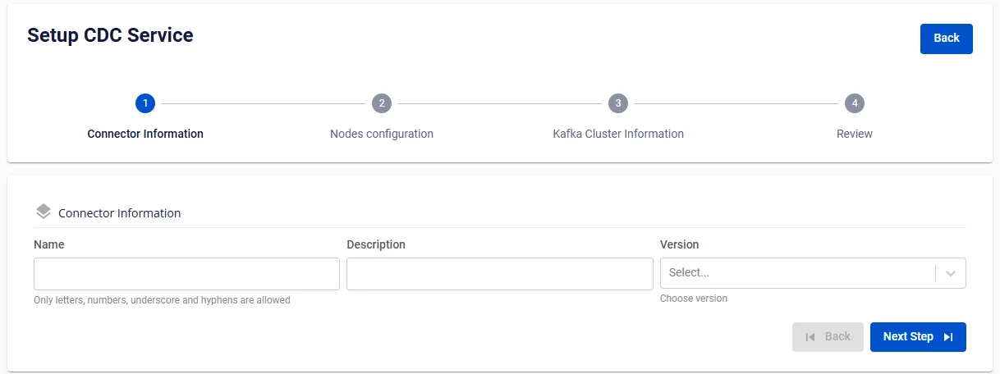

# Create CDC Service

**CDC Service** is a low-latency, flexible, and reliable data transfer tool between Apache Kafka and other data systems. Users can easily define Connectors to integrate data into/out of Kafka from/to various databases.

To create a CDC Service, follow these steps:

**Step 1:** In the menu bar, select **Data Platform** > **Workspace Management** > **Workspace name**

**Step 2:** In the **My services** section, click **Create** > a New service popup appears > select **CDC service** > **Create Services**

**Step 3.** In the CDC Service creation form, enter the connector information:

 * **Name** (required): CDC Service name

 * 
:::warning
The CDC Service name must be 1 to 30 characters. It may contain lowercase letters a-z, uppercase letters A-Z, or digits 0-9. Do not use duplicate Kafka connect names. Spaces are not allowed — use "-" or "_" instead.
:::

 * **Description** (optional): CDC Service description

 * **Version** (required): Version for the CDC Service

**Step 4.** Click **Next Step** to proceed to Node configuration

Select the following:

 * **Storage policy** (required): select a storage policy

 * **Type** (required): select a configuration type

 * **Number of nodes**: enter the number of nodes

:::warning
The number of nodes must be greater than or equal to 2 and less than or equal to 10.
:::

**Step 5:** Click **Next** to proceed to the **Kafka Cluster Information** screen

**There are two options:**

 * From FPT Database Engine
 * Manual configuration

**When selecting Manual configuration:**

Enter and select the following information:

 * **Bootstrap server endpoint**: enter the Bootstrap server endpoint address

 * **Security protocol**: select one of the following security protocols:

 * **SASL_PLAINTEXT**: a simple authentication mechanism using Username and password

 * SASL Mechanism

 * SASL Username

 * SASL Password

 * **SASL_SSL**: provides a comprehensive security layer for authentication and data encryption using Username and password

 * SASL Mechanism

 * SASL Username

 * SASL Password

 * **PLAINTEXT**: data is transmitted over the network without encryption, _not recommended_

 * **SSL**: a network security protocol used to protect data when transmitted over the Internet 

**When selecting From FPT Database Engine:**

Enter and select the following information:

 * **Database Name (required)**: select a Database

 * **Bootstrap server endpoint**: enter the Bootstrap server endpoint address

 * **Security protocol**: select one of the following security protocols:

 * **SASL_PLAINTEXT**: a simple authentication mechanism using Username and password

 * SASL Mechanism

 * SASL Username

 * SASL Password

 * **SASL_SSL**: provides a comprehensive security layer for authentication and data encryption using Username and password

 * SASL Mechanism

 * SASL Username

 * SASL Password

 * **PLAINTEXT**: data is transmitted over the network without encryption, _not recommended_

 * **SSL**: a network security protocol used to protect data when transmitted over the Internet 

**Step 6.** Click the **Test connection** button to verify the connection, then click Next Step to proceed to the review screen

**Step 7.** Review all entered information and click **Create** to complete.
