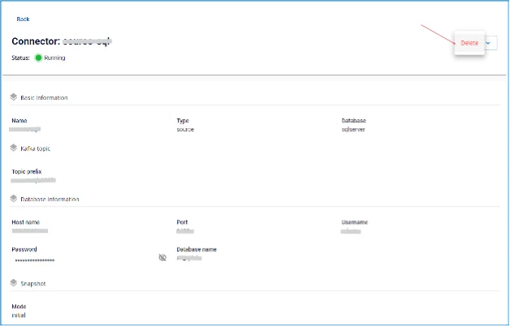

# Delete connector

**Pre-condition: Connector is in STOPPED status**

To delete a Connector, follow these steps:

  * **Step 1:** From the menu bar, select **Data Platform** > **Workspace Management** > **Workspace name**

  * **Step 2:** Under **My services**, select **CDC service**

  * **Step 3:** On the **CDC service** detail screen > Select the **Connectors** tab > Select the connector name > Select Action > Select **Delete** 

  * **Step 4:** The **Delete connector** dialog appears > Enter **Delete** > Click **Confirm** to delete the connector > Select **Cancel** to cancel the operation. 
