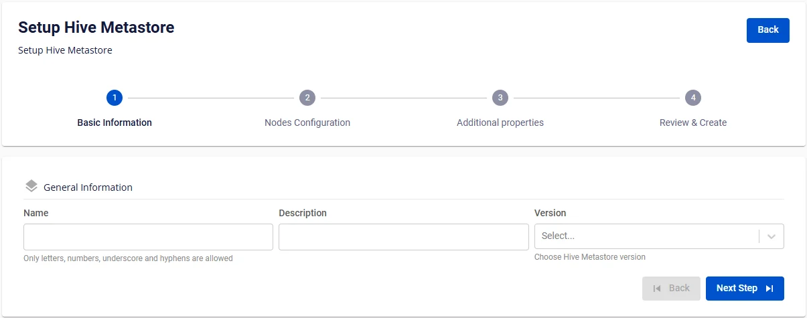

# Create Hive Metastore

**Hive Metastore** is a core component for storing metadata in a Lakehouse architecture. It provides information about tables, schemas, partitions, and data locations, enabling tools such as **Apache Spark**, **Trino**, or **Presto** to understand and access data efficiently.

To create a **Hive Metastore**, follow these steps:

**Step 1:** In the menu bar, select **Data Platform** > **Workspace Management** > select the **Workspace name**

**Step 2:** In the **My services** section, click **Create** > the **New Service** popup appears, select **Hive Metastore** > **Create**

**Step 3:** In the **Hive Metastore** creation form, enter the **Basic Information**:

 * **Name** (required): Service name

Note: The service name must be between 1 and 30 characters. It can contain lowercase letters a-z, uppercase letters A-Z, or digits 0-9.

 * **Description** (optional): Description

 * **Version** (required): Select the version

**Step 4.** Click **Next** to proceed to the **Node configuration** screen

Enter the following information:

 * **Storage policy** (required): Select the **Storage Policy**

 * **Type** (required): Select the resource configuration

**Step 5.** Click **Next** to proceed to the **Additional properties** screen

 * **Database** (Database information for Hive Metastore; users can use a Database created on the **FPT Database Engine** service or any other user-managed **Database**)

   * When the **type** is **PostgreSQL**:

     * **Host name (required)**: Hostname or IP of the **Postgres** server

     * **Port (required)**: Connection port, default is 5432

     * **Database name (required)**: Database name

     * **Username (required)**: Username

     * **Password (required)**: Password

   * When the **type** is **MySQL**:

     * **Host name (required)**: Hostname or IP of the **MySQL** server

     * **Port (required)**: Connection port, default is 3306

     * **Database name (required)**: Database name

     * **Username (required)**: Username

     * **Password (required)**: Password

After entering the **Database** information, click **Test connection** to verify the connection from the **Workspace** to the entered **Database**.

 * Enter the **Storage** information:

   * **Bucket name (required)**: Bucket name

   * **Endpoint (required)**: Endpoint address

   * **Access key (required)**: Access key

   * **Secret (required)**: Secret key

   * **Path (required)**: Data storage directory

Click **Test connection** to verify the connection from the **Workspace** to the **Storage**.

**Step 6:** Click **Next** to proceed to the **Review & Create** screen

**Step 7.** Review the information, then click **Create** to complete the **Hive Metastore** initialization.

**Hive Metastore** is fully initialized when **Worker Status** is **Succeeded** and the **Status** of **Hive Metastore** is **Healthy** (~10 minutes).

