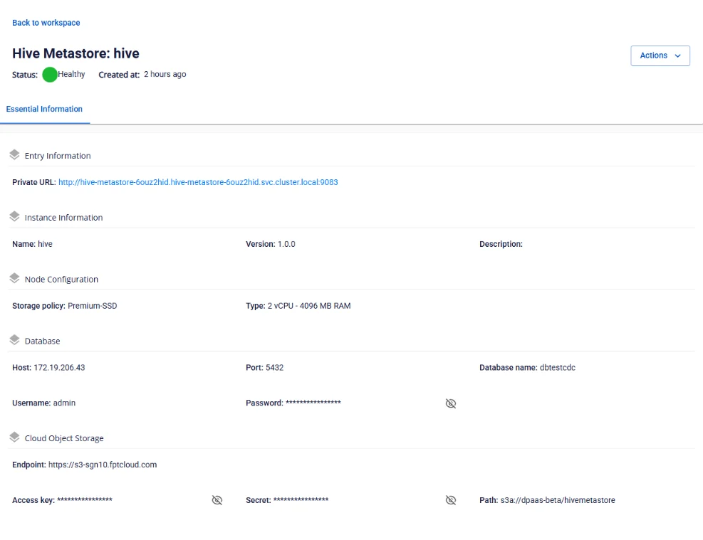

# View Hive Metastore information

To view Hive Metastore information, follow these steps:

**Step 1:** In the menu bar, select **Data Platform** > **Workspace Management** > select the **Workspace name**

**Step 2:** In the **Service** section, select **Hive Metastore**

**Essential Information** tab

Displays the detailed configuration of **Hive Metastore** as set up by the user. Other services will access **Hive Metastore** via the **Private URL**.

