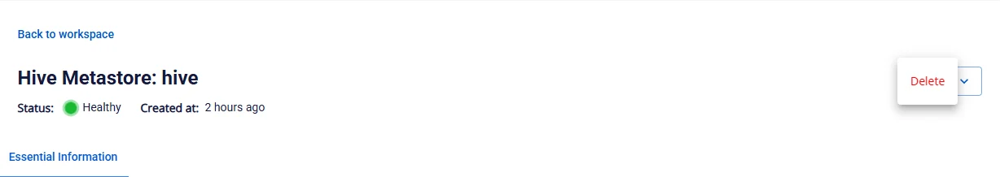

# Delete Hive Metastore

To delete **Hive Metastore**, follow these steps:

**Step 1:** In the menu bar, select **Data Platform** > **Workspace Management** > select the **Workspace name**

**Step 2:** In the **My services** section, select **Hive Metastore** > click the **Action** button in the top-right corner and select **delete**

**Step 3.** The **Delete application** dialog box appears. Enter **delete** > click **Confirm** to complete the deletion.

