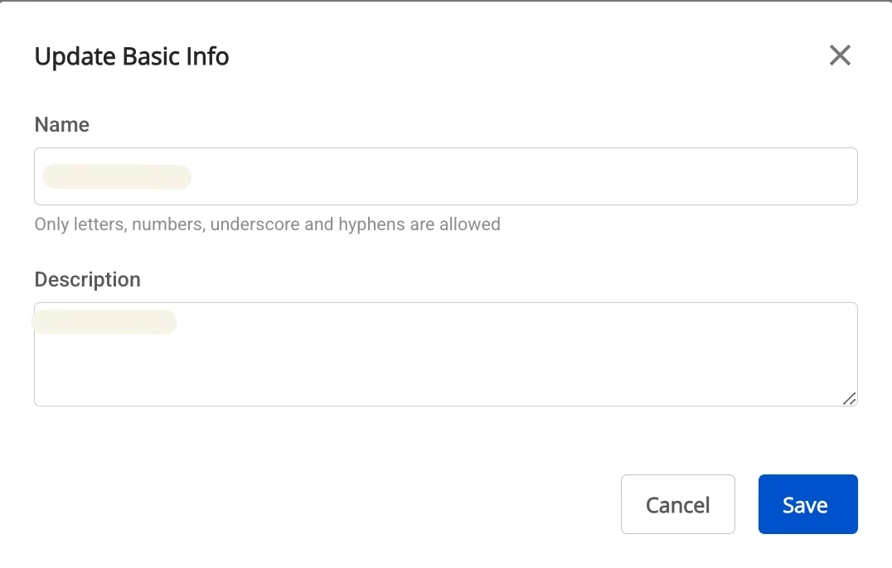
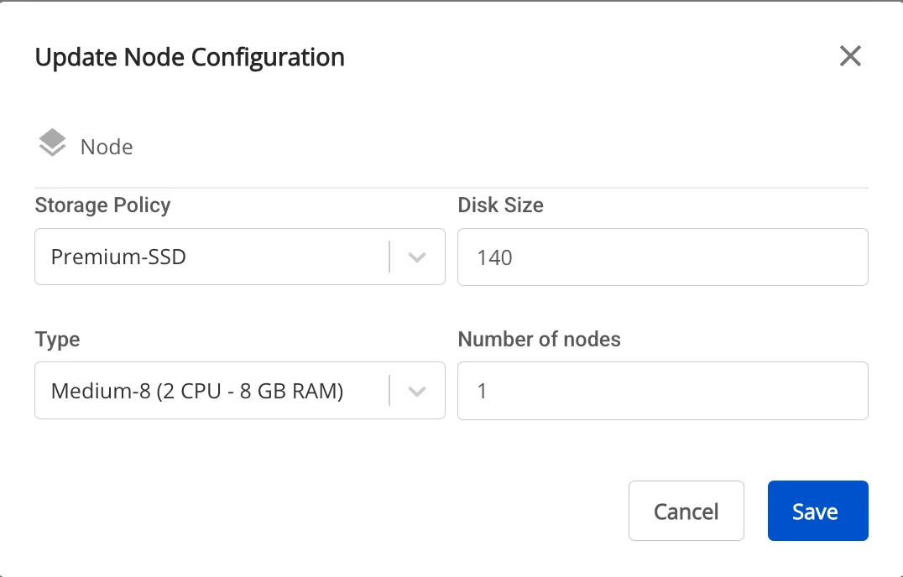

# Edit Ingestion

To edit **Ingestion service** information, follow these steps:

**Step 1:** In the menu bar, select **Data Platform** > **Workspace Management** > **Workspace name**

:::warning
Users can access the Ingestion service directly by selecting Data Platform > Ingestion service from the menu bar.
:::

**Step 2:** In the **My Service** section, select **Ingestion Service**. On the **Detail Ingestion Service** screen, click the **Edit** icon for the section you want to update

  * Update **Instance Information**:

    * The **Instance Information** edit screen is displayed, allowing you to modify:

    * **Name** (Required): Service name

:::warning
The service name must be 1 to 30 characters. It may contain lowercase letters a-z, uppercase letters A-Z, or digits 0-9.
:::

    * **Description** (optional): Service description

  * Update **Node Configuration**:

    * The **Node Configuration** edit screen is displayed, allowing you to modify:

    * **Type**: Select the configuration type for the service

    * **Number of node:** Select the appropriate number of nodes

:::warning
The number of nodes must be greater than or equal to 1 and less than or equal to 10.
:::

    * **Storage policy**: Select a storage policy

    * **Disk (GB)**: Enter disk size

:::warning
The disk size must be greater than or equal to 100 and less than or equal to 1000.
:::

**Step 3:** Click **Save** to complete.
