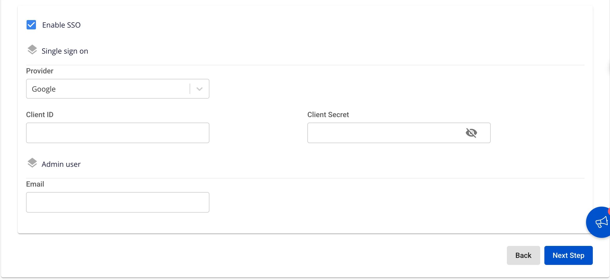

# Create Ingestion

The **Ingestion service** is built to automate data flows between systems. It manages, orchestrates, and automates the movement of data between different systems in an easy and efficient manner, while providing data flow monitoring, supervision, and management capabilities.

To create an **Ingestion service**, follow these steps:

**Step 1:** In the menu bar, select **Data Platform** > **Workspace Management** > **Workspace name**

Note: Users can access the Ingestion service directly by selecting Data Platform > Ingestion service from the menu bar.

**Step 2:** In the **My Services** section, click **Create** > the **New service** popup appears, select **Ingestion service** > **Create**

**Step 3:** In the **Ingestion service** creation form, enter the **Basic Information**:

  * **Name** (required): Service name

Note: The service name must be 1 to 30 characters. It may contain lowercase letters a-z, uppercase letters A-Z, or digits 0-9.

  * **Description** (optional): Service description

  * **Version** (required): Select version

**Step 4:** Click **Next Step** to proceed to the **Node Configuration** screen

  * **Type**: Select the configuration type for the service

  * **Number of node:** Select the appropriate number of nodes

:::warning
The number of nodes must be greater than or equal to 1 and less than or equal to 10.
:::

  * **Storage policy**: Select a storage policy

  * **Disk (GB)**: Enter disk size

:::warning
The disk size must be greater than or equal to 100 and less than or equal to 1000.
:::

**Step 5:** Click **Next Step** to proceed to the **Advanced** screen

  * Enter **Mount storage** information

    * **Name**: Storage name
    * **Path**: Path to the folder in storage

Users can add more **Mount storage** entries by clicking the "+" button

:::warning
A maximum of **5 Mount storage** entries can be added.
:::

  * Enter **Nars storage** information

    * **Bucket name (required)**: Bucket name

    * **Endpoint (required)**: Access address

    * **Access key (required)**: Access key

    * **Secret (required)**: Access password

    * **Path (required)**: Storage folder path

  * **Single Sign On**

    * If Single Sign On is not enabled, the service is initialized with **Basic authentication**

    * If **Single Sign On** is enabled:

    * **Provider: FPT ID**

      * Enter the following information:

      * **Username**: Username

      * **Email**: FPT email address

    * **Provider: Google**

      * Enter the following information:

      * **Client ID**: An ID code used to authenticate the client with Google

      * **Client Secret**: Password used to authenticate the client with Google

      * **Email**: Email address

    * **Provider: Keycloak**

      * Enter the following information:

      * **Auth Provider name**: Provider name

      * **Realm**: A management space in which all users, groups, roles, clients, and other objects are managed and secured independently

      * **Auth server url**: The base URL of the Keycloak server, used by clients to perform authentication

      * **Client ID**: An ID code used to authenticate the client with Keycloak

      * **Client Secret**: Password used to authenticate the client with Keycloak

      * **Username**: Username in Keycloak

      * **Email**: Email address in Keycloak

**Step 6:** Click **Next Step** to proceed to the **Review & Create** screen

  * **Custom Domain**

    * **Purpose:** Allows configuring a custom domain to access services.

      * **For Public Workspace:** Used to assign a domain and certificate without needing to enable/disable TLS (HTTPS is always available).

      * **For Private Workspace:** In addition to the domain and certificate, users can optionally enable or disable TLS/SSL to choose between HTTPS or HTTP.

    * **Public Workspace**

      * **Custom domain**: Check to enable a custom domain.

      * **Domain**: Enter the domain name (e.g., abc.local, jupyter.example.com).

      * **Certificate name**: Select from the list of certificates imported in **Certificate Manager**.

      * **Buttons**:

      * **Manage certificate**: Open the certificate management screen.

      * **Validate**: Verify that the certificate is valid for the domain.

      * 
:::note
In a Public Workspace, the **TLS/SSL certificate** option is **not displayed** — the system supports HTTPS by default.
:::

    * **Private Workspace**

      * **Custom domain**: Check to enable a custom domain.

      * **Domain**: Enter the domain name.

      * **TLS/SSL certificate**: Check to enable HTTPS for services.

      * **Certificate name**: Select from the certificate list.

      * **Buttons**:

      * **Manage certificate**: Open certificate management.

      * **Validate**: Verify the certificate.

      * 
:::note
If **TLS/SSL certificate** is unchecked, the service will run over HTTP and no certificate is required.
:::

**Step 7.** Review all entered information, then click **Create** to complete the Ingestion service initialization.

**Ingestion service** initialization is complete when the **Worker Status** is **Succeeded** and the **Ingestion service** **Status** is **Healthy** (~10 minutes)
