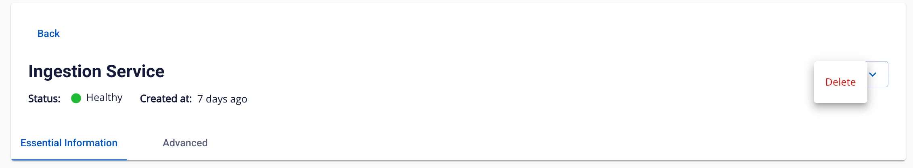

# Delete Ingestion

To delete an **Ingestion service**, follow these steps:

**Step 1:** In the menu bar, select **Data Platform** > **Workspace Management** > **Workspace name**

Note: Users can access the Ingestion service directly by selecting Data Platform > Ingestion service from the menu bar.

**Step 2:** In the **My services** section, select **Ingestion service** > click **Action** > select **Delete**

**Step 3.** The **Delete Application** dialog appears > type **delete** > click **confirm** to complete the deletion of the **Ingestion service** from the workspace

