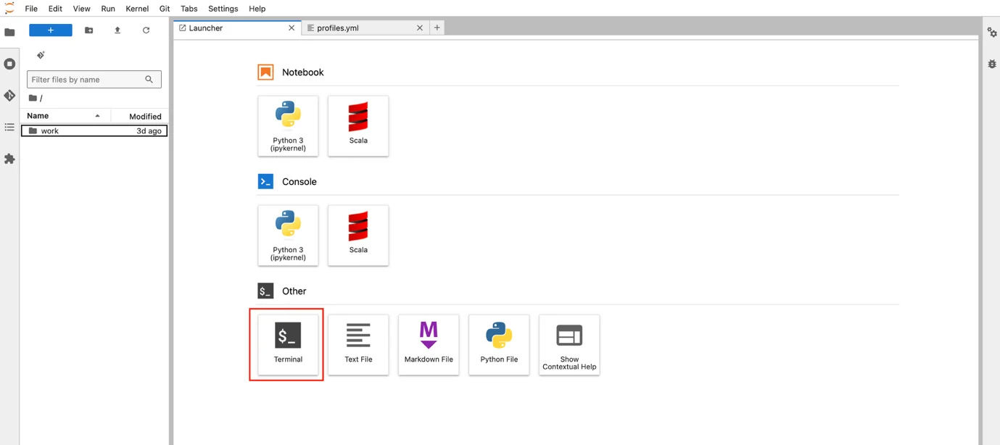

# Run dbt project on JupyterHub

To run a dbt project in the notebooks environment, follow the steps below:

**Step 1.** Initialize the dbt GIT project with a directory belonging to the user's Workspace on JupyterHub (refer to the Orchestration service documentation, section 5.3.3).

To run with a Spark session, configure the profiles.yml file in the dbt project as follows:

```
<PROJECT-NAME>:

  target: dev

  outputs:

    dev:

      type: spark

      method: session

      schema: <SCHEMA-NAME>

      database: <DATABASE-NAME>

      catalog: iceberg

      host: NA

      server_side_parameters:

        spark.jars: /opt/spark/jars/iceberg-spark-runtime-3.5_2.12-1.5.0.jar,/opt/spark/jars/iceberg-aws-bundle-1.5.0.jar,/opt/spark/jars/hadoop-auth-3.3.4.jar,/opt/spark/jars/hadoop-aws-3.3.4.jar,/opt/spark/jars/nessie-spark-extensions-3.5_2.12-0.104.2.jar,/opt/spark/jars/hadoop-common-3.3.4.jar,/opt/spark/jars/aws-java-sdk-bundle-1.12.787.jar,/opt/spark/jars/openmetadata-spark-agent-1.0-beta.jar
```

**Step 2:** In the Jupyter Notebooks working interface, select **Other** / **Terminal**



**Step 3:** In the Terminal interface, navigate to the directory containing the dbt project content and use the dbt command to execute it.


