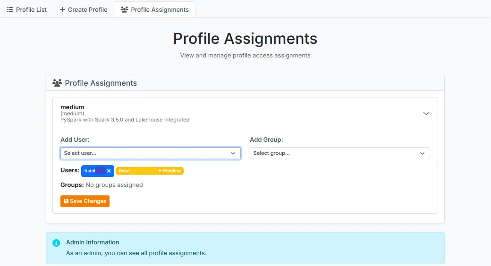

# Assign User Profile Permissions

After logging into JupyterHub, a user with the **Admin** role selects the **Service** > **Profile** menu and clicks the **Profile Assignments** tab.

The system displays cards corresponding to the created profiles. Click on the profile that needs permissions configured to expand its details.

 * **Add User**: Select from the list of Users in the system

 * **Add Group**: Select from the list of Groups in the system

After making your selections, click **Save Changes** to apply the user/group permissions to the profile.

