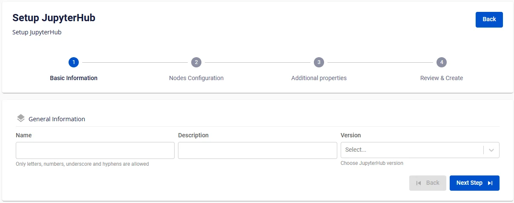
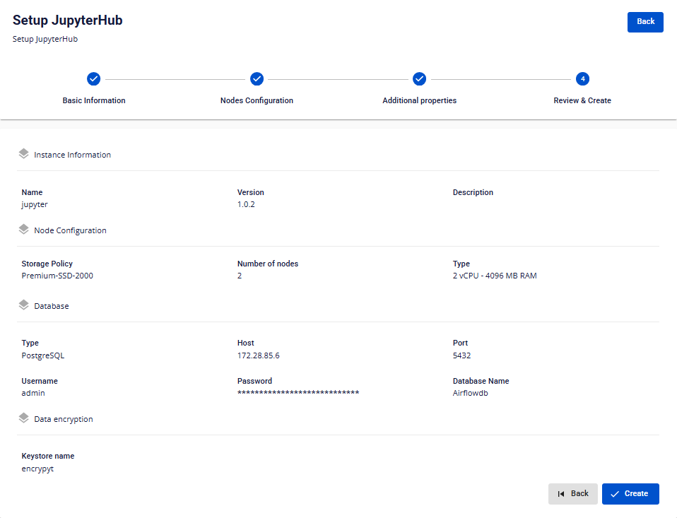

# Create JupyterHub

To create a **JupyterHub**, follow the steps below:

**Step 1:** In the menu bar, select **Data Platform** > **Workspace Management** > **Workspace name**

**Step 2:** In the **Workspace Details** section, click **Create** > the **Services** popup appears, select **JupyterHub service** > **Create Service**

**Step 3.** In the **JupyterHub** creation form, enter the **Basic Information** details:

 * **Name** (required): Service name

Note: The name may contain lowercase letters a-z, uppercase letters A-Z, or digits 0-9. Spaces are not allowed — use "-" or "_" instead.

 * **Description** (optional): Description

 * **Version** (required): Select the JupyterHub version

**Step 4:** Click **Next Step** to proceed to the **Nodes Configuration** screen

Enter the following information:

 * **Storage policy**: Select a storage policy

 * **Type**: Select the flavor type

 * **Number of nodes**: Enter the number of nodes to configure for JupyterHub

:::warning
The number of nodes must be greater than or equal to 2 and less than or equal to 10.
:::

**Step 5:** Click **Next Step** to proceed to the **Advanced Properties** screen

Configure the following options:

**Custom workspace**: Check to save user data to S3

**Mount S3 storage** (directory for storing user Workspace code)

 * **Storage name**: Select the storage name

 * **S3 workspace path**: Enter the storage path

**Database**

 * **Type**: Default is PostgreSQL

 * **Host name (required)**: Hostname or IP address of Postgres

 * **Port (required)**: Connection port, default is 5432

 * **Database name (required)**: Database name

 * **Username (required)**: Access account username

 * **Password (required)**: Access password

**Data encryption**

 * **Keystore name:** Select from the Workspace Keystore catalog to encrypt sensitive data when using JupyterHub with the Database

**Single Sign On**: Check to enable SSO authentication for JupyterHub

 * **Provider: FPT ID**

   * **Username**: Username

   * **Email**: FPT email address

 * **Provider: Google**

   * **Client ID**: Client ID information

   * **Client Secret**: Secret information

   * **Email**: Email address

 * **Provider: Keycloak**

   * **Auth Provider name**: Provider name

   * **Realm**: Realm information

   * **Auth server url**: Auth URL address

   * **Client ID**: Client ID information

   * **Client Secret**: Secret information

   * **Username**: Account username

   * **Email**: Email address

 * **Custom Domain**

   * **Purpose:** Allows configuration of a custom domain to access services.

     * **For Public Workspace:** Used to assign a domain and certificate without needing to enable/disable TLS (HTTPS is always available).

     * **For Private Workspace:** In addition to domain and certificate, users can optionally enable or disable TLS/SSL to choose between HTTPS and HTTP.

   * **Workspace is Public**

     * **Custom domain**: Check to enable custom domain.

     * **Domain**: Enter the domain name (e.g., abc.local, jupyter.example.com).

     * **Certificate name**: Select from the list of certificates imported in **Certificate Manager**.

     * **Buttons**:

     * **Manage certificate**: Open the certificate management screen.

     * **Validate**: Verify the certificate is valid for the domain.

:::note
For a Public Workspace, the **TLS/SSL certificate** option is **not displayed** — the system supports HTTPS by default.
:::

   * **Workspace is Private**

     * **Custom domain**: Check to enable custom domain.

     * **Domain**: Enter the domain name.

     * **TLS/SSL certificate**: Check to enable HTTPS for services.

     * **Certificate name**: Select from the certificate list.

     * **Buttons**:

     * **Manage certificate**: Open certificate management.

     * **Validate**: Verify the certificate.

:::note
If **TLS/SSL certificate** is unchecked, the service will run on HTTP and no certificate is required.
:::

**Step 6.** Click **Next Step** to proceed to the **Review & Create** screen

**Step 7.** Review the information, then click **Create** to complete the JupyterHub creation.

**JupyterHub** initialization is complete when the **Worker Status** is **Succeeded** and the **Status** of JupyterHub is **Healthy** (~10 minutes).
