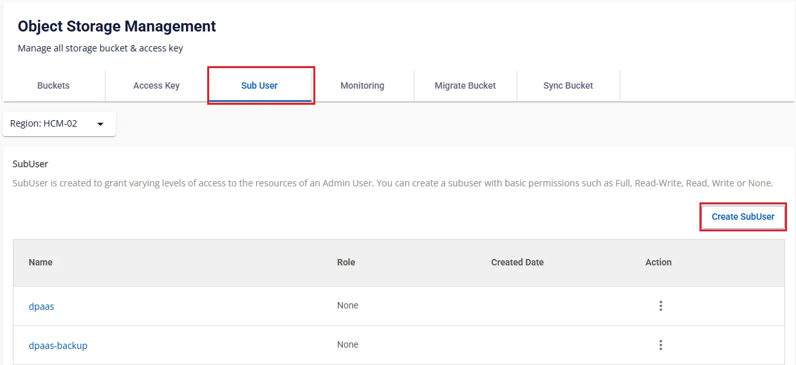
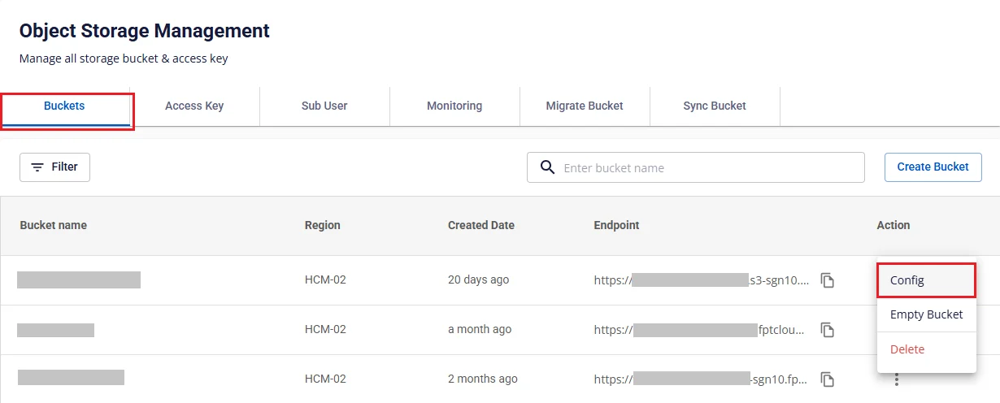

# Create Profile

After logging into JupyterHub, a user with the **Admin** role selects the **Service** > **Profile** menu and clicks the **Create Profile** tab.

 * **Profile Name**: Profile name

 * **Slug**: Enter the names of libraries to use when spawning the server

 * **Image**: Select the image to use when running the profile from the list

 * **MODE**: Select **local**

 * **S3_ACCESSIBLE**: Select **false** if not using **S3**, select **true** if using **S3** and enter the following information:

   * **S3_ENDPOINT**: URL endpoint of the S3 service

   * **S3_ACCESS_KEY**: Access key ID for authenticating with the S3 service

   * **S3_SECRET_KEY**: Secret access key for authenticating with the S3 service

 * **LAKEHOUSE_ENABLED**: Select **false** if not using a **lakehouse** connection, select **true** if using **lakehouse** and enter the following information:

   * **CATALOG_TYPE**: Type of metadata catalog to use — select Hive or Nessie

   * **CATALOG_URI**: URI for connecting to the metadata catalog

   * **SPARK_WAREHOUSE_DIR**: Warehouse directory path for Apache Spark

 * **Additional Environment Variables**

   * KEY: Enter the environment variable name

   * Value: Enter the corresponding environment variable value

 * **CPU Guarantee**: Enter the guaranteed CPU amount for the profile at initialization

 * **CPU Limit**: Enter the maximum CPU threshold when using the profile

 * **Memory Guarantee**: Enter the guaranteed RAM amount for the profile at initialization

 * **Memory Limit**: Enter the maximum RAM threshold when using the profile

 * **Available Worker Pools**: Select from the **Worker Pool** list in the **Processing service** to choose the spawn environment for the profile

 * **Active profile**: Check to set the profile to **Active** status after creation

After entering all the information, click **Create Profile** to complete the creation.

To ensure user access to the lakehouse catalog, configure directory permissions on FPT Cloud Storage:

 * **Step 1.** Go to <https://console.fptcloud.com/>, select the **Object Storage** menu

 * **Step 2.** In the **Object Storage Management** interface, select the **Sub user** tab and click **Create SubUser**

 * **Step 3.** Enter the **Name** for the **Subuser**, set **Access level for sub user** to **Full**

 * **Step 4.** In the **Sub User** list interface, click to view details, click **Generate Key**, then save the **Access Key** and **Secret Key** information

 * **Step 5.** Return to the **Object Storage Management** interface, select the **Buckets** tab. For the bucket that needs permissions assigned to the subuser, select the **Config** action

 * **Step 6.** In the bucket details interface, select the **Bucket Policy** tab and click **Add Policy Statement**

 * **Step 7.** In the **Add Policy Statement** interface:

   * **Sid**: Enter the statement ID

   * **Effect**: Select **Allow**

   * **Principal**: Select the subuser list

   * **Action**: Check **Action**, check **All S3 Actions (s3.\*)**

   * **Resource (ARN)**: Enter the resource information in the specified format, pointing the subuser to the exact directory containing the **catalog** they are permitted to access

Click **Add** to complete the **Policy Statement** configuration.

After creation, the profile information is displayed in the **Profile List** tab.

