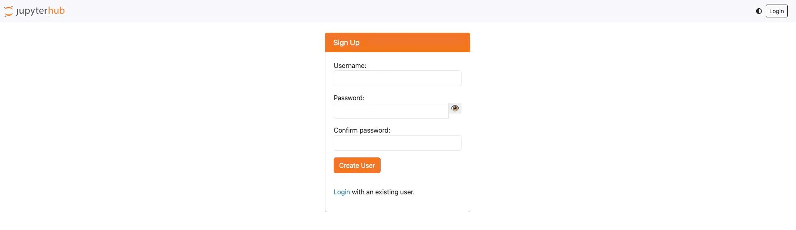

# Add Users

**_Guide to accessing JupyterHub and creating the first account_**

(When JupyterHub is created with Basic authentication)

 1. Open a browser and navigate to the provided JupyterHub URL.

 2. On the displayed screen, click the **Create User** button.

 3. Enter a **Username** and **Password**.

**Note:** The first account created must have the **username** set to **admin** to serve as the system administrator account.

 4. Confirm the information and complete the account creation.

 5. Log in with the **admin** account just created to perform administrative functions.

**_Adding users to the system_**

 1. After logging into JupyterHub, a user with the **Admin** role selects the **Admin** menu and clicks **Add Users** to add new users to the system.

 2. In the **Add Users** interface, enter the username (the system supports adding multiple users by entering one username per line).

 3. Check **Admin** to assign the **Admin** role to the user. If unchecked, the user defaults to the **User** role.

**_When JupyterHub is created with Basic authentication — user self-registration — Admin grants access_**

In some cases, users click **Create User** themselves to create an account first.

In this case, the account is created but **does not have access to JupyterHub** until the admin approves it.

To grant access, the admin proceeds as follows:

 1. Log in with the **admin** account.

 2. Navigate to the path: **/hub/authorize**

 3. This screen displays a list of all created users along with management actions:

   * **Authorize**

     * Allows the user to access JupyterHub.

     * If not yet Authorized, the user will not be able to log in to the interface.

   * **Unauthorize**

     * Revokes previously granted access.

     * The user still exists in the system but cannot log in.

   * **Change password**

     * Allows the admin to reset the user's password.

     * Used when the user forgets their password or a reset is required.

   * **Discard**

     * Removes the user from the management list.

     * After Discard, the user must recreate their account or be re-added by the admin if they wish to continue using the system.
