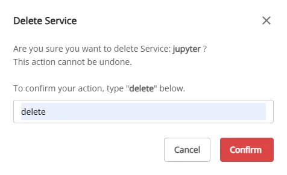

# Delete JupyterHub

To delete a **JupyterHub**, follow the steps below:

**Step 1:** In the menu bar, select **Data Platform** > **Workspace Management** > **Workspace name**

**Step 2:** In the **My service** section, select **JupyterHub** > click **Action** > select **Delete**

**Step 3:** The **Delete Application** dialog appears > enter **delete** > click **Confirm** to complete the deletion of JupyterHub from the workspace.

