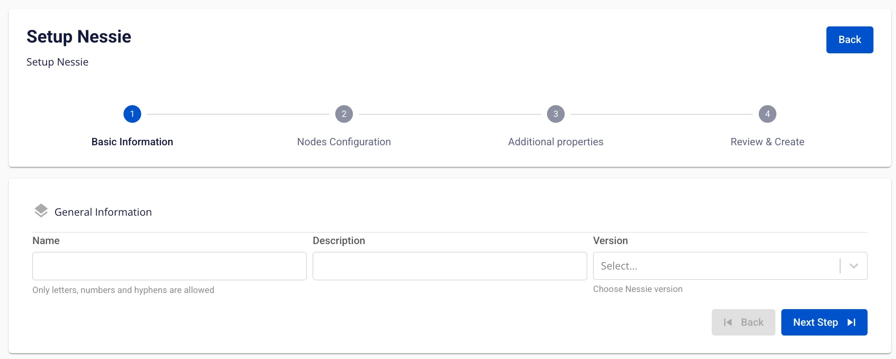
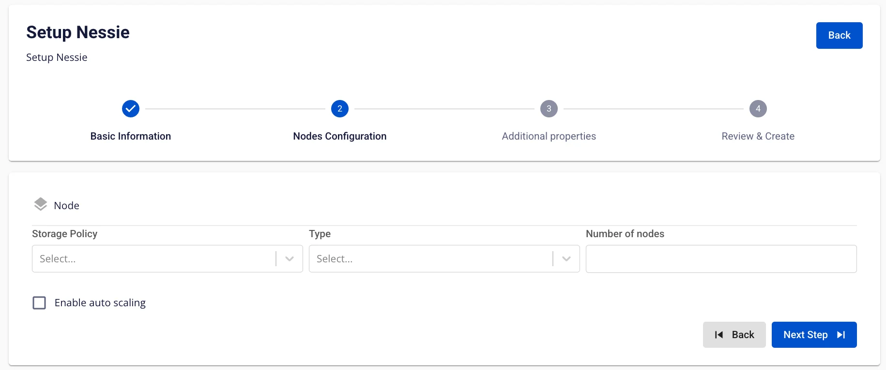

# Create Nessie

**Nessie** is designed to support large and complex distributed data environments, helping data teams more effectively manage the development, control, and deployment of data within the system.

To create **Nessie**, follow these steps:

**Step 1.** In the menu bar, select **Data Platform** > **Workspace Management** > select the **Workspace name**

**Step 2.** In the application section, click **Create** > the application selection popup appears, select **Nessie** > **Create**

**Step 3.** In the **Nessie** creation form, enter the **Basic Information**:

 * **Name** (required): Nessie name

:::warning
The Nessie name must be between 1 and 30 characters. It can contain lowercase letters a-z, uppercase letters A-Z, or digits 0-9.
:::

 * **Description** (optional): Description

 * **Version** (required): Select the version

**Step 4.** Click **Next Step** to proceed to the **Node configuration** screen

Enter the following information:

 * **Storage policy** (required): Select the Storage for Nessie

 * **Type** (required): Select the configuration type for Nessie

 * **Number of nodes**: Enter the number of nodes

:::warning
The number of nodes must be greater than or equal to 2.
:::

If you need to auto-scale the service, check **Enable auto scaling** and enter the desired number of nodes.

:::warning
The scaled number of nodes must be greater than the **Number of nodes**.
:::

**Step 5.** Click **Next Step** to proceed to the **Additional properties** screen

Enter the following information:

When the type is **PostgreSQL**:

 * **Host name** (required): Hostname or IP of the Postgres server

 * **Port** (required): Postgres server port, default is 5432

 * **Database name** (required): Database name

 * **Username** (required): Username to access the Postgres server

 * **Password** (required): Password to access the Postgres server

When the type is **MySQL**:

 * **Host name** (required): Hostname or IP of the MySQL server

 * **Port** (required): MySQL server port, default is 5432

 * **Database name** (required): Database name

 * **Username** (required): Username to access the MySQL server

 * **Password** (required): Password to access the MySQL server

:::warning
Users can choose to use a **Database from FPT** or their own Database.
:::

**Step 6.** Click **Next Step** to proceed to the **Review & Create** screen

**Step 7.** Review the entered information, then click **Create** to complete.
