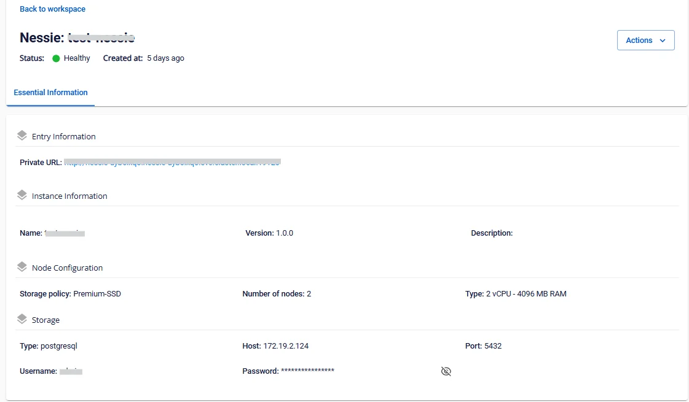

# View Nessie information

To view **Nessie** information, follow these steps:

**Step 1.** In the menu bar, select **Data Platform** > **Workspace Management** > select the **Workspace name**

**Step 2.** In the application section, select **Nessie**

**Essential Information** tab

Displays the detailed information of **Nessie**.

