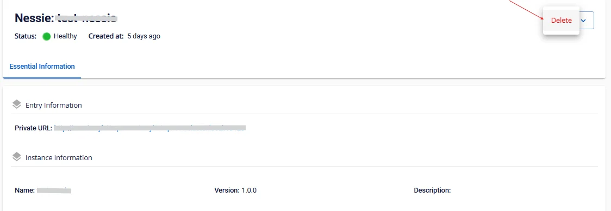

# Delete Nessie

To delete Nessie, follow these steps:

**Step 1.** In the menu bar, select **Data Platform** > **Workspace Management** > select the **Workspace name**

**Step 2.** In the application section, select **Nessie** > click the action button in the top-right corner and select **Delete**

**Step 3.** The **Delete** application dialog box appears. Enter **delete** > click **Confirm** to complete the deletion.

