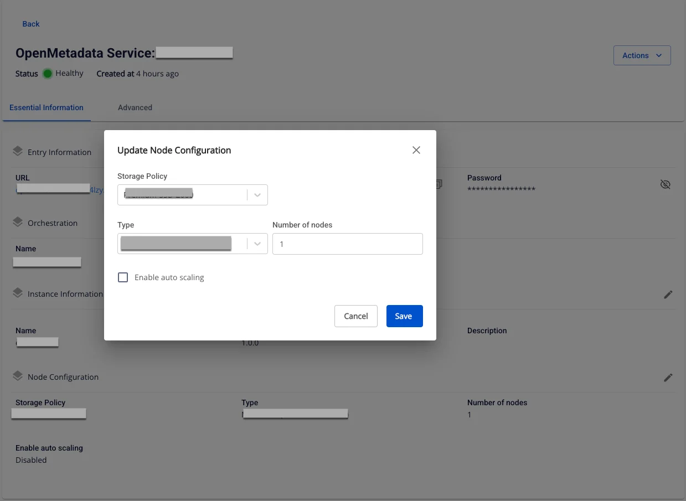

# Update Open Metadata

To edit **Open Metadata service** information, follow these steps:

**Step 1:** In the menu bar, select **Data Platform** > **Workspace Management** > **Workspace name**

Note: Users can access the Open Metadata service directly by selecting Data Platform > Open Metadata service from the menu bar.

**Step 2:** In the **My Service** section, select Open Metadata **Service**. On the **Detail Open Metadata Service** screen, click the **Edit** icon for the section you want to update.

  * Update Instance Information

The **Instance Information** edit screen is displayed, allowing you to modify:

    * **Name** (Required): Service name

Note: The service name must be 1 to 30 characters. It may contain lowercase letters a-z, uppercase letters A-Z, or digits 0-9.

    * **Description** (optional): Service description

  * Update Node Configuration

The **Node Configuration** edit screen is displayed, allowing you to modify:

    * **Type**: Select the configuration type for the service

    * **Number of node:** Select the appropriate number of nodes

:::warning
The number of nodes must be greater than or equal to 1 and less than or equal to 10.
:::

    * **Storage policy**: Select a storage policy

**Step 3:** Click **Save** to complete.
