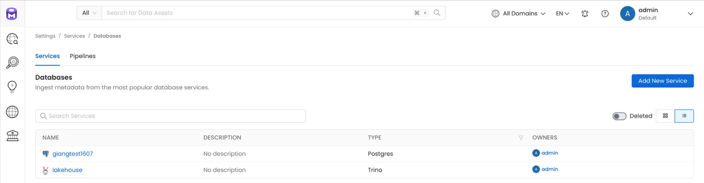
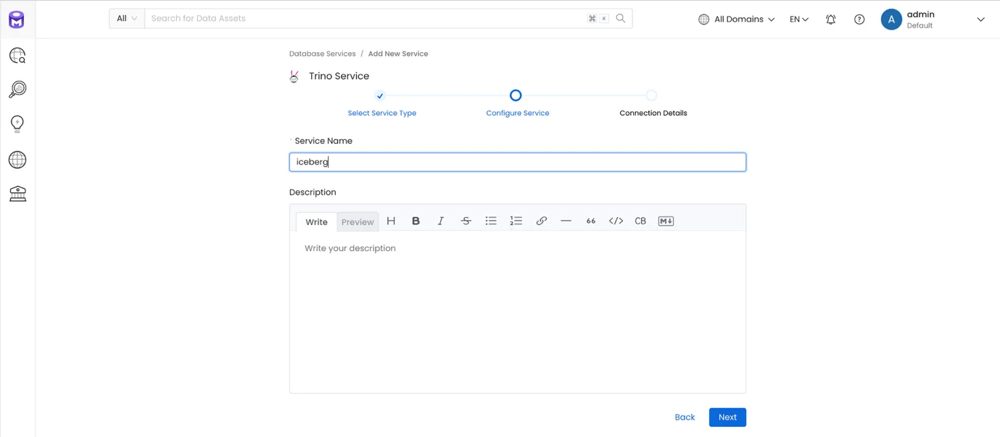
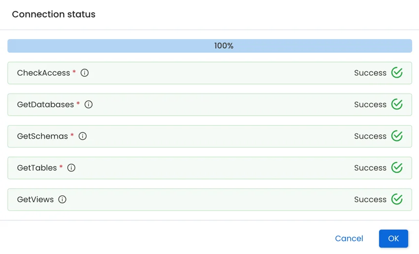
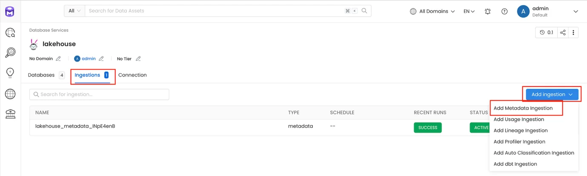
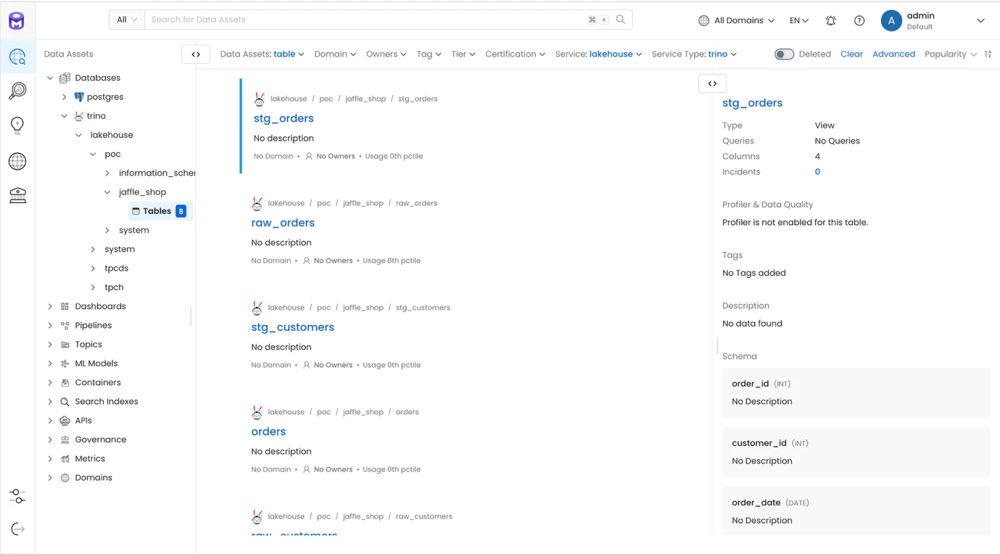
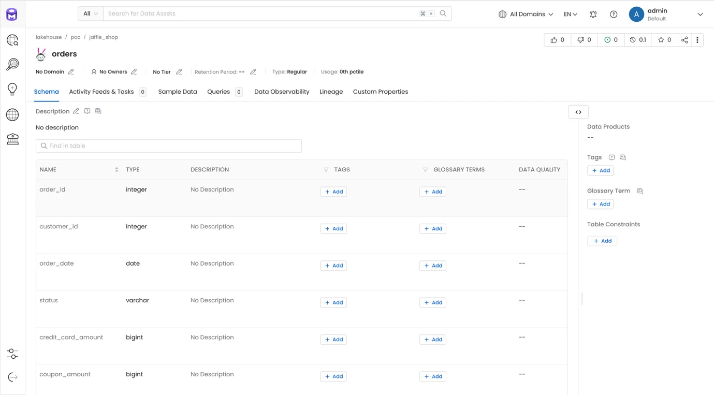
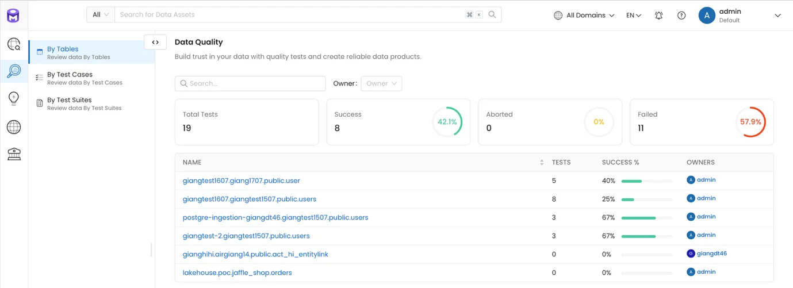

# Open Metadata Usage Guide

### 1\. Create Service

**Step 1.** Access Open Metadata, in the left menu select Settings > Services > Databases, then click **Add New Service**

**Step 2.** Select Service Type **Trino**, then click **Next**

**Step 3.** Enter the following information:

 * **Service name**: Service name

 * **Description**: Service description

Click **Next**

**Step 4.** Enter the **Connection Details**:

 * **Username**: Account name

 * **Auth Configuration Type**: Select Basic Auth

 * **Host and Port**: Enter the Trino connection information

 * **Catalog** (optional): Enter the exact catalog to retrieve data from. If left blank, the system will retrieve data from all Catalogs available through Trino.

 * **DatabaseSchemas** (optional): Enter the exact schema to retrieve data from. If left blank, the system will retrieve data from all Schemas available through Trino.

Click **Test connection** to verify the connection to Trino

**Step 5.** Click **Save** to complete creating the **Service**

### 2\. Configure Pipeline

Configure a Pipeline to ingest data from the Service into Open Metadata

**Step 1:** On the Service list screen, click to view the details of the newly created service

**Step 2:** On the Service detail screen, select the **Ingestion** tab, then click **Add Ingestion** > **Add Metadata Ingestion**

**Step 3.** On the **Add Metadata Ingestion** screen:

 * **Name**: Pipeline name

 * **Database Filter Pattern**

 * **Includes**: Enter the databases to include for data ingestion

 * **Exclude** (optional): Enter the databases to exclude from data ingestion

 * **Schema Filter Pattern**

 * **Includes**: Enter the schemas to include for data ingestion

 * **Exclude** (optional): Enter the schemas to exclude from data ingestion

 * **Table Filter Pattern**

 * **Includes**: Enter the tables to include for data ingestion

 * **Exclude** (optional): Enter the tables to exclude from data ingestion

Click **Next**

 * Select **Schedule** to set up a recurring ingestion schedule

 * Select **On demand** to run ingestion manually

 * **Number of retries**: Number of retry attempts if ingestion fails

Click **Add & Deploy** to complete adding the Ingestion and deploy the Ingestion Job

### 3\. Run Pipeline

**Step 1:** On the Service list screen, click to view the details of the newly created service

**Step 2:** On the **Service** detail screen, select the **Ingestion** tab

**Step 3:** For the newly created pipeline, click the **Run** action

After clicking **Run**, the Ingestion Job is executed to fetch **Metadata** into the system

If the Ingestion Job is scheduled, the Pipelines will be automatically executed at the configured time

### 4\. Explore

After running Ingestion, explore the data in the **Explore** menu

### 5\. Create Testcase

Check data quality

**Step 1.** From the **Explore** screen, select the table to create a **Testcase** for, then click **Add Test** (use **Table** to test at the table level, **Column** to test at the column level)

**Step 2.** Create an **Add Column Test**

Click **Submit** to create the Test

### 6\. Create Pipeline Test

**Step 1.** From the **Explore** screen, on the table that has the newly created Test case, select the **Pipeline** tab and click **Add**

**Step 2.** Enter the **Scheduler for Test Cases** information:

 * **Name**: Schedule name

 * Select **Schedule** to set up a recurring schedule

 * Select **On Demand** to run manually

 * Select the test cases to include in the pipeline

Click **Submit** to complete creating the schedule for the testcase

After the test pipeline runs, the system will check the data according to the configured testcases and return results at both the table level and the overall system level

