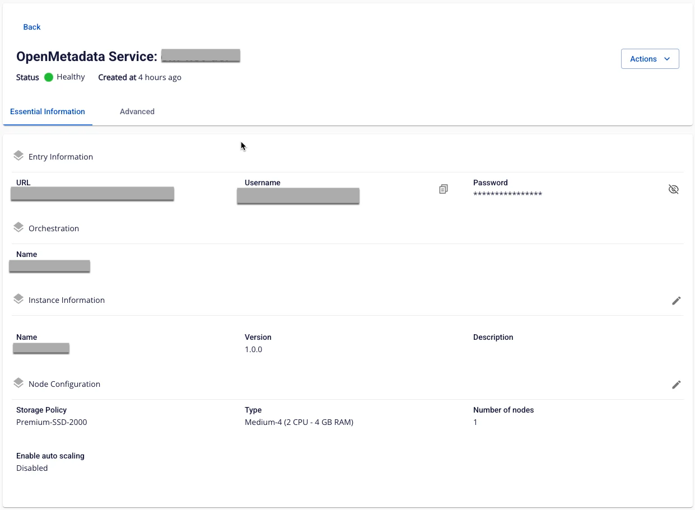

# View Open Metadata service Details

To view **Open Metadata** information, follow these steps:

**Step 1:** In the menu bar, select **Data Platform** > **Workspace Management** > **Workspace name**

**Step 2:** In the **Workspace** details section, select **Open Metadata**

  * **Tab Essential Information**

    * Displays detailed information about the **Open Metadata** service that the user has configured. Access **Open Metadata** using the **URL/Username/Password** shown on the screen.

  * **Advanced**

    * Displays **Database** and **Search Engine Database** information

