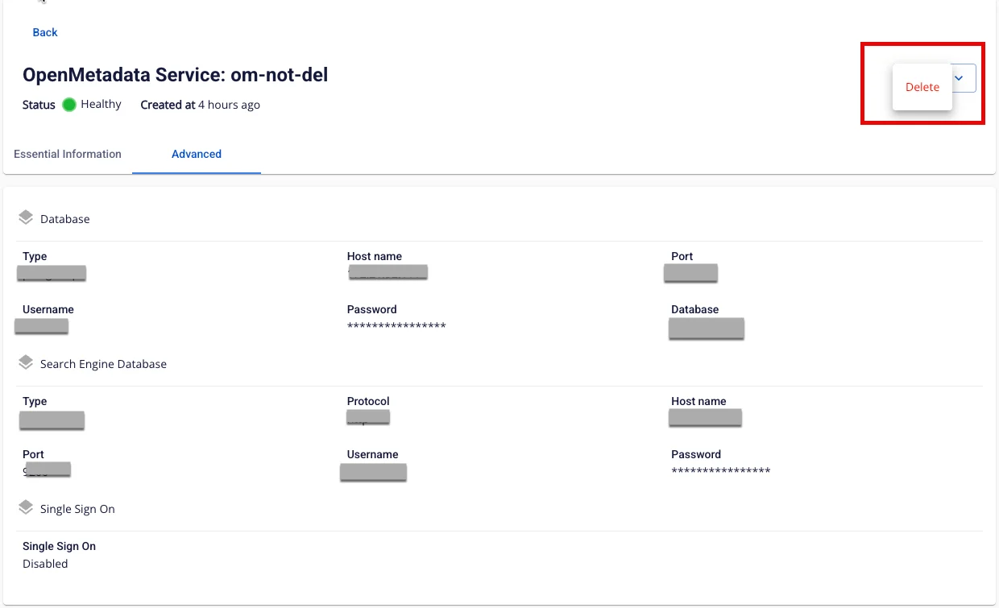

# Delete Open Metadata service

To delete an **Open Metadata** service, follow these steps:

**Step 1:** In the menu bar, select **Data Platform** > **Workspace Management** > **Workspace name**

**Step 2:** In the **My Service** section, select the **Open Metadata** service. On the **Detail Open Metadata Service** screen, click the **Delete** icon.

**Step 3:** The **Delete Open Metadata** dialog box is displayed. Enter "**delete**" in the input field and click **Confirm** to complete the deletion.

