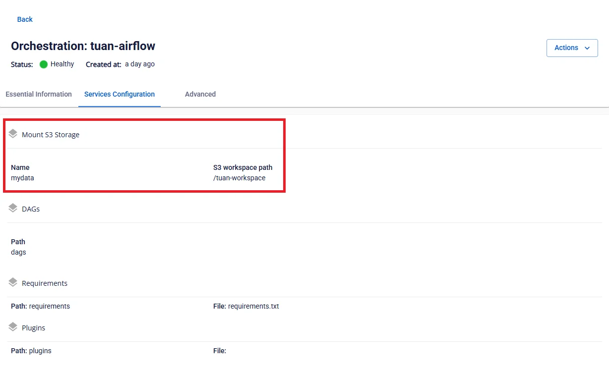
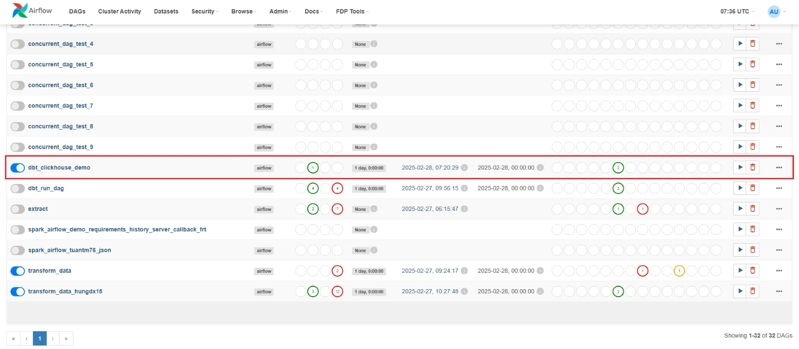

# Airflow & dbt Guide

**Step 1.** Upload the dbt project to the mount path directory configured for the Orchestration service




**Step 2.** Create a DAG from the template to execute the dbt job

dbt_clickhouse_example.py

Change the path to point to the directory containing the dbt project:

```
DBT_PROJECT_DIR = "/mnt/<WORKSPACE-STORAGE-NAME>/<DBT-PROJECT-DIRECTORY>"  |
```

**Step 3.** Upload the DAG file for the dbt job to the dags directory of the Orchestration service


**Step 4.** Access and log in via the Airflow URL of the Orchestration service to run the DAG



