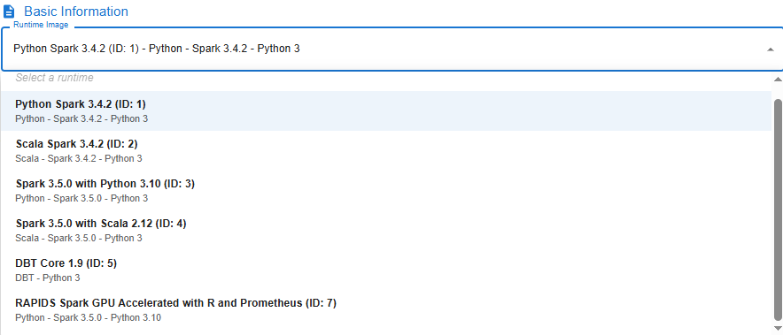
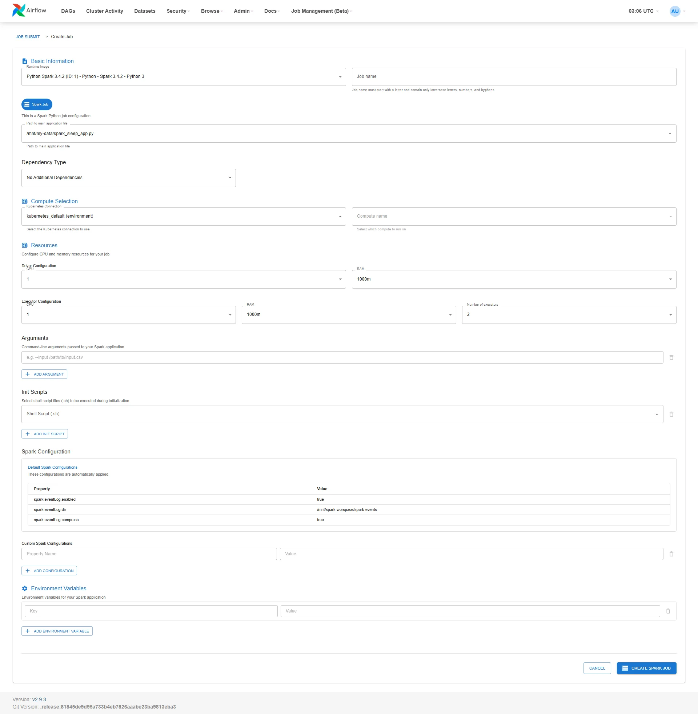
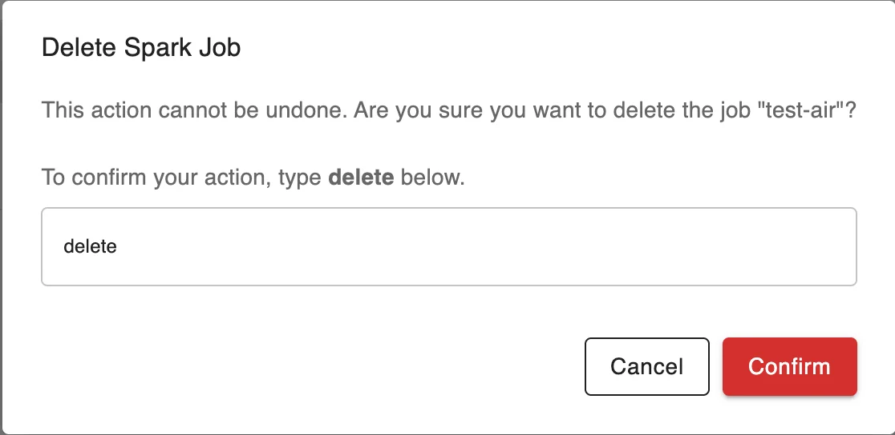

# Airflow & Job Submit Guide

**Job Submit** is a feature that allows users to create and submit data processing jobs (e.g., Spark jobs) directly from the Airflow UI without manually creating a DAG. This feature is especially useful for testing, quickly running analysis scripts, or validating data processing pipelines.

The Job Submit interface supports the following main functions:

 * Select the job type (e.g., Spark Python job)

 * Configure resources for the driver and executor

 * Specify the main script, dependencies, arguments, and environment variables

 * Add initialization scripts and custom Spark configurations

**Accessing Job Submit**

 * **Step 1:** Access the **Airflow UI** from the created Orchestration service screen

 * **Step 2:** In the menu bar, select **Job Management (Beta)** > **Job Submit**

### 1\. Create a New Job on Airflow (Job Submit)

**Step 1:** Access the Airflow UI, select **Job Management (Beta) > Job Submit**.

**Step 2:** Click the **Create Job** button to open the new job creation interface.

**Step 3:** Fill in all the configuration information for the job:

 * **Runtime Image**: Select the image appropriate for the job's purpose

Image | Description
---|---
Python Spark 3.4.2 (ID: 1) | Supports Spark library version 3.4.2 with Python version 3
Scala Spark 3.4.2 (ID: 2) | Supports Spark library version 3.4.2 with Scala
Spark 3.5.0 with Python 3.10 (ID: 3) | Supports Spark library version 3.5.0 with Python version 3.10
Spark 3.5.0 with Scala 2.12 (ID: 4) | Supports Spark library version 3.5.0 with Scala version 2.12
DBT Core 1.9 (ID: 5) | Supports running DBT Core library version 1.9 with Python version 3
RAPIDS Spark GPU Accelerated (ID: 7) | Supports RAPIDS Spark GPU Accelerated library with Python version 3

 * **Job Name**: Set the job name (lowercase, no spaces, only letters, numbers, and "-")

 * **Dependency Type**:

   * **PyPi Requirements**: Select the requirements.txt file from My Workspace

   * **Packaged Virtual Environment**: Select a *.tar.gz file

   * **No Additional Dependencies**: No dependencies to install

 * **Kubernetes Connection**: Select kubernetes_default (environment)

 * **Compute Name**: Select compute

 * Check **Spark Job**

 * **Path to main application file**: Select the main .py file in My Workspace

 * **Driver Configuration**:

   * CPU: 1

   * RAM: 1000m

 * **Executor Configuration**:

   * CPU: 1

   * RAM: 1000m

   * Number of Executors: 1

 * **Init Scripts (optional)**: Add a .sh file if there are initialization steps before running the job

 * **Arguments (optional)**: Add command-line arguments, e.g., --input /mnt/data/input.csv

 * **Environment Variables (optional)**: Add environment variables if needed

 * **Custom Spark Configurations (optional)**: Add key-value Spark configuration entries to override defaults

**Step 4:** Review all information, then click **Create Spark Job** to submit the job to the system.

### 2\. Edit a Job on Airflow

**Step 1:** Access the Airflow UI, select **Job Management (Beta) > Job Submit**.

**Step 2:** Click the **Action** button for the job you want to update

**Step 3:** Select **Edit Job** to open the Edit job interface.

**Step 4:** Update the **Job** information

**Step 5:** Review all information, then click **Update Spark Job** to save the changes to the system.

### 3\. Delete a Job on Airflow

**Step 1:** Access the Airflow UI, select **Job Management (Beta) > Job Submit**.

**Step 2:** Click the **Action** button for the job you want to delete

**Step 3:** Select **Delete**

**Step 4.** Enter "delete" in the **Confirm Delete Spark Job - Delete job** popup

**Step 5.** Enter "delete" in the **Confirm Delete Spark Job** popup to delete the job and ALL associated DAG resources, including database records, DAG files, and run history

### 4\. Configure DAG

**Step 1:** On the Job list page, click the three-dot icon to the right of the job you want to configure. Select **Configure DAG**

**Step 2: Enter DAG information**

 * **DAG ID**: Set the DAG name

 * **Spark Job**: Select the corresponding job

 * **Description**: Brief description for the DAG

 * **Schedule Type**: Select the execution type

   * To run manually, select None (Manual Trigger)

**Step 3: Set up detailed configuration**

 * **Timing**:

   * **Start Date**: Select the date when the DAG starts running

   * **End Date (Optional)**: Can be left blank for no end date

   * Check options:

     * **Paused on creation**: If you want the DAG to not be active immediately after creation

     * Uncheck **Catchup** and **Depends on past** if you do not need backfill or historical dependency

 * **Concurrency Settings**:

   * **Max Active Runs**: Number of DAG runs that can run in parallel

   * **Concurrency**: Number of tasks allowed to run concurrently

 * **Retry Settings**:

   * **Retries**: Number of retry attempts if the run fails

   * **Retry Delay (seconds)**: Wait time between retries in seconds

 * **Owner & Tags**:

   * **Owner**: Name of the DAG owner

   * **Add Tag**: Add tags for classification (e.g., spark submit)

**Step 4:** Review all information. Click **Create DAG** to complete DAG creation

### 5\. Trigger DAG

**Step 1:** On the Job list page, click the three-dot icon to the right of the job you want to configure. Select **Trigger DAG**

**Step 2:** In the menu bar, select **Job Management (Beta)** > **Spark UI**

**Step 3:** On the **Spark UI** screen, select **View Logs** for the job that just triggered the DAG

**Purpose of viewing logs:**

 * Monitor the detailed execution process of the job

 * Check the status of Spark processing steps (e.g., data loading, transformation execution, writing results...)

 * Analyze and troubleshoot errors if the job fails

 * Confirm the job ran successfully and returned the expected results
