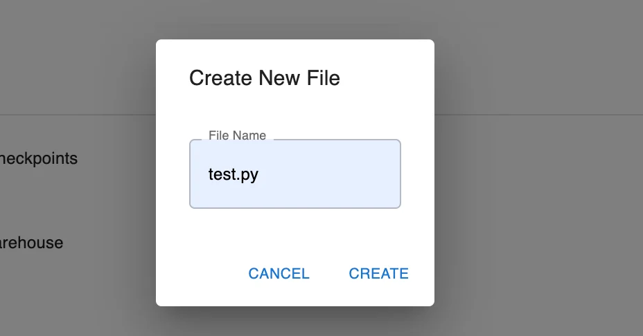
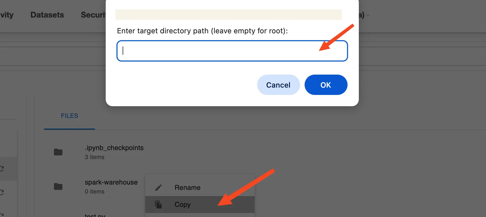
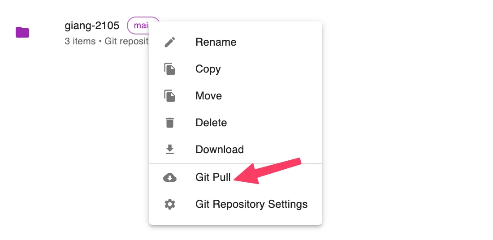

# Airflow & My Workspace Guide

**My Workspace** is a personal workspace provided within the Orchestration Service (Airflow UI), allowing users to easily manage DAG source code, scripts, configuration files, sample data, and more — all in one place.

All files and directories in My Workspace are organized in a directory tree structure at Root and can be integrated with Git for convenient version management and source code synchronization.

The Workspace interface supports the following basic functions:

 * Create new files, directories, upload files

 * Edit file content directly

 * Quick search

 * Delete files or directories

 * Connect Git repository and synchronize source code

### 1\. Access My Workspace

**Step 1:** Access the Airflow UI from the created Orchestration service screen

**Step 2:** Select **Browse > My Workspace** from the menu bar

**Note:** Each user's **Workspace** is displayed separately in the Root directory. Each directory corresponds to a workspace, for example: giang-git, cdcs3, dbt-demo, etc.

### 2\. My Workspace Layout

The My Workspace screen layout consists of 3 main areas:

 * **Breadcrumb navigation**: displays the current directory path

 * **Left sidebar (Directories)**: displays the Root directory tree structure

 * **Main panel (Files)**: displays the file and directory contents of the current workspace

### 3\. Manage Resources in My Workspace

#### a. Create New File / Directory / Upload File

 * **Create a new file:**

   * **Step 1:** Select the target directory by clicking the directory name in the Directories list or the Files panel

   * **Step 2:** Click the **+** icon in the top corner > select **New File**

   * **Step 3:** Enter the file name and click **Create** to save

**Note:** Create files with the .py extension in the dags/ directory if you want to declare DAGs for the Orchestration service.

 * **Create a new directory:**

   * **Step 1:** Select the target directory by clicking the directory name in the Directories list or the Files panel

   * **Step 2:** Click the **+** icon > select **New Directory**

   * **Step 3:** Enter the directory name and click **Create** to save

 * **Upload a file from your computer:**

   * **Step 1:** Select the target directory by clicking the directory name in the Directories list or the Files panel

   * **Step 2:** Click the **+** icon > select **Upload File**

   * **Step 3:** Select the file from your computer to upload

The file will be saved in the current directory. Verify the target directory carefully before proceeding.

#### b. Rename File / Directory

 * **Step 1:** Right-click the file or directory you want to rename

 * **Step 2:** Select **Rename**

 * **Step 3:** Enter the new name and press **Enter** to confirm

#### c. Copy File / Directory to Another Location

 * **Step 1:** Right-click the file or directory you want to copy

 * **Step 2:** Select **Copy**

 * **Step 3:** Enter the target directory path in the _Enter target directory path_ field (leave blank to copy to the root directory)

 * **Step 4:** Click **OK** to perform the copy

#### d. Move File / Directory to Another Location

 * **Step 1:** Right-click the file or directory you want to move

 * **Step 2:** Select **Move**

 * **Step 3:** Enter the target directory path in the **Enter target directory path** field (leave blank to move to the root directory)

 * **Step 4:** Click **OK** to perform the move

#### e. Delete File / Directory

 * **Step 1:** Right-click the file or directory you want to delete

 * **Step 2:** Select **Delete**

 * **Step 3:** Confirm the action if the system displays a confirmation popup such as: Delete directory "" recursively?

 * **Step 4:** Click **OK** to confirm or **Cancel** to abort

**Note:** Deleted files/directories cannot be recovered.

#### f. Download File / Directory

 * **Step 1:** Right-click the file or directory you want to download

 * **Step 2:** Select **Download**

 * **Step 3:** The file/directory will be downloaded to your device in its original format

#### g. Initialize Git Repository

**Applies to directories only**

 * **Step 1:** Right-click the directory you want to initialize as a Git repository

 * **Step 2:** Select **Initialize Git Repository**

 * **Step 3:** The configuration window will appear, including:

   * **Repository URL** (required): Enter the path to the Git repository

   * **Authentication Type**: Select the authentication method for the repository

     * **None**

       * No authentication required

       * Applies to public Git repositories

       * No login credentials needed

     * **SSH Key**

       * Use an SSH key pair to authenticate with the repository

       * Ensure the SSH key is already configured on the system

       * When this type is selected:

         * No username or password required

         * The system will automatically use the default SSH key (if available)

     * **Username & Password**

       * Use username and password for authentication

       * Applies to private repositories or when Git requires authentication

       * A **Personal Access Token** can be used instead of a password (for GitHub, GitLab, etc.)

       * When this type is selected:

         * Enter **Username**

         * Enter **Password** or **Access Token**

 * **Step 4:** Select the branch to pull from Git

 * **Step 5:** Click **Test connection** to verify the connection to the repository

 * **Step 6:** If the connection is successful, the **Initialize** button will be enabled

 * **Step 7:** Click **Initialize** to initialize the Git repository for the selected directory

#### h. Git Pull

**Applies only to directories that have been initialized with Git**

 * **Step 1:** Right-click the directory you want to Git Pull

 * **Step 2:** Select **Initialize Git Repository**

The system will pull the latest changes to the directory

#### i. Git Repository Settings

The Git Repository Settings feature is only displayed and applicable for directories that have been initialized with Git (.git). Users can view and configure synchronization (sync) settings between the local directory and the Git repository from the interface.

Applies only to Git-initialized directories

**A. Manual Pull (Pull Now — similar to Git Pull)**

 * **Step 1:** Right-click the Git-initialized directory

 * **Step 2:** Select **Git Repository Settings**

 * **Step 3:** In the **Sync Settings** tab, there are 2 ways to perform synchronization:

 * **Step 4:** Click the **Pull Now** button in the bottom-right corner of the window

 * **Step 5:** The system will pull the latest changes from the repository to the local directory

**B. Enable Auto Sync (Auto Sync)**

 * **Step 1:** Right-click the Git-initialized directory

 * **Step 2:** Select **Git Repository Settings**

 * **Step 3:** In the **Sync Settings** tab, there are 2 ways to perform synchronization:

 * **Step 4:** Toggle the **Enable automatic synchronization** switch to ON

 * **Step 5:** Enter the sync time interval in the **Sync Interval (minutes)** field
_— Minimum value: 5 minutes; maximum: 1440 minutes (24 hours)_

 * **Step 6:** Click **Save Sync Settings** to save the configuration

 * **Step 7:** The system will automatically synchronize at the configured interval

