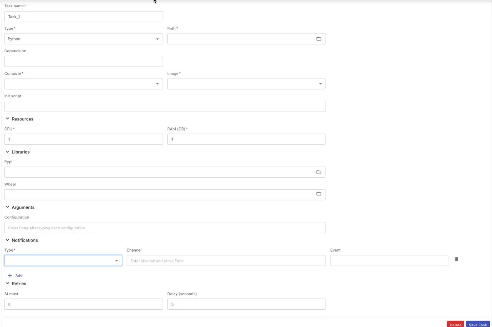
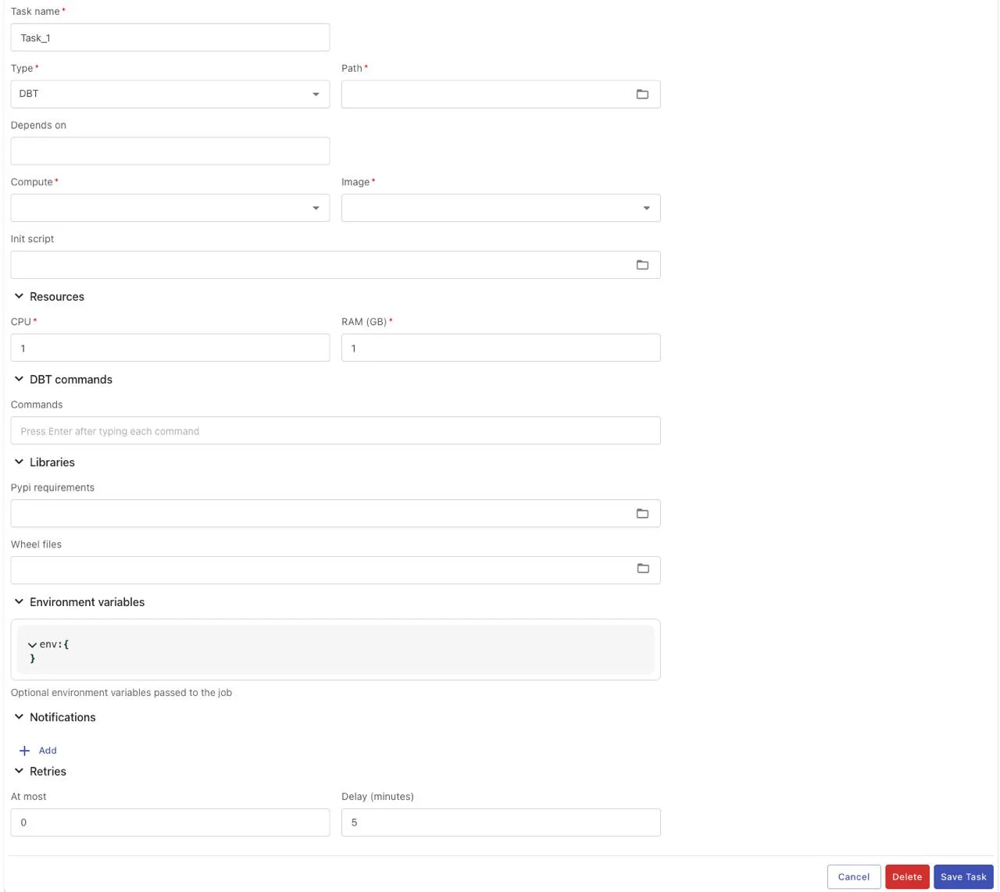
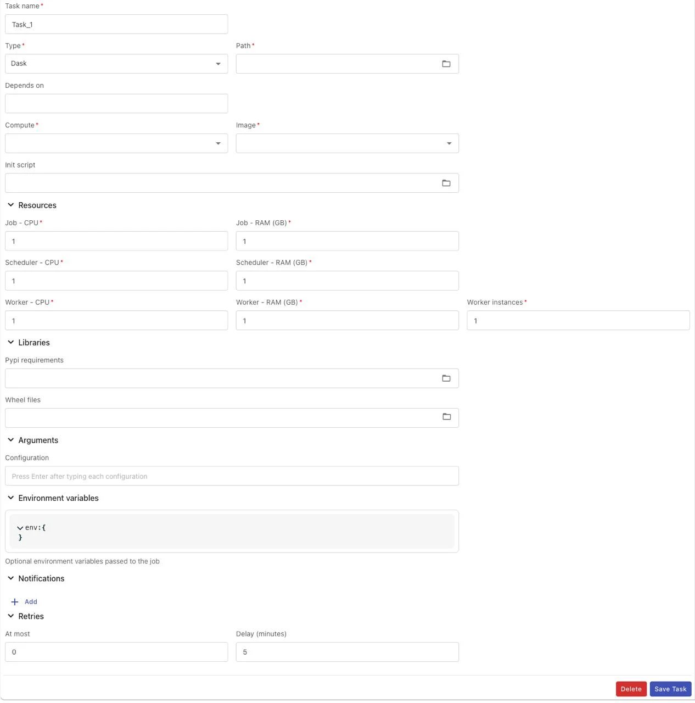
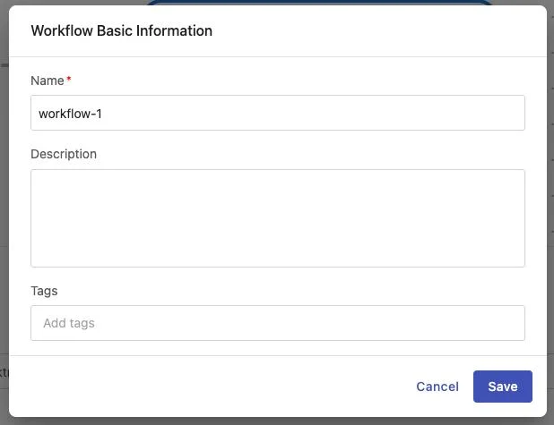

# Airflow Workflow Guide

Workflow Engine is the core component of the Data Platform, allowing users to define, manage, and execute data processing workflows. Each workflow consists of multiple interdependent tasks, modeled as a DAG (Directed Acyclic Graph).

This guide will help you:

 * Access and manage the workflow list

 * Create and configure workflows

 * Set up tasks of various types (Python, PySpark, Jar, DBT, Dask)

 * Configure schedules and notifications

 * Manage and delete workflows

### 1\. Access Workflow Engine

To access the Workflow Engine, follow these steps:

**Step 1:** In the main menu bar of Data Platform, select **Workflow Engine**

**Step 2:** A dropdown menu displays 2 options:

 * **Jobs**: Manage the workflow list

 * **Notifications**: Configure notification channels (Email, Telegram)

**Step 3:** Select **Jobs** to access the workflow list

### 2\. Workflow List

The workflow list interface displays all workflows in the system with an overview of key information.

### Main Functions

**Function** | **Description**
---|---
**Create Workflow** | Create a new workflow
**Trigger workflow** | Manually trigger a workflow run
**View graph** | View workflow details and run history
**Delete workflow** | Delete a workflow from the system
**Sort** | Sort the list by Name, Description, Number of tasks (ascending/descending)
**Filter** | Filter results by conditions: contains, equals, starts with, ends with, is empty, is any of
**Hide column** | Hide unnecessary columns
**Manage columns** | Customize displayed columns in the list
**Rows per page** | Select the number of workflows per page (10, 25, 50)

### Displayed Information

Each workflow in the list shows the following information:

 * **Name**: Workflow name (click to view details)

 * **Description**: Brief description of the workflow

 * **Number of tasks**: Number of tasks in the workflow

 * **Actions**: Quick actions (Run, View graph, Delete)

### 3\. Create New Workflow

### Initialize Workflow

**Step 1:** On the workflow list interface, click the **Create Workflow** button

**Step 2:** The system automatically initializes a workflow with default information:

 * **Workflow ID**: Auto-generated in ascending order (unique in the system)

 * **Workflow name**: Auto-generated following the pattern workflow- + 8 random characters (letters and numbers)

 * **Description**: Empty (can be added later)

 * **Tag**: Empty (can be added later)

 * **Schedule**: Default is "Manual trigger"

**Step 3:** The system displays a notification:

 * Subject: **Success**

 * Message: **Workflow initialized successfully!**

**Step 4:** Proceed to the workflow detail interface to configure tasks

### Workflow Detail Interface

The workflow detail interface consists of 2 main sections:

**Section 1: Graph View area (left side)**

 * Displays the DAG diagram of tasks

 * Allows zoom in/zoom out to view details

 * Click on a task to view or edit its configuration

 * **Add task** button to add new tasks

**Section 2: Information area (right side)**

 * **Basic Information**: Name, description, tags of the workflow

 * **Schedule**: Automatic run schedule

 * **Notifications**: Notification configuration when workflow runs

### Function Buttons

**Button** | **Function**
---|---
**Run** | Trigger the workflow to run immediately
**History** | View the run history of the workflow
**Delete** | Delete the workflow and all associated data
**Zoom in** | Zoom in on the graph view
**Zoom out** | Zoom out on the graph view
**Add task** | Add a new task to the workflow

### 4\. Configure Tasks

Workflow Engine supports 5 different task types, each suited for a specific processing purpose.

#### Add a New Task to Workflow

**Step 1:** On the workflow detail interface, find the **Add task** button on the Graph View

**Step 2:** Click the **Add task** button

**Step 3:** The system displays a task configuration form at the bottom with the default Type set to "Python"

**Step 4:** Select the appropriate task type from the **Type** dropdown:

 * **Python**: Simple Python script

 * **PySpark**: Spark job written in Python

 * **Jar**: Packaged Java/Scala application

 * **DBT**: DBT (Data Build Tool) project

 * **Dask**: Dask distributed computing job

**Step 5:** The configuration form will change according to the selected task type

**Step 6:** Fill in all required fields (see details for each task type below)

**Step 7:** Click **Save Task** to save the configuration

**Step 8:** The new task will appear on the Graph View

**Note:**

 * If the current task form is in editing state and has not been saved, clicking **Add task** will display a warning:

`o` Subject: **Warning**

`o` Message: **Please save the current task before creating a new one**

 * New tasks will have no default dependencies; configure the "Depends on" section if you want the task to run after other tasks

 * Multiple tasks can be added to a workflow with no limit on the number

#### Task Type: Python

The Python task allows executing simple Python scripts, suitable for small data processing tasks, automation scripts, or simple business logic.

#### Configuration Fields

**Basic Information:**

 * **Task name** (required): Task name — letters, numbers, underscores (_), hyphens (-) only, maximum 100 characters

 * **Type** (required): Select "Python" from the dropdown list

 * **Path** (required): Select the Python file path (*.py) from the directory

 * **Depends on**: Select tasks that this task depends on (multiple selections allowed)

 * **Trigger rule**: Rule for triggering the task based on the status of upstream tasks

**Execution Environment:**

 * **Compute** (required):

`o` Select the Compute to execute the script

`o` Select from the compute list in Processing service

`o` Single selection only

 * **Image** (required): Select the appropriate runtime image:

`o` Python Spark 3.4.2

`o` Spark 3.5.0 with Python 3.10

`o` DBT Core 1.9

`o` Spark 3.5.0 with Python3 for Openmetadata with Lakehouse

`o` RAPIDS Spark GPU Accelerated

`o` Python Dask 2025.4.1 (Beta)

 * **Init scripts**: Script executed before running the Python script (optional)

**Resources:**

 * **CPU** (required): Number of CPU cores (Min: 1, Max: 64)

 * **RAM (GB)** (required): RAM capacity (Min: 1, Max: 128)

**Libraries:**

 * **Pypi**: requirements.txt file containing the list of Python libraries to install

 * **Wheel**: .whl files (multiple files can be selected)

**Arguments:**

 * **Arguments**: Parameters passed when executing the script (maximum 255 characters)

**Notifications:**

 * **Type**: Select notification type (Telegram or Email)

 * **Channel**: Telegram channel or email address to receive notifications (5-254 characters, valid email format)

 * **Event**: Select the status to send notifications (running, success, failed) — multiple selections allowed

**Retry Policy:**

 * **At most** (required): Number of retries when the script fails (Min: 0, Max: 10)

 * **Delay** (required): Wait time between retries, in minutes (Min: 1, Max: 10)

#### Trigger Rules

**Trigger Rule** | **Description**
---|---
**all_success** | Task runs only when all upstream tasks succeed
**all_failed** | Task runs only when all upstream tasks have FAILED
**all_done** | Task runs when all upstream tasks have finished (in any state: success, failed, skipped)
**all_done_setup_success** | Task runs only when all upstream tasks have finished and all SETUP tasks succeeded
**one_success** | Task runs if at least one upstream task is SUCCESS
**one_fail** | Task runs if at least one upstream task has FAILED
**one_done** | Task runs if at least one upstream task is DONE (finished, regardless of state)
**none_failed** | Task runs when no upstream tasks have FAILED, but some may be SKIPPED
**none_failed_or_skipped** | Task runs when there are no FAILED and no SKIPPED tasks. Only accepts SUCCESS
**none_skipped** | Task runs when no upstream tasks are SKIPPED. Can be FAILED or SUCCESS
**dummy** | Performs no action. Always runs regardless of whether previous tasks succeeded, failed, or were skipped
**always** | Task always runs regardless of upstream status
**none_failed_min_one_success** | Task runs when there are no FAILED tasks and at least one SUCCESS task
**all_skipped** | Task runs when all upstream tasks are SKIPPED

#### Steps

**Step 1:** On the workflow detail interface, click the **Add task** button

**Step 2:** The system displays the task configuration form with the default Type set to "Python"

**Step 3:** Fill in all required fields:

 * Task name

 * Path to the Python file

 * Compute cluster

 * Runtime image

 * CPU and RAM

**Step 4:** (Optional) Configure additionally:

 * Dependencies (Depends on)

 * Trigger rule

 * Init scripts

 * Libraries (Pypi, Wheel)

 * Arguments

 * Notifications

 * Retry policy

**Step 5:** Click the **Save Task** button

**Step 6:** The system displays a notification:

 * Subject: **Success**

 * Message: **{{task_name}} created successfully!**

**Step 7:** The new task appears on the Graph View

#### Task Type: PySpark

PySpark tasks allow executing Spark jobs written in Python, suitable for large-scale data processing with distributed computing.

#### Configuration Fields

**Basic Information:**

 * **Task name** (required): Task name — letters, numbers, underscores (_), hyphens (-) only, maximum 100 characters

 * **Type** (required): Select "PySpark" from the dropdown list

 * **Path** (required): Select the Python file path (*.py) from the directory

 * **Depends on**: Select tasks that this task depends on (multiple selections allowed)

 * **Trigger rule**: Rule for triggering the task based on the status of upstream tasks

**Execution Environment:**

 * **Compute** (required):

`o` Select the Compute to execute the script

`o` Select from the compute list in Processing service

`o` Single selection only

 * **Image** (required): Select the appropriate runtime image:

`o` Python Spark 3.4.2

`o` Spark 3.5.0 with Python 3.10

`o` Spark 3.5.0 with Python3 for Openmetadata with Lakehouse

 * **Init scripts**: Script executed before running the PySpark script (optional)

 * **Spark configuration**: Configure Spark parameters in JSON Key-Value format (reference: https://spark.apache.org/docs/latest/configuration.html)

 * **Environment variables**: Configure environment variables in JSON Key-Value format

**Resources (Spark-specific):**

 * **Driver CPU** (required): CPU for Spark Driver (Min: 1, Max: 64)

 * **Driver RAM (GB)** (required): RAM for Spark Driver (Min: 1, Max: 128)

 * **Executor CPU** (required): CPU per Executor (Min: 1, Max: 64)

 * **Executor RAM (GB)** (required): RAM per Executor (Min: 1, Max: 128)

**Libraries:**

 * **Pypi requirements**: requirements.txt file

 * **Wheel**: .whl files (multiple selections allowed)

 * **Jar**: .jar files for Java runtime (multiple selections allowed)

**Arguments:**

 * **Arguments**: Parameters passed when executing the script (maximum 255 characters)

**Notifications:**

 * **Type**: Select notification type (Telegram or Email)

 * **Channel**: Telegram channel or email address to receive notifications (5-254 characters, valid email format)

 * **Event**: Select the status to send notifications (running, success, failed) — multiple selections allowed

**Retry Policy:**

 * **At most** (required): Number of retries when the script fails (Min: 0, Max: 10)

 * **Delay** (required): Wait time between retries, in minutes (Min: 1, Max: 10)

#### Steps

**Step 1:** Click **Add task** on the workflow interface

**Step 2:** Select Type = "PySpark" from the dropdown

**Step 3:** Fill in all required fields including resources for both Driver and Executor

**Step 4:** (Optional) Configure:

 * Spark configuration

 * Environment variables

 * Jar libraries (if needed)

**Step 5:** Click **Save Task** to save the configuration

#### Task Type: Jar

Jar tasks allow executing Java/Scala applications packaged as JAR files, suitable for Spark jobs written in Scala or Java.

#### Configuration Fields

**Basic Information:**

 * **Task name** (required): Task name — letters, numbers, underscores (_), hyphens (-) only, maximum 100 characters

 * **Type** (required): Select "Jar" from the dropdown list

 * **Path** (required): Select the JAR file path (*.jar) from the directory

 * **Main class** (required): The Java class name containing the main() method to start execution (maximum 255 characters, letters, numbers, dots (.), underscores (_) only)

 * **Depends on**: Select tasks that this task depends on (multiple selections allowed)

 * **Trigger rule**: Rule for triggering the task based on the status of upstream tasks

**Execution Environment:**

 * **Compute** (required):

`o` Select the Compute to execute the script

`o` Select from the compute list in Processing service

`o` Single selection only

 * **Image** (required): Select the appropriate runtime image:

`o` Scala Spark 3.4.2

`o` Spark 3.5.0 with Scala 2.12

 * **Init scripts**: Script executed before running the Jar script (optional)

 * **Spark configuration:**

`o` Configure Spark parameters

`o` JSON Key-Value format: https://spark.apache.org/docs/latest/configuration.html

 * **Environment variables:**

`o` Configure environment parameters

`o` JSON Key-Value format

**Resources:**

 * **Driver CPU** (required): Driver CPU resource for running the job (Min: 1, Max: 64)

 * **Driver RAM (GB)** (required): Driver RAM resource for running the job (Min: 1, Max: 128)

 * **Executor CPU** (required): Executor CPU resource for running the job (Min: 1, Max: 64)

 * **Executor RAM (GB)** (required): Executor RAM resource for running the job (Min: 1, Max: 128)

**Libraries:**

 * **Pypi requirements**: Select the Python library installation file requirements.txt

 * **Wheel**: Select the Python library installation file *.whl

 * **Jar**: Select the Java runtime library installation file *.jar (multiple selections allowed)

**Arguments:**

 * **Arguments**: Parameters passed when executing the script (maximum 255 characters)

**Notifications:**

 * **Type**: Select notification type (Telegram or Email)

 * **Channel**: Telegram channel or email address to receive notifications (5-254 characters, valid email format)

 * **Event**: Select the status to send notifications (running, success, failed) — multiple selections allowed

**Retry Policy:**

 * **At most** (required): Number of retries when the script fails (Min: 0, Max: 10)

 * **Delay** (required): Wait time between retries, in minutes (Min: 1, Max: 10)

#### Steps

**Step 1:** Click **Add task** on the workflow interface

**Step 2:** Select Type = "Jar" from the dropdown

**Step 3:** Fill in all required fields:

 * Task name

 * Path to the JAR file

 * Main class (e.g., com.example.MainApp)

 * Compute, Image

 * Driver and Executor resources

**Step 4:** (Optional) Add dependent JAR files if needed

**Step 5:** Click **Save Task**

#### Task Type: DBT

DBT tasks allow executing DBT (Data Build Tool) projects, suitable for transforming data in a data warehouse using the ELT model.

#### Configuration Fields

**Basic Information:**

 * **Task name** (required): Task name — letters, numbers, underscores (_), hyphens (-) only, maximum 100 characters

 * **Type** (required): Select "DBT" from the dropdown list

 * **Path** (required): Path to the directory containing the DBT project

 * **Depends on**: Select tasks that this task depends on (multiple selections allowed)

 * **Trigger rule**: Rule for triggering the task based on the status of upstream tasks

**Execution Environment:**

 * **Compute** (required):

`o` Select the Compute to execute the script

`o` Select from the compute list in Processing service

`o` Single selection only

 * **Image** (required): Select the appropriate runtime image:

`o` DBT Core 1.9

 * **Init scripts**: Script executed before running the DBT script (optional)

**Resources:**

 * **CPU** (required): Number of CPU cores for DBT (Min: 1, Max: 64)

 * **RAM (GB)** (required): RAM capacity for DBT (Min: 1, Max: 128)

**DBT Commands:**

 * **Commands** (required): List of DBT commands to execute

`o` Each command: 7-100 characters, letters, numbers, hyphens (-), underscores (_), spaces only

`o` Maximum 20 commands

`o` Examples: dbt run, dbt test, dbt snapshot

**Libraries:**

 * **Pypi requirements**: Select the Python library installation file requirements.txt

 * **Wheel**: Select the Python library installation file *.whl

**Environment variables:**

 * Configure environment variables in JSON Key-Value format

**Arguments:**

 * **Arguments**: Parameters passed when executing the script (maximum 255 characters)

**Notifications:**

 * **Type**: Select notification type (Telegram or Email)

 * **Channel**: Telegram channel or email address to receive notifications (5-254 characters, valid email format)

 * **Event**: Select the status to send notifications (running, success, failed) — multiple selections allowed

**Retry Policy:**

 * **At most** (required): Number of retries when the script fails (Min: 0, Max: 10)

 * **Delay** (required): Wait time between retries, in minutes (Min: 1, Max: 10)

#### Steps

**Step 1:** Click **Add task** on the workflow interface

**Step 2:** Select Type = "DBT" from the dropdown

**Step 3:** Fill in all required information:

 * Task name

 * Path to the DBT project directory

 * Compute, Image

 * CPU and RAM

**Step 4:** Enter the DBT commands to execute (e.g., dbt run, dbt test)

**Step 5:** (Optional) Configure environment variables if needed

**Step 6:** Click **Save Task**

#### Task Type: Dask

Dask tasks allow executing parallel data processing jobs with the Dask framework, suitable for large-scale data processing with Python in a distributed environment.

#### Configuration Fields

**Basic Information:**

 * **Task name** (required): Task name — letters, numbers, underscores (_), hyphens (-) only, maximum 100 characters

 * **Type** (required): Select "Dask" from the dropdown list

 * **Path** (required): Select the Python file path (*.py) from the directory

 * **Depends on**: Select tasks that this task depends on (multiple selections allowed)

 * **Trigger rule**: Rule for triggering the task based on the status of upstream tasks

**Execution Environment:**

 * **Compute** (required): `o` Select the Compute to execute the script `o` Select from the compute list in Processing service `o` Single selection only
 * **Image** (required): Select the appropriate runtime image: `o` Python Dask 2025.4.1 (Beta)
 * **Init scripts**: Script executed before running the Python script (optional)

**Resources (Dask-specific):**

 * **Job - CPU** (required): CPU for the Job (Min: 1, Max: 64)
 * **Job - RAM (GB)** (required): RAM for the Job (Min: 1, Max: 128)
 * **Scheduler - CPU** (required): CPU for the Dask Scheduler (Min: 1, Max: 64)
 * **Scheduler - RAM (GB)** (required): RAM for the Dask Scheduler (Min: 1, Max: 128)
 * **Worker - CPU** (required): CPU per Dask Worker (Min: 1, Max: 64)
 * **Worker - RAM (GB)** (required): RAM per Dask Worker (Min: 1, Max: 128)
 * **Worker instances** (required): Number of Workers (Min: 1, Max: 100)

**Libraries:**

 * **Pypi**: requirements.txt file containing the list of Python libraries to install
 * **Wheel**: .whl files (multiple files can be selected)

**Arguments:**

 * **Arguments**: Parameters passed when executing the script (maximum 255 characters)

**Notifications:**

 * **Type**: Select notification type (Telegram or Email)
 * **Channel**: Telegram channel or email address to receive notifications (5-254 characters, valid email format)
 * **Event**: Select the status to send notifications (running, success, failed) — multiple selections allowed

**Retry Policy:**

 * **At most** (required): Number of retries when the script fails (Min: 0, Max: 10)
 * **Delay** (required): Wait time between retries, in minutes (Min: 1, Max: 10)

#### Steps

**Step 1:** Click **Add task** on the workflow interface

**Step 2:** Select Type = "Dask" from the dropdown

**Step 3:** Fill in all resource information for:

 * Job
 * Scheduler
 * Worker (including number of instances)

**Step 4:** Configure other information as in Python Task

**Step 5:** Click **Save Task**

#### Delete Task

Deleting a task removes it from the workflow along with all associated dependencies.

#### Steps

**Step 1:** On the workflow detail interface, click the task you want to delete on the Graph View

**Step 2:** The task configuration form will appear below

**Step 3:** Click the **Delete** button (red) in the lower-left corner of the form

**Step 4:** A confirmation popup appears with:

 * Title: **Delete task**
 * Message: **Are you sure you want to delete task "{{task_name}}"? This action cannot be undone.**

**Step 5:** Click **Delete** to confirm deletion or **Cancel** to abort

**Step 6:** After confirmation, the system:

 * Removes the task from the workflow

 * Removes all dependencies associated with this task

 * Displays a notification:

`o` Subject: **Success**

`o` Message: **Task deleted successfully!**

**Step 7:** The task disappears from the Graph View

**Note:**

 * The deletion action cannot be undone

 * If other tasks depend on the deleted task (downstream tasks), update their dependencies accordingly

 * Deleting a task affects the workflow execution flow; review carefully before deleting

 * Consider backing up the task configuration before deleting (take a screenshot or note down the parameters)

### 5\. Update Workflow Information

After creating a workflow, you can update basic information, the schedule, and notification configuration.

#### Update Basic Information

**Step 1:** On the workflow detail interface, find the **Basic Information** section on the right

**Step 2:** Click the **Edit** icon (pencil icon) at the top right of the Basic Information section

**Step 3:** The "Workflow Basic Information" popup appears with the following fields:

**Field** | **Description** | **Requirements**
---|---|---
**Name** | Workflow name | Required. 3-100 characters, letters, numbers, _, - only. Must be unique among workflows in the system
**Description** | Workflow description | Optional. Maximum 255 characters
**Tags** | Tags for the workflow | Optional. Each tag 1-30 characters, letters, numbers, -, _ only. No duplicate tags within the same workflow. Maximum 10 tags

**Step 4:** Edit the required information

**Step 5:** Click **Save** to save changes or **Cancel** to abort

**Step 6:** The system displays a notification:

 * Subject: **Success**

 * Message: **Workflow updated successfully!**

**Note:** If the workflow name already exists, the system will show an error:

 * Subject: **Error**

 * Message: **Workflow with name '{{workflow_name}}' already exists**

#### Update Schedule

Schedule allows setting up automatic run schedules for the workflow.

**Step 1:** On the workflow detail interface, find the **Schedule** section on the right

**Step 2:** Click the **Edit** icon at the top right of the Schedule section

**Step 3:** The "Schedule" popup appears with the following options:

**Manual trigger:**

 * Checkbox "Manual trigger (do not run on schedule)" — Workflow runs only when manually triggered

**Schedule interval (if Manual trigger is not selected):**

 * **Minutes**: Run by minute interval

 * **Hourly**: Run hourly

 * **Daily**: Run daily

 * **Weekly**: Select days of the week (Monday, Tuesday, Wednesday, Thursday, Friday, Saturday, Sunday)

 * **Monthly**: Run monthly

 * **Custom**: Enter a custom cron expression

**Start time:**

 * Select the hour and minute when the workflow starts running

**Cron expression preview:**

 * The system displays the cron expression corresponding to the selected options

 * Example: 0 0 * * * (runs at 12:00 AM every day)

**Step 4:** Configure the schedule as needed

**Step 5:** Click **Save** to save changes or **Cancel** to abort

**Step 6:** The system displays a notification:

 * Subject: **Success**

 * Message: **Schedule updated successfully!**

**Note:**

 * The cron expression must follow the correct 5-field syntax (minute, hour, day-of-month, month, day-of-week)

 * Valid characters: * , - /

 * No newlines allowed

 * Maximum 100 characters

#### Update Notifications (Workflow level)

Configure notifications for the entire workflow when events occur.

**Step 1:** On the workflow detail interface, find the **Notifications** section on the right

**Step 2:** Click the **Edit** icon at the top right of the Notifications section

**Step 3:** The "Notifications" popup appears with the following fields:

**Field** | **Description**
---|---
**Type** | Select notification type: Telegram or Email
**Channel** | Telegram channel or Email address to receive notifications (5-254 characters, valid email format)
**Event** | Select the status to send notifications: running, success, failed (multiple selections allowed)

**Step 4:** Click the **Add** button (+) to add a new notification configuration

**Step 5:** Fill in the information for each notification:

 * Select Type (Telegram/Email)

 * Enter Channel (Telegram channel name or email)

 * Select Event (running, success, failed)

**Step 6:** Add multiple notifications by clicking **Add** multiple times

**Step 7:** To delete a notification, click the **Delete** icon (trash) next to it

**Step 8:** Click **Save** to save the configuration or **Cancel** to abort

**Step 9:** The system displays a notification:

 * Subject: **Success**

 * Message: **Notifications updated successfully!**

#### Update Notifications (Task level)

In addition to workflow-level notifications, each task can also configure its own notifications.

**Step 1:** Click on a task in the Graph View to open the task configuration form

**Step 2:** Scroll down to the **Notifications** section in the task form

**Step 3:** Click the expand icon (dropdown) for the Notifications section

**Step 4:** Click the **Add** button to add a new notification

**Step 5:** Fill in the notification information (same as workflow level):

 * Type (Telegram/Email)

 * Channel

 * Event (running, success, failed)

**Step 6:** Multiple notifications can be added for the task

**Step 7:** Click **Save Task** to save the task configuration

**Note:**

 * Task notifications are independent from workflow notifications

 * If both the workflow and task have notifications configured, both will be sent when the corresponding event occurs

### 6\. Configure Notification Channels

Before using notifications in workflows/tasks, notification channels must be configured first.

#### Access Notification Management

**Step 1:** In the main menu bar, select **Workflow Engine**

**Step 2:** In the dropdown menu, select **Notifications**

**Step 3:** The notification channels list interface displays the following information:

 * **Type**: Notification type (email/telegram)

 * **Name**: Configuration name

 * **Description**: Description

 * **Active**: Active/inactive status

 * **Actions**: Operations (Edit)

#### Configure Email Notification

**Step 1:** In the Notifications list, find the row with Type = "email"

**Step 2:** Click the **Edit** icon (pencil) in the Actions column

**Step 3:** The "Email Notification Configuration" popup appears with the following fields:

**Field** | **Description** | **Requirements**
---|---|---
**Name** | Email configuration name | Required
**Description** | Configuration description | Optional
**SMTP Server Host** | SMTP server address (e.g., smtp.gmail.com) | Required
**SMTP Server Port** | SMTP server port (e.g., 587, 465) | Required
**SMTP Username** | SMTP login username | Required
**SMTP Password** | SMTP password (show/hide button) | Required
**Enable configuration** | Toggle to enable/disable configuration | —

**Step 4:** Fill in all SMTP server information:

 * Host: SMTP server address of your email provider

 * Port: Typically 587 (TLS) or 465 (SSL)

 * Username: Email or login username

 * Password: App password or email password

**Step 5:** Enable the **Enable configuration** toggle to activate

**Step 6:** Click **Save** to save the configuration or **Cancel** to abort

**Note:**

 * For Gmail, create an "App Password" instead of using your regular password

 * For Office 365, configure SMTP authentication

 * Test the SMTP connection before using in production

#### Configure Telegram Notification

**Step 1:** In the Notifications list, find the row with Type = "telegram"

**Step 2:** Click the **Edit** icon in the Actions column

**Step 3:** The "Telegram Notification Configuration" popup appears with the following fields:

**Field** | **Description** | **Requirements**
---|---|---
**Name** | Telegram configuration name | Required
**Description** | Configuration description | Optional
**Telegram Bot Token** | Telegram Bot token (show/hide button) | Required
**Enable configuration** | Toggle to enable/disable configuration | —

**Step 4:** Obtain the Telegram Bot Token:

 * Open Telegram and find @BotFather

 * Send the command /newbot to create a new bot

 * Set the name and username for the bot

 * BotFather will return the Bot Token (format: 123456789:ABCdefGHIjklMNOpqrsTUVwxyz)

**Step 5:** Copy the Bot Token and paste it into the **Telegram Bot Token** field

**Step 6:** Enable the **Enable configuration** toggle to activate

**Step 7:** Click **Save** to save the configuration or **Cancel** to abort

**Step 8:** Get the Chat ID/Channel:

 * Add the bot to the group/channel where you want to receive notifications

 * Send any message in the group/channel

 * Access the URL: https://api.telegram.org/bot{YOUR_BOT_TOKEN}/getUpdates

 * Find chat.id in the JSON response

 * Use this Chat ID when configuring notifications in workflows/tasks

**Note:**

 * The bot must be added to the group/channel before it can send notifications

 * For channels, the bot needs "Post Messages" permission

 * Negative Chat IDs are groups/channels; positive Chat IDs are personal chats

### 7\. Run Workflow

There are 2 ways to run a workflow: manually and automatically on a schedule.

#### Manual Trigger

**Method 1: From the workflow list**

**Step 1:** On the workflow list interface, find the workflow to run

**Step 2:** Click the **Trigger workflow** icon (play button) in the Actions column

**Step 3:** The workflow will be triggered to run immediately

**Method 2: From the workflow detail**

**Step 1:** Click on the workflow name to enter the detail interface

**Step 2:** Click the **Run** button in the upper right corner

**Step 3:** The workflow will be triggered to run immediately

#### Automatic Scheduled Run

The workflow will run automatically according to the schedule configured in the Schedule section (see section 5.5.2).

#### View Run History

**Method 1: From the workflow list**

Click the **View graph** icon (graph icon) in the Actions column

**Method 2: From the workflow detail**

Click the **History** button in the upper right corner

**Displayed information:**

 * List of workflow runs

 * Start and end times

 * Status (success, failed, running)

 * Detailed log of each task

### 8\. Delete Workflow

Deleting a workflow removes the entire workflow, all tasks within it, and all associated data (run history, logs).

#### Steps

**Method 1: From the workflow list**

**Step 1:** On the workflow list interface, find the workflow to delete

**Step 2:** Click the **Delete** icon (trash) in the Actions column

**Step 3:** A confirmation popup appears:

 * Title: **Delete workflow**

 * Message: **Are you sure you want to delete workflow "{{workflow_name}}"? This action cannot be undone.**

**Step 4:** Click **Delete** to confirm deletion or **Cancel** to abort

**Step 5:** The system deletes the workflow and displays a notification:

 * Subject: **Success**

 * Message: **Workflow deleted successfully!**

**Step 6:** Returns to the workflow list screen

**Method 2: From the workflow detail**

**Step 1:** Click on the workflow name to enter the detail interface

**Step 2:** Click the **Delete** button in the upper right corner

**Step 3:** A confirmation popup appears:

 * Title: **Delete workflow**

 * Message: **Are you sure you want to delete workflow "{{workflow_name}}"? This action cannot be undone.**

**Step 4:** Click **Delete** to confirm deletion or **Cancel** to abort

**Step 5:** The system deletes the workflow and displays a notification:

 * Subject: **Success**

 * Message: **Workflow deleted successfully!**

**Step 6:** Returns to the workflow list screen

**Note:**

 * The deletion action cannot be undone

 * All run history and logs will be deleted along with the workflow

 * If the workflow is currently running, stop it before deleting
