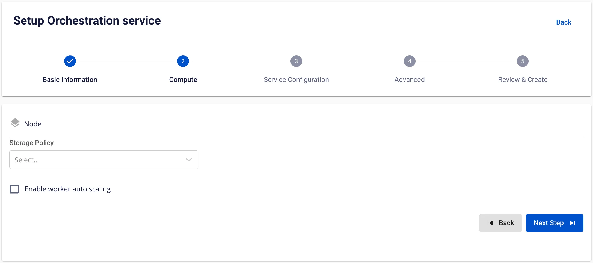

# Create Orchestration

The **Orchestration service** is defined as a service that manages and automates workflows within a data system, ensuring that data processing tasks are executed sequentially or in parallel according to schedules or events, while providing effective monitoring and troubleshooting capabilities.

To create an Orchestration service, follow these steps:

**Step 1:** In the menu bar, select **Data Platform** > **Workspace Management** > **Workspace name**

**Step 2:** In the **My services** section, click **Create** > the **New service** popup appears, select **Orchestration** > **Create**


**Step 3:** In the **Orchestration** creation form, enter the **Basic Information**:

  * **Name** (required): Orchestration name

Note: The Orchestration name may contain lowercase letters a-z, uppercase letters A-Z, or digits 0-9. Spaces are not allowed — use "-" or "_" instead.

  * **Description** (optional): Description

  * **Version** (required): Select version

  * **Size** (required): Select the configuration size for Airflow based on the number of DAGs running concurrently

    * **Dev** package: Recommended DAG limit of approximately 20–25 DAGs

    * **Small** package: Recommended DAG limit of approximately 40–50 DAGs

    * **Medium** package: Recommended DAG limit of approximately 70–80 DAGs


**Step 4:** Click **Next Step** to proceed to the **Compute** configuration screen

Enter the following information:

  * **Storage policy** (required): Select **Storage Policy**



To automatically scale the Airflow Worker configuration, check **Enable worker auto scaling** > enter the maximum number of nodes for the **Worker**

**Step 5:** Click **Next** to proceed to the **Service configuration** screen

Enter the following information:

  * **Mount S3 storage**

    * **Storage Name** (required): Select Storage for S3 mount
  * **DAGs**

    * **Type** (required): Select type as S3 or GIT

    * If **Type** is **S3**: DAG information is retrieved from S3 storage

    * If **Type** is **GIT**, enter the following:

  * **Repository URL (required)**: Address where DAG files are stored

  * **Branch (required)**: Branch connecting to the directory containing DAG files

  * **Path (required)**: Specific path to the directory containing DAG files


**Step 6:** Click **Next** to proceed to the **Advanced** screen

  * Database (Database information for storing **Data governance** data — users can use a Database created in the **FPT Database Engine** service or any other **Database**)

When **type** is **PostgreSQL**:

  * **Select Database** (required): Select Database

  * **Host name** (required): Hostname or IP of the Postgres server

  * **Port** (required): Postgres server port, default is 5432

  * **Database** (required): Database name

  * **Username** (required): Account name for accessing the Database

  * **Password** (required): Password for accessing the Database

When **Manual configuration** is selected:

  * **Host name** (required): Hostname or IP of the Postgres server

  * **Port** (required): Postgres server port, default is 5432

  * **Database** (required): Database name

  * **Username** (required): User for accessing the Database

  * **Password** (required): Password for accessing the Database


After entering all **Database** information, click **Test connection** to verify the connection from the **Workspace** to the configured **Database**

  * **Redis**

When **From FPT Database Engine** is selected:

    * **Select Database** (required): Select Database

    * **Host name** (required): Hostname or IP of Redis

    * **Port** (required): Redis port, default is 6379

    * **Username** (required): User for accessing the Database

    * **Password** (required): Password for accessing the Database

    * **Logical database** (required): Select logical DB information

When **Manual configuration** is selected:

    * **Host name** (required): Hostname or IP of Redis

    * **Port** (required): Redis port

    * **Username** (required): User for accessing the Database

    * **Password** (required): Password for accessing the Database

    * **Logical database** (required): Select logical DB information

After entering all **Database** information, click **Test connection** to verify the connection from the **Workspace** to the configured **Database**

  * **Remote logging**

    * **Bucket name** (required): Bucket name

    * **Endpoint** (required): Access address

    * **Access key** (required): Access key

    * **Secret** (required): Access secret

    * **Path** (required): Directory containing **remote log** files

After entering all **Remote logging** information, click **Test connection** to verify the connection from the **Workspace** to the configured **S3**

  * **Single Sign On**

    * If Single Sign On is not enabled, the service is initialized with **Basic authentication**

    * If **Single Sign On** is enabled:

    * **Provider: FPT ID**

Enter the following information:

      * **Username**: Username

      * **Email**: FPT email address

    * **Provider: Google**

Enter the following information:

      * **Client ID**: An ID code used to authenticate the client with Google

      * **Client Secret**: Password used to authenticate the client with Google

      * **Email**: Email address

    * **Provider: Keycloak**

Enter the following information:

      * **Auth Provider name**: Provider name

      * **Realm**: A management space in which all users, groups, roles, clients, and other objects are managed and secured independently

      * **Auth server url**: The base URL of the Keycloak server, used by clients to perform authentication

      * **Client ID**: An ID code used to authenticate the client with Keycloak

      * **Client Secret**: Password used to authenticate the client with Keycloak

      * **Username**: Username in Keycloak

      * **Email**: Email address in Keycloak

  * **Secret backends**

    * **Provider = FPT Key Vault**

      * **Mount point (required):** Mount point path of the secrets backend (e.g., airflow-connections)

      * **Connection path (required):** Path/key used for Airflow connections

      * **Variable path (required):** Path/key for environment variables or secrets

      * **URL (required):** Vault endpoint address (e.g., <http://pickadkf.keyvault.fptcloud.com>)

      * **Auth type:** Authentication type with Vault (e.g., token)

      * **Token (required):** Authentication token for the account with Vault

**Note:** Vault Policy — the Token must have "read" and "list" permissions on the paths containing connections and variables, and the policy must be assigned to the token

```
{
    "path": {
    "/data//*": {
      "capabilities": [
        "read",
        "list"
      ]
    },
    "/data//*": {
      "capabilities": [
        "read",
        "list"
      ]
    },
    "/metadata/": {
      "capabilities": [
        "list"
      ]
    },
    "/metadata/": {
      "capabilities": [

        "list"
      ]
    }
    }
    }
```

Click the **Test connection** button to verify the actual connection to the secret backend


  * **Custom Domain**

    * **Purpose:** Allows configuring a custom domain to access services.

      * **For Public Workspace:** Used to assign a domain and certificate without needing to enable/disable TLS (HTTPS is always available).

      * **For Private Workspace:** In addition to the domain and certificate, users can optionally enable or disable TLS/SSL to choose between HTTPS or HTTP.

    * **Public Workspace**

      * **Custom domain**: Check to enable a custom domain.

      * **Domain**: Enter the domain name (e.g., abc.local, jupyter.example.com).

      * **Certificate name**: Select from the list of certificates imported in **Certificate Manager**.

      * **Buttons**:

      * **Manage certificate**: Open the certificate management screen.

      * **Validate**: Verify that the certificate is valid for the domain.

      * 
:::note
In a Public Workspace, the **TLS/SSL certificate** option is **not displayed** — the system supports HTTPS by default.
:::


    * **Private Workspace**

      * **Custom domain**: Check to enable a custom domain.

      * **Domain**: Enter the domain name.

      * **TLS/SSL certificate**: Check to enable HTTPS for services.

      * **Certificate name**: Select from the certificate list.

      * **Buttons**:

      * **Manage certificate**: Open certificate management.

      * **Validate**: Verify the certificate.

      * 
:::note
If **TLS/SSL certificate** is unchecked, the service will run over HTTP and no certificate is required.
:::


**Step 7:** Click **Next** to proceed to the **Review & create** screen

**Step 8:** Review all entered information, then click **Create** to complete the Orchestration initialization

**Orchestration** initialization is complete when the **Worker Status** is **Succeeded** and the **Orchestration** **Status** is **Healthy** (~10 minutes)
