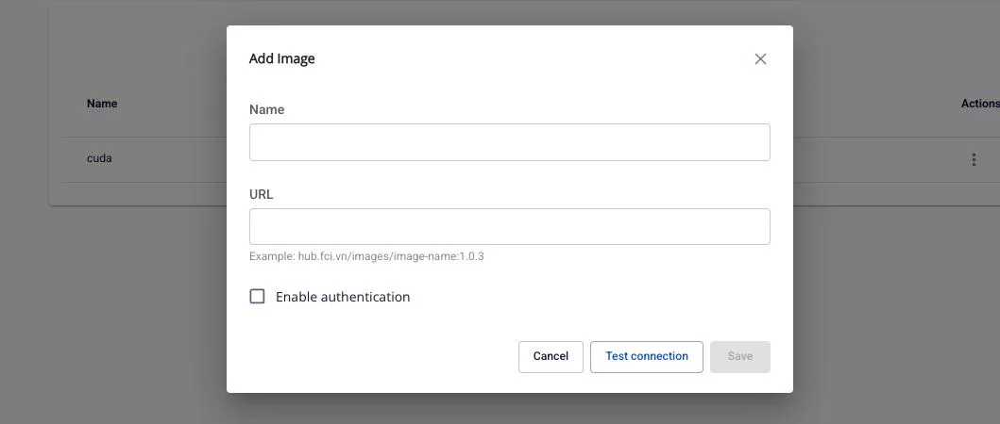
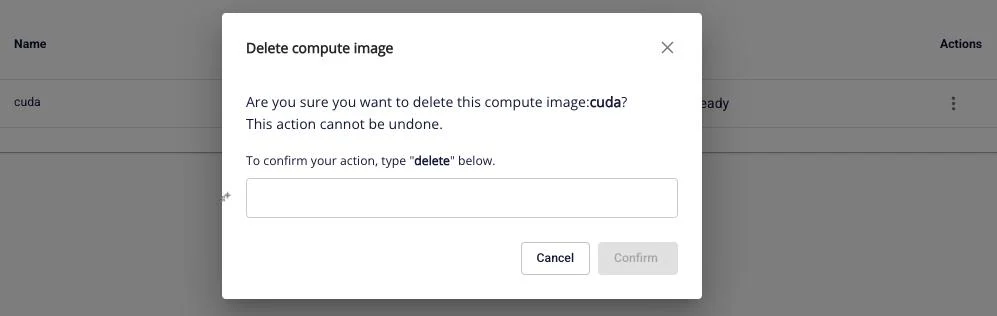

# Manage Compute Images

The **Prepulling Image** feature allows users to manage Docker images pulled into the workspace from various registries. Pre-pulling images optimizes container startup time and ensures images are ready to use when needed.

**Benefits:**

  * Reduces container startup time
  * Centralized management of images required for compute
  * Supports both public and private registries
  * Real-time monitoring of image pull status

**Limit:** Each Processing Service can have a maximum of **5 computes**.

### 1\. View Compute Image List

To view the list of pre-pulled images on a compute, follow these steps:

**Step 1:** On the **Processing services** screen > select the **Compute** tab

**Step 2:** Click on the compute whose image list you want to view

**Step 3:** Select the **Images** tab

**Result:** The list of images added to the compute is displayed with the following information:

  * **Name**: Image identifier name
  * **URL**: Full path to the image registry
(e.g., `docker.io/nvidia/cuda:13.1.0-devel-ubuntu24.04`)
  * **Status**: Current status of the image
    * **Ready**: Image is ready to use
    * **Progressing**: Image pull is in progress
    * **Processing**: Being processed
    * **Failed**: Image pull failed
    * **Degraded**: Image has an issue (icon available to view detailed logs)
    * **Unknown**: Unknown status
  * **Actions**: Image operation menu (Update, Retry, Delete)

**Note:** If no images exist yet, the screen will display the message "No image yet" with a **Create** button to add a new image.

### 2\. Add New Image

#### Add Image from Public Registry (no authentication required)

**Step 1:** On the **Images** tab of the Compute, click the **Create** button

**Step 2:** In the **Add Image** popup, enter the following information:

  * **Name**: Image identifier name (required)
    * Only letters, numbers, and hyphens (-) are accepted
    * Maximum 30 characters
    * Example: `nginx-latest`, `cuda-13-1-0`
  * **URL**: Path to the image (required)
    * Format: registry/repository/image-name:tag
    * Example: docker.io/library/nginx:latest
    * Example: hub.fci.vn/images/image-name:1.0.3

**Step 3:** Ensure the **Enable authentication** checkbox is not selected (for public images)

**Step 4:** Click the **Test connection** button to verify the connection to the registry

  * If successful: Displays the message "Success - Test connection successfully"
  * If failed: Displays a detailed error message

**Step 5:** After a successful test connection, the **Save** button will be enabled

**Step 6:** Click the **Save** button

**Result:**

  * Displays the message "Success - Add successfully"
  * The new image appears in the list with **Progressing** status
  * After the pull completes, the status changes to **Ready**

#### Add Image from Private Registry (with authentication)

**Step 1:** On the **Images** tab of the Compute, click the **Create** button

**Step 2:** In the **Add Image** popup, enter the following information:

  * **Name**: Image identifier name
  * **URL**: Path to the private image

**Step 3:** Check the **Enable authentication** checkbox

**Step 4:** Enter the authentication information:

  * **Username**: Username or service account (required)
  * **Secret**: Access token or password (required)
    * Click the view icon to show/hide the password

**Step 5:** Click the **Test connection** button to verify the connection

**Step 6:** After a successful test connection, click the **Save** button

**Result:** The image is added to the list and the pull process begins with the provided authentication.

### 3\. Update Image

Users can update information for an existing image (name, URL, authentication). When updated, the system will automatically re-pull the image with the new information.

**Step 1:** In the Images list, click the **⋮** icon (vertical three dots) in the **Actions** column for the image to update

**Step 2:** Select **Update** from the dropdown menu

**Step 3:** In the **Update Image** popup, the fields will display the current image information

**Step 4:** Edit the required information:

  * Change **Name** (following the rules: letters, numbers, hyphens, max 30 characters)
  * Change **URL**
  * Enable/Disable **authentication**:
    * If enabled: Enter new Username and Secret
    * If disabled: Remove authentication (for public images)

**Step 5:** Click the **Test connection** button to verify the new configuration

**Step 6:** After a successful test, click the **Save** button

### 4\. Retry Image

When an image has a **Failed** or **Degraded** status, users can retry to re-pull the image.

**Step 1:** In the Images list, click the **⋮** icon for the image with Failed/Degraded status

**Step 2:** Select **Retry** from the dropdown menu

**Step 3:** In the **Retry compute image** popup, confirm the information:

**Step 4:** Click the **Confirm** button to confirm the retry

### 5\. Delete Image

Users can remove images that are no longer needed from the compute.

**Step 1:** In the Images list, click the **⋮** icon for the image to delete

**Step 2:** Select **Delete** (red) from the dropdown menu

**Step 3:** In the **Delete compute image** popup, read the warning:

**Step 4:** To confirm deletion, type `delete` (lowercase) exactly in the input field

**Step 5:** The **Confirm** button will be enabled after the correct input is entered

**Step 6:** Click the **Confirm** button

### 6\. View Image Logs

When an image has a **Degraded** status, users can view detailed logs to troubleshoot the issue.

**Step 1:** In the Images list, find the image with **Degraded** status (with icon beside it)

**Step 2:** Click the information icon

**Step 3:** The **Logs** popup will display with detailed log content

**Example log:** _[2020-07-07 15:04:29,334] DEBUG Progress event:
TRANSFER_PART_COMPLETED_EVENT, bytes: 0
(io.confluent.connect.s3.storage.S3OutputStream:286)_

**Step 4:** Read and analyze the logs to identify the cause of the error

**Step 5:** Click the X icon to close the log popup

**Result:** The popup closes and returns to the Images list screen
