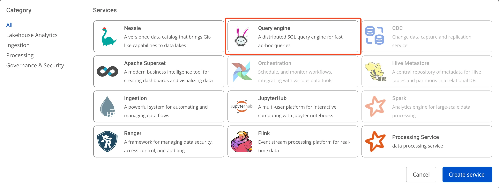
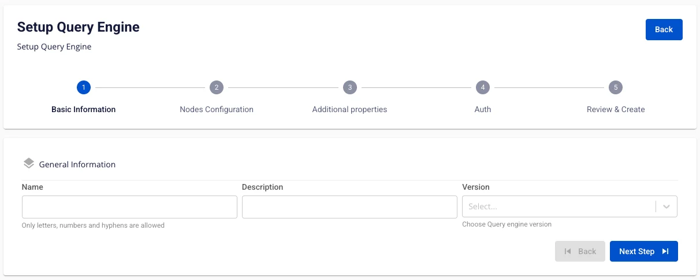
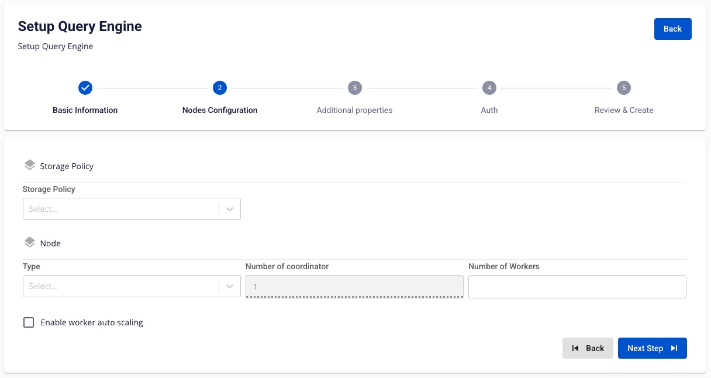
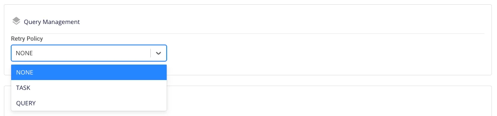
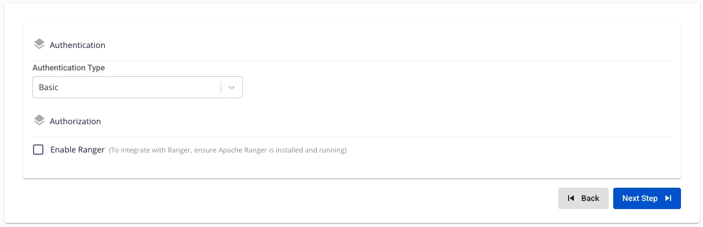
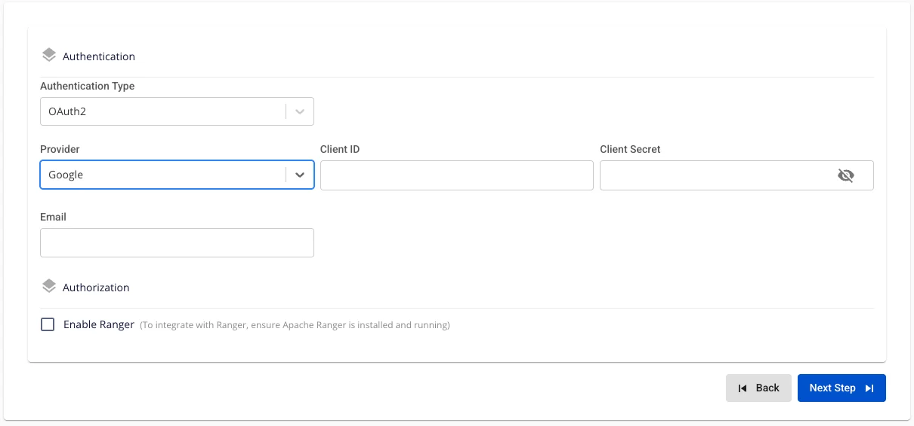
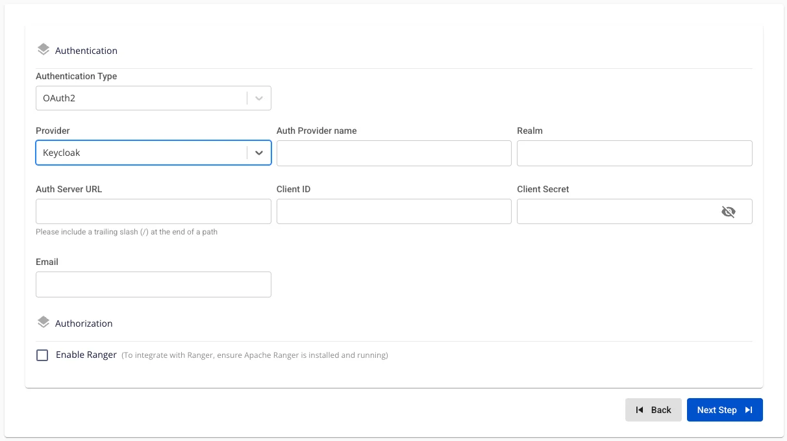
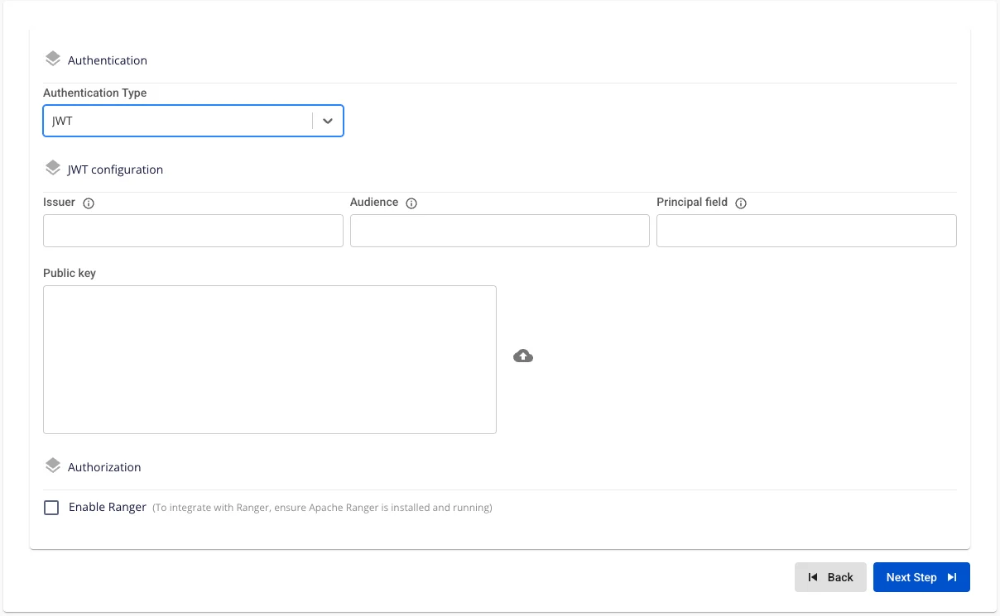
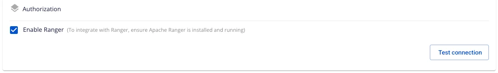

# Create Query Engine

**FPT Query Engine** uses **Trino**, an open-source distributed SQL query engine designed to process queries quickly and efficiently on large datasets. Trino allows you to query data from multiple sources — including relational databases, data warehouses, and non-relational data storage systems — without needing to move or copy the data.

To create a **Query Engine**, follow the steps below:

**Step 1:** In the menu bar, select **Data Platform** > **Workspace Management** > **Workspace name**

**Step 2:** In the **My services** section, click **Create** > the popup appears, select **New service**, choose **Trino** > **Create**

**Step 3:** In the **Query Engine** creation form, enter the **Basic Information** details:

 * **Name** (required): Service name

Note: The service name must be 1 to 30 characters. It may contain lowercase letters a-z, uppercase letters A-Z, or digits 0-9.

 * **Description** (optional): Description

 * **Version** (required): Select the version

**Step 4:** Click **Next** to proceed to the **Node configuration** screen

Enter the following information:

 * **Storage policy** (required): Select Storage for Query Engine

 * **Type** (required): Select the configuration type for Query Engine

 * **Number of coordinator**: Default is 1

 * **Number of workers** (required): Enter the number of workers

**Note:** The number of **Workers** must be greater than or equal to **1** and less than or equal to **10**.

To automatically scale the Worker configuration, check **Enable worker auto scaling** > enter the maximum number of nodes for the Worker.

**Step 5:** Click **Next** to proceed to the **Additional Properties** screen

Enter the following information:

 * **Max memory (GB)**: Enter the Max memory value; default is 20.

This is the maximum amount of memory that a query can use across the entire cluster. User memory is allocated during execution for tasks directly related to, or controllable by, the user's query — for example, memory used by hash tables created during execution, memory used during sorting, etc. When the user memory allocated for a query across all workers reaches this limit, the query will be terminated.
**Note:** The **Max memory** value must be greater than or equal to 1.

 * **Retry policy**: Select a Retry policy; default is **NONE**.

   * **NONE**: Disables fault-tolerant execution mode.

   * **TASK**: Retries individual tasks within a query when an error occurs. Requires an **exchange manager** to be configured.

   * **QUERY**: Retries the entire query when an error occurs.

 * **Custom Domain**

   * **Purpose:** Allows configuration of a custom domain to access services.

     * **For Public Workspace:** Used to assign a domain and certificate without needing to enable/disable TLS (HTTPS is always available).

     * **For Private Workspace:** In addition to domain and certificate, users can optionally enable or disable TLS/SSL to choose between HTTPS and HTTP.

   * **Workspace is Public**

     * **Custom domain**: Check to enable custom domain.

     * **Domain**: Enter the domain name (e.g., abc.local, jupyter.example.com).

     * **Certificate name**: Select from the list of certificates imported in **Certificate Manager**.

     * **Buttons**:

       * **Manage certificate**: Open the certificate management screen.

       * **Validate**: Verify the certificate is valid for the domain.

:::note
For a Public Workspace, the **TLS/SSL certificate** option is **not displayed** — the system supports HTTPS by default.
:::

   * **Workspace is Private**

     * **Custom domain**: Check to enable custom domain.

     * **Domain**: Enter the domain name.

     * **TLS/SSL certificate**: Check to enable HTTPS for services.

     * **Certificate name**: Select from the certificate list.

     * **Buttons**:

       * **Manage certificate**: Open certificate management.

       * **Validate**: Verify the certificate.

:::note
If **TLS/SSL certificate** is unchecked, the service will run on HTTP and no certificate is required.
:::

**Step 6:** Click **Next** to proceed to the **Auth** screen

**Authentication Type:**

 * **Authentication Type = Basic**

   * Query Engine is initialized with **Basic authentication**.

 * **Authentication Type: OAuth2**

   * **Provider: FPT ID**. Enter the following information:

     * Email (required): FPT email address used as the admin account.

   * **Provider: Google**. Enter the following information:

     * **Client ID (required)**: Application identifier (obtained from Google Cloud → OAuth Credentials).

     * **Client Secret (required)**: Secret string associated with the Client ID, used to authenticate the application.

     * **Email (required)**: Gmail or Workspace address of the administrator initializing the engine.

Before testing the connection, ensure that Google Cloud has added the Query Engine's redirect URI to the allowed list.

   * **Provider: Keycloak**. Enter the following information:

     * Auth Provider Name (optional): Provider name

     * Realm (required): A management space in which all users, groups, roles, clients, and other objects are managed and secured independently.

     * Auth Server URL (required): The base URL of the Keycloak server used by clients for authentication. **Must end with "/"**.

     * Client ID (required): An ID code used to authenticate the client with Keycloak.

     * Client Secret (required): The password used to authenticate the client with Keycloak.

     * Email (required): Email address in Keycloak.

 * **Authentication Type: LDAP**. Enter the following information:

   * **URL (required)**: LDAP path, e.g., ldap://ldap.example.com:389 or ldaps://ldap.example.com:636.

   * **Base DN (required)**: Query root, e.g., dc=example,dc=com.

   * **Username (required)**: Bind DN with search permissions (e.g., cn=admin,dc=example,dc=com).

   * **Password (required)**: Bind DN password.

   * **User Bind Pattern (optional)**: DN pattern for finding users, e.g., uid={0},ou=People,dc=example,dc=com.

   * **Group Auth Pattern (required)**: DN pattern for querying groups, e.g., cn={0},ou=Groups,dc=example,dc=com.

 * **Authentication Type: JWT**

Enter the following information:

   * **Issuer (required)**: The iss claim value that Query Engine must match.

   * **Audience (optional)**: The aud claim value (if the JWT system uses this field).

   * **Principal Field (required)**: The claim name containing the username (typically sub or email).

   * **Public Key (required)**: PEM-formatted public key (paste directly or upload a file) for Query Engine to verify the JWT signature.

     * It is recommended to use RSA or EC keys of 2048 bits or more; the PEM file must begin with -----BEGIN PUBLIC KEY-----.

**Authorization: Integrate Ranger**

 * **Enable Ranger** = False (Query Engine is initialized in standard mode, with **no** policies applied from Ranger.)

 * **Enable Ranger** = True

   * Check **Enable Ranger** → The UI automatically displays the **Test connection** button.

   * Click **Test connection** to verify the connection to **Ranger** for integration. **Query Engine** can only be initialized with **Authentication type** set to **Integrate Ranger** when Test Connection succeeds.

To use Ranger for authentication control and permission management for Trino, users must initialize the **Data Governance** (**Ranger**) service before initializing the **Query Engine** service.

Initialize **Ranger** [here](https://fptcloud.com/documents/cloud-data-platform/?doc=tao-ranger)

**Step 7:** Click **Next** to proceed to the **Review & Create** screen

**Step 8.** Review the entered information, then click **Create** to complete.

**Query Engine** initialization is complete when the **Worker Status** is **Succeeded** and the **Status** of **Trino** is **Healthy** (~10 minutes).
