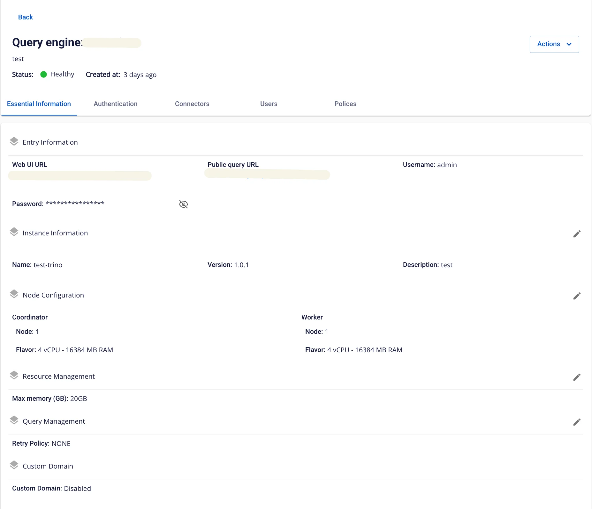
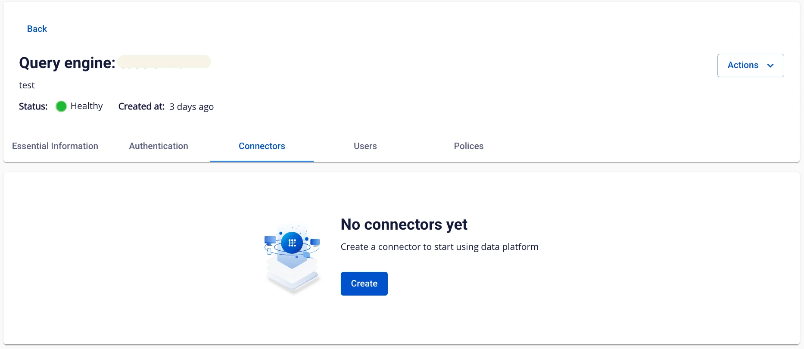
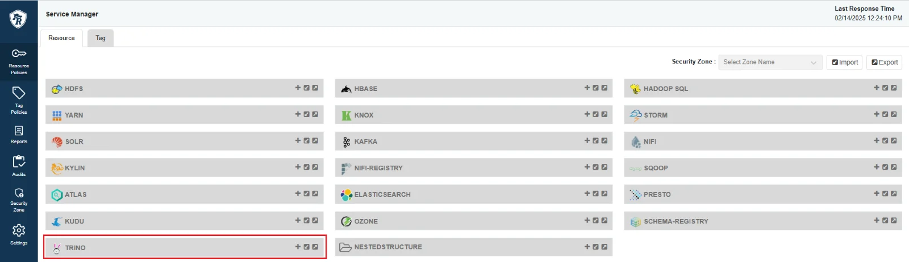
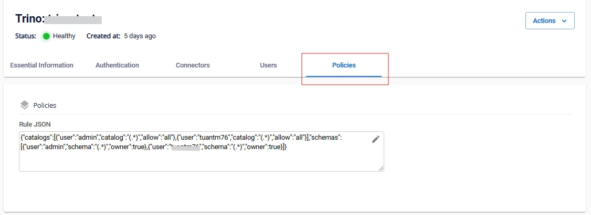

# View Query Engine Details

To view **Query Engine** information, follow the steps below:

**Step 1:** In the menu bar, select **Data Platform** > **Workspace Management** > **Workspace name**

**Step 2:** In the **My services** section, select **Query Engine**

The screen displays 5 tabs: **Essential Information**, **Authentication**, **Connectors**, **Users**, **Policies**

**_1\. Essential Information_**

Displays detailed information about the Query Engine.

**_2\. Authentication_**

Displays the authentication information of the **Query Engine**.

**_3\. Connectors_**

Displays the **Connector** information of the **Query Engine**.

**_4\. Users_**

Displays the list of **Users** for the **Query Engine**.

**_5\. Policies_**

Displays the **Policies** information of the **Query Engine**. If the Authentication type is **Integration Ranger**, the **Query Engine** does not display the **Policies** tab — all access control configuration is performed through **Ranger-Admin**.

