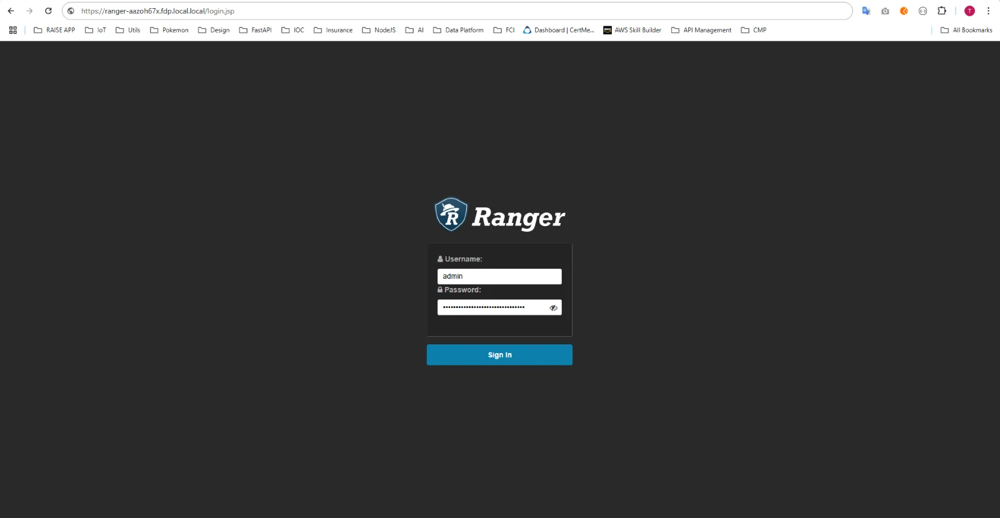

# Access and Configure Query Engine Management

**Precondition**: The **Query Engine** service has been successfully initialized, the **Workspace** status is **Succeeded**, and the **Trino** status is **Healthy** (initialize the Query Engine service **here**).

**Step 1.** Access **Ranger** using the **URL** on the **Essential information** tab along with the **Username** / **Password**.

**Step 2:** Create a Trino Service from **Ranger Admin**. On the **Service Manager** screen, select **Resource TRINO** and click the **Add** icon.

**Step 3.** Enter the **Service** initialization information:

 * **Service name**: Service name (a string found in the **Trino** access URL, in the format: **trino-xxxxxxxx**)

 * **Display name**: Display name

 * **Description**: Description

 * **Active Status**: Status of the **Service**

 * **Select Tag Service**: Select the tag service

 * **Username**: Login account username for Query Engine

 * **Password**: Login password for Query Engine

 * **jdbc.driverClassName**: Default is io.trino.jdbc.TrinoDriver

 * **jdbc.url**: JDBC connection address for Query Engine (**jdbc:trino://:443**)

 * **Superusers**: Account names that will bypass access control checks when connecting to Query Engine

 * **Superuser groups**: Group names whose members will bypass access control checks when connecting to Query Engine

 * **Service admin users**: Account names on Ranger designated as Service admins

 * **Service admin usergroups**: Group names on Ranger designated as Service admins

**Step 4.** Save the **Service** information.

After entering all required information, click **Add** to save the **Service** information for **Query Engine** into **Ranger-Admin**.

**Step 5:** Verify the connection

 * On the Service Manager screen, click the **Edit** icon for the **Trino Service** just created, then click **Test connection**.

 * Confirm that **Ranger-Admin** has successfully connected to **Query Engine** (**Trino**) when the **Test connection** result shows **Connected Successfully**.

