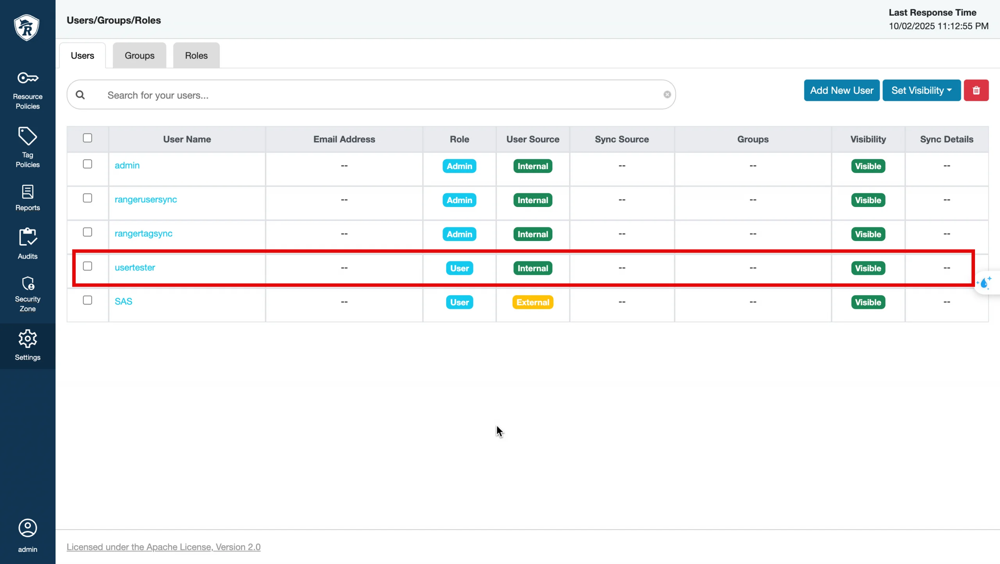

# Tag Sync (OpenMetadata & Ranger Integration)

The **Tag Sync** feature allows synchronization of tags from **OpenMetadata** to **Apache Ranger**, enabling expanded permission management in **Trino** based on tags (in addition to resources).

**Steps**

**_Step 1: Portal_**

On the Portal, you need to create all 3 components:

 1. OpenMetadata
 2. Apache Ranger
 3. Trino

When creating the **Trino cluster**, you must check **Integrate Ranger** to allow Trino to use permissions from Ranger.

**_Step 2: Create Resource Policies for Trino in Ranger_**

Go to **Ranger > Service Manager > Resource Tab** → select the Trino service just created (e.g., trino-msu9test).

**Note:** The service name must match the cus_app_id of Trino.

This is a mandatory prerequisite for Trino to function and for OpenMetadata to test the connection successfully. If the basic Resource Policies are missing, when creating the Trino service in OM → Test Connection will fail.

**_Step 3: Create Trino Service in OpenMetadata_**

 1. Go to **OpenMetadata > Settings > Services > Databases** → click **Add New Service**.

 2. Select **Trino** → click **Next**.

 3. Fill in the service details:

**Service Name** (e.g., trino-tester).

**Username, Password, Host, Port** (pointing to the Trino cluster just created on the portal).

 4. Click **Test Connection** → if successful, click **Save**.

 5. Go to the **Ingestion** tab of the Trino service → click **Add Ingestion**.

Fill in the Database/Schema/Table Filter Pattern.

Run ingestion.

 6. After ingestion succeeds, the Trino DB appears in **Explore**.

 7. Go to **Explore > Database Trino** → assign a tag to a column (e.g., tag _Sensitive_ for the custkey column in the customer table).

**_Step 4: Create Tag Service & Trino Service in Ranger_**

 1. Go to **Ranger dashboard > Service Manager > Tag Tab** → click **Add New Service** to create the **Tag Service** first (e.g., trino-msu9test-tag).

 2. Go to **Service Manager > Resource Tab** → edit **Service Trino** (e.g., trino-msu9test).

In the Trino service config → set the **Select Tag Service** field = trino-msu9test-tag.

 3. Go to **Settings > Users** → click **Add New User**:

Create a user (e.g., usertest) with role = User.

The username must match the user created in the Trino portal.

 4. Go to **Resource Policies** → add user usertest to the default policies.

a. Check/Add the default policies:

   * **all – trinouser**

   * **all - queryid**

b. Add a new policy (**policy-customer-access**):

   * Catalog = tpch

   * Schema = sf1, information_schema

   * Table = customer, columns, schemata, tables

   * Column = custkey

:::note
information_schema, columns, schemata, tables → required for Trino to read metadata (show tables, describe, etc.).
:::

customer → the business table you want to allow.

c. In **Allow Conditions**, add user (e.g., usertest) → Permission = Select.

d. Save the policy.

**_Step 5: Configure Tag Sync on the Ranger Service_**

 1. Go to **Data Platform > Data Governance (Ranger) > Advanced > Tag Sync**.

 2. Check **Enable Tag Sync**.

 3. Retrieve the **JWT Token** from OpenMetadata:

Go to **Settings > Bots** → select the tagsync-bot → **Credentials** tab → copy the token.

Paste it into the **JWT Token** field.

 4. In the **Service mappings** section, select:

**OpenMetadata service** = the Trino service created in OpenMetadata.

**Ranger service** = the Trino service created in Ranger.

At least 1 mapping is required; up to 5 mappings are allowed.

 5. Click **Test Connection**.

If successful → _"Connection successful"_ is displayed, and the **Save** button becomes active.

If failed → an error is displayed, and saving is not possible.

 6. When **Test Connection** succeeds, click **Save** to save the configuration.

**_Step 6:_** Go to **Tag Policies** → select the _Sensitive_ tag → click **Add New Policy**:

 1. Policy Name: allow-sensitive.

 2. Allow Conditions: user = usertest, component = TRINO, check all permissions.

 3. Save.

**_Step 7: Test access with queries_**

**_Only usertest is granted access to the customer table; usertest does not have query permissions on the orders table._**

**Case 1 – User is Allowed & has permission to query the custkey column**

 1. Use **DataGrip** to connect to Trino with user usertest.

 2. Run the query:

`SELECT custkey FROM tpch.sf1.customer LIMIT 1;`

 3. **Expected result:** Table data is returned.

**Case 2 – User is Allowed & does not have permission to query the table**

 1. **DataGrip** connects to Trino with user usertest.

 2. Run the query:

`SELECT * FROM tpch.sf1.customer LIMIT 1;`

 3. **Expected result:** The query is denied with a _no permission_ message.

**Case 3 – User is Denied & does not have permission to query the custkey column**

 1. Create another user (e.g., usertest2).

 2. Assign the Personal tag to the custkey column.

 3. In **Tag Policies** → create a Deny policy for tag Personal for user usertest2.

 4. Use **DataGrip** to connect to Trino with user usertest2.

 5. Run the query:

`SELECT custkey FROM tpch.sf1.customer LIMIT 1;`

 6. **Expected result:** The query is denied with a _no permission_ message.
