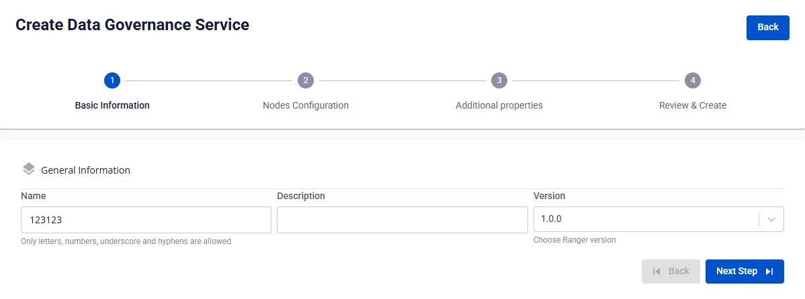
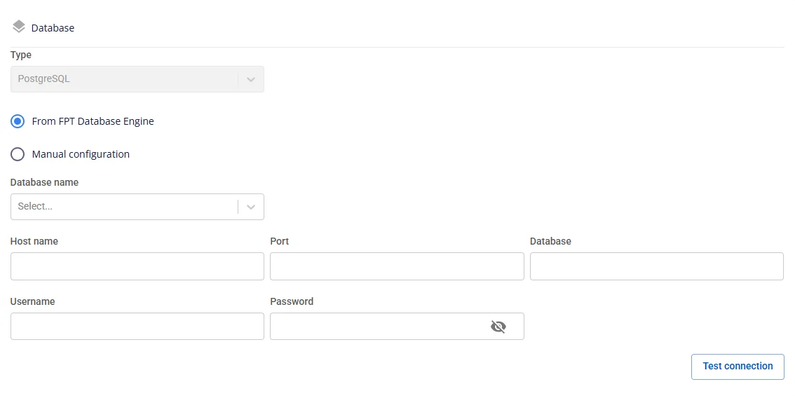
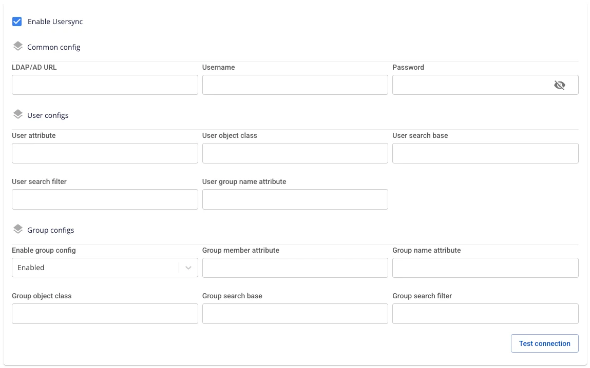

# Create Ranger

**FPT Data Governance** uses **Ranger** as a security management and access control solution for the **Lakehouse** solution for **Query Engine** (**Trino**). It provides centralized and granular access management, supporting control based on Role-Based Access Control (RBAC) and Attribute-Based Access Control (ABAC).

To create **Data Governance**, follow the steps below:

**Step 1:** In the menu bar, select **Data Platform** > **Workspace Management** > **Workspace name**

**Step 2:** In the **My service** section, click **Create** > the popup appears, select **New service**, choose **Ranger** > **Create**

**Step 3:** In the **Data Governance** creation form, enter the **Basic Information** details:

 * **Name** (required): Service name

Note: The service name must be 1 to 30 characters. It may contain lowercase letters a-z, uppercase letters A-Z, or digits 0-9.

 * **Description** (optional): Description

 * **Version** (required): Select the version

**Step 4:** Click **Next** to proceed to the **Node configuration** screen

Enter the following information:

 * **Storage policy** (required): Select a storage policy

 * **Type** (required): Select the resource configuration

**Step 5.** Click **Next** to proceed to the **Additional properties** screen

 * **Database** (Database information for storing **Data Governance** data. Users can use a database created on the **FPT Database Engine** service or any other database.)

When **type** is **PostgreSQL**:

 * **Host name (required)**: Hostname or IP address of **Postgres**

 * **Port (required)**: Connection port, default is 5432

 * **Database name (required)**: Database name

 * **Username (required)**: Account username for accessing **Postgres**

 * **Password (required)**: Password for accessing **Postgres**

After entering all **Database** information, click **Test connection** to verify the connection from the **Workspace** to the entered **Database**.

Enter **Audit logs database** information:

 * **Type (required)**: OpenSearch or Elasticsearch

:::note
In the **Configure Parameters** of **OpenSearch**, the ssl_http parameter must be set to False (HTTP) instead of the default value True (HTTPS).
:::

 * **Protocol (required)**: Select http or https

 * **Host name (required)**: Access address

 * **Port (required)**: Connection port

 * **Username (required)**: Account username

 * **Password (required)**: Password

 * **Index (required)**: Index

Click **Test connection** to verify the connection from the **Workspace** to the **Audit logs database**.

**Usersync:** (Automatically syncs users and groups from LDAP/AD into Ranger, enabling centralized permission management and reducing manual creation.)

 * **Enable Usersync** (optional): Default is **unchecked**.

   * **Unchecked** → Ranger does not sync LDAP; no additional fields are displayed.

   * **Checked** → Opens the configuration sections below.

 * When **Enable Usersync** = checked, enter the following information:

   * **LDAP/AD URL (required)**: ldap://host:port or ldaps://host:port.

   * **Password (required)**: Password of the bind account.

   * **Username (required)**: Bind account with read permissions (e.g., cn=admin,dc=example,dc=com).

   * **User attribute (required)**: Attribute used as the username in Ranger (uid, sAMAccountName, cn, etc.).

   * **User object class (required)**: Object type containing users (person, inetOrgPerson, user, etc.).

   * **User search base (required)**: Root DN for user search, e.g., ou=Users,dc=example,dc=com.

   * **User search filter (optional)**: Additional filter if needed, e.g., (&(objectClass=person)(department=IT)).

   * **User group name attribute (optional)**: Attribute storing the group list on the user (typically memberOf).

   * **Enable group config**: Select Enabled to sync groups.

   * **Group member attribute (optional)**: Attribute listing members (member, uniqueMember, memberUid).

   * **Group name attribute (required when Enabled)**: Attribute for group name (cn).

   * **Group object class (required when Enabled)**: Group object type (groupOfNames, group, etc.).

   * **Group search base (required when Enabled)**: Root DN for group search, e.g., ou=Groups,dc=example,dc=com.

   * **Group search filter (optional)**: Advanced filter, e.g., (&(objectClass=group)(cn=dev*)).

After filling in all information, click **Test connection** to verify that Ranger can connect to LDAP/AD successfully.

 * **Custom Domain**

   * **Purpose:** Allows configuration of a custom domain to access services.

     * **For Public Workspace:** Used to assign a domain and certificate without needing to enable/disable TLS (HTTPS is always available).

     * **For Private Workspace:** In addition to domain and certificate, users can optionally enable or disable TLS/SSL to choose between HTTPS and HTTP.

   * **Workspace is Public**

     * **Custom domain**: Check to enable custom domain.

     * **Domain**: Enter the domain name (e.g., abc.local, jupyter.example.com).

     * **Certificate name**: Select from the list of certificates imported in **Certificate Manager**.

     * **Buttons**:

     * **Manage certificate**: Open the certificate management screen.

     * **Validate**: Verify the certificate is valid for the domain.

:::note
For a Public Workspace, the **TLS/SSL certificate** option is **not displayed** — the system supports HTTPS by default.
:::

   * **Workspace is Private**

     * **Custom domain**: Check to enable custom domain.

     * **Domain**: Enter the domain name.

     * **TLS/SSL certificate**: Check to enable HTTPS for services.

     * **Certificate name**: Select from the certificate list.

     * **Buttons**:

     * **Manage certificate**: Open certificate management.

     * **Validate**: Verify the certificate.

:::note
If **TLS/SSL certificate** is unchecked, the service will run on HTTP and no certificate is required.
:::

**Step 6:** Click **Next Step** to proceed to the **Review & Create** screen

**Step 7.** Review the entered information, then click **Create** to complete.

**Data Governance** initialization is complete when the **Worker Status** is **Succeeded** and the **Status** of **Ranger** is **Healthy** (~10 minutes).
