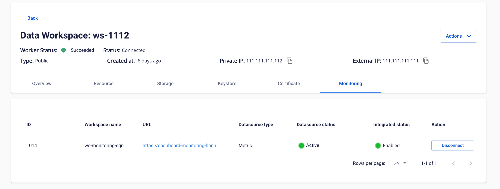

# Monitoring

### 1. Connect to Monitoring Workspace

To integrate with Monitoring Workspace, follow these steps:

**Step 1:** On the Workspace Details screen, switch to the **Monitoring** tab

**Step 2:** In the Monitoring Workspace information table, review the following fields:

 * **ID**: Workspace ID

 * **Workspace name**: Workspace name

 * **URL**: URL to access the Monitoring Dashboard

 * **Datasource type**: Datasource type (Metric)

 * **Datasource status**: Datasource status (Activating, Active, Active Failed, Inactive, Deactivate Failed)

 * **Integrated status**: Integration status (Enabled/Disabled)

**Step 3:** Click the **Integrate** button in the Action column

**Step 4:** The system establishes a connection to the Monitoring Workspace

### 2\. Configure and Use the Monitoring Dashboard

After a successful integration, to view and configure the Monitoring Dashboard, follow these steps:

**A. Access the Monitoring Dashboard**

**Step 1:** On the Workspace **Monitor** tab, click the **URL** in the Monitoring Workspace information table

**Step 2:** The system opens the Monitoring Dashboard in a new tab

**B. Import Dashboard Template**

**Step 3:** In the Monitoring Dashboard, select the left menu > **Dashboards**

**Step 4:** Click **New** > select **New folder**

**Step 5:** Enter a folder name (e.g., "Workspace Monitoring") > click **Create**

**Step 6:** Navigate into the newly created folder > click **New** > select **Import**

 * [Template link](<https://fptsoftware362.sharepoint.com/:f:/r/sites/FCI_CLOUD/XPLAT/Shared%20Documents/PRODUCT/FDP%20\(Data%20Platform\)/Documentation/4.%20User%20Guide/Template?csf=1&web=1&e=G2aD50>)

**Step 7:** On the Import Dashboard screen:

 * Click **Upload JSON file** or drag and drop the dashboard template file

 * The dashboard template file is provided by the system (in .json format)

**Step 8:** After a successful upload:

 * Verify the dashboard information (Name, UID, Folder)

 * Select the **Datasource** corresponding to the integrated API Gateway

 * Click **Import** to complete

**Step 9:** The dashboard is created and displays the service metrics
