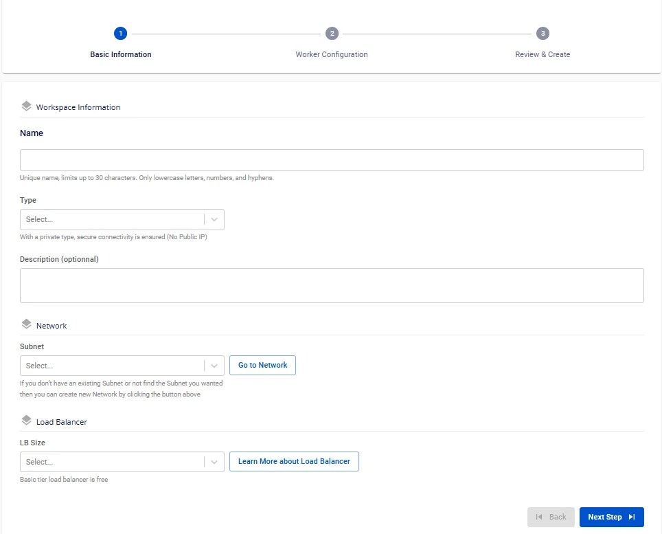
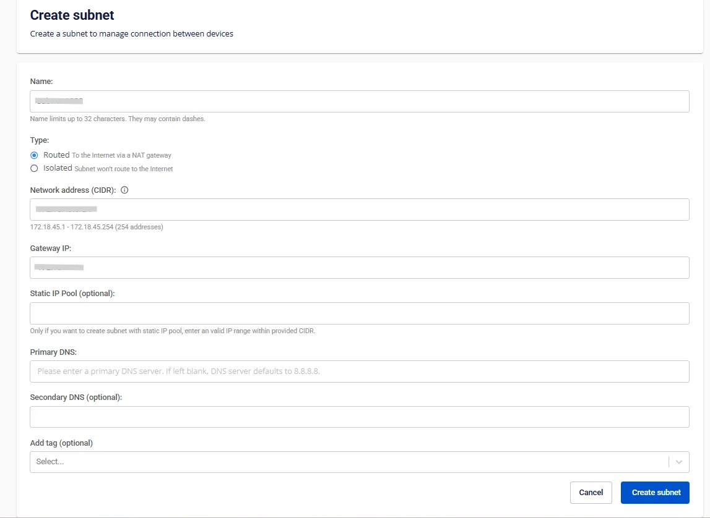
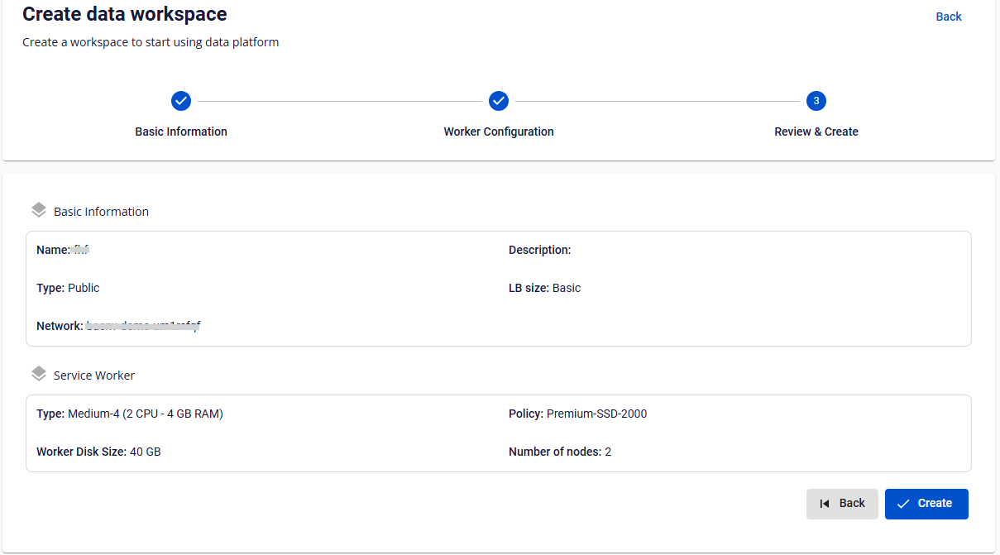

# Create workspace

**Workspace** is the user's working environment on the **Data Platform** system. The primary purpose of a **Workspace** is to provide an isolated and secure environment where users can perform data-related operations efficiently and conveniently.

To create a workspace, follow these steps:

**Step 1.** In the menu bar, select **Data Platform** > **Workspace Management** > click **Create a Data Workspace**

**Step 2.** In the workspace creation form, enter the **Basic Information**:

 * **Name** (required): Workspace name

:::warning
The workspace name must be between 1 and 30 characters. It can contain lowercase letters a-z, uppercase letters A-Z, or digits 0-9. Workspace names must be unique. Spaces are not allowed — use "-" or "_" instead.
:::

 * **Description** (optional): Workspace description

 * **Type** (required): Select **Public** or **Private**

 * **Subnet** (required): Select a network

Workspaces only work with Subnets that have the **Static Pool** option enabled. Therefore, you need to create a Subnet with a Static Pool by following these steps:

Click **Go to Network**

The screen switches to the Subnet creation screen. Click **Create Subnet**

In the Subnet creation form, enter the following information:

 * **Name**: Enter the Subnet name

 * **Type**: Select the Subnet type

:::warning
Select **Routed** as the Type
:::

 * Network address (CIDR): Enter a valid CIDR

 * Gateway IP: Enter the gateway IP address

 * Static IP Pool (optional): Enter a valid IP range taken from the CIDR.

:::warning
**Static IP Pool** information is required
:::

 * **Primary DNS**: Primary DNS address

 * **Secondary DNS** (Optional): Secondary DNS address

 * **Add tag** (optional): Tag to attach to the subnet

Then click **Create subnet** to complete the Subnet creation.

 * **LB Size** (required): Select the correct allocated LB

:::warning
Check your LB quota before creating a **Workspace** by selecting **Dashboard** from the menu, then choosing **detail** under the **load balancer** section. If no quota is available, please contact sales support.
:::

**Step 3.** Click **Next Step** to proceed to the **Worker Configuration** screen

Enter the **Worker Configuration** information:

 * **Policy** (required): Select the **storage policy** for the **Service worker**

 * **Type**: Default value is Medium-4 (2 VCPU – 4 GB RAM)

 * **Number of nodes**: Default value is 2

**Disk (GB)**: Default value is 40

**Step 4.** Click **Next Step** to proceed to the **Review & Create** screen

**Step 5.** Review the information, then click **Create** to complete the workspace creation.

The **Workspace** is fully initialized when **Worker Status** is **Succeeded** and Status is **Connected** (~10 minutes).
