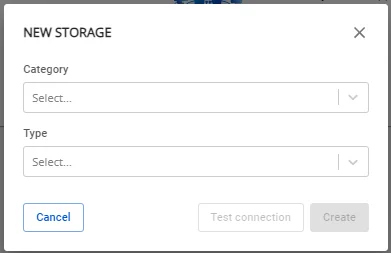
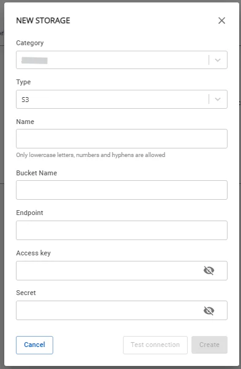

# View workspace information

To view workspace information, follow these steps:

**Step 1.** In the menu bar, select **Data Platform** > **Workspace Management**

**Step 2.** Click on a **workspace name**

The screen displays 3 tabs: **Overview**, **Resource**, **Storage**

**Overview Tab**

Displays all **services** installed in the workspace

**Resource Tab**

Displays the **Resource** configuration for the workspace

**Storage Tab**

Manages the integrated data sources (**Mount**) on the **Workspace**.

To create storage, follow these steps:

**Step 1.** In the menu bar, select **Data Platform** > **Workspace Management** > click on a **workspace name**

**Step 2.** Select the **Storage** tab > click **Create**

**Step 3.** A dialog box appears. Select the following information:

 * **Category**:

   * **Airflow - Jupyterhub - Spark service**: Storage for the following services: **Airflow**, **Jupyterhub**, **Spark service**

   * **Flink**: Storage for **Apache Flink**

   * **Ingestion service**: Storage for **Ingestion service**

 * **Type**: Select the storage type: **S3** or **NFS**

**Step 4.** Click **Create**. The screen switches to the storage connection information form:

 * **Name** (required): Package name

 * **Bucket name** (required): Bucket name

 * **Endpoint** (required): Endpoint address

 * **Access key** (required): Access key

 * **Secret** (required): Secret key

After entering the connection information, click **Test connection** to verify the connection from the **Workspace** to the **S3** storage.

If the **Type** is **NFS**, the screen switches to the NFS storage connection information form:

 * **Version** (required): NFS version

 * **Port** (required): Connection port

 * **Name** (required): Storage name

 * **Server address** (required): NFS server address

 * **Directory** (required): Directory path

**Step 5.** Click **Create** to complete the storage creation.
