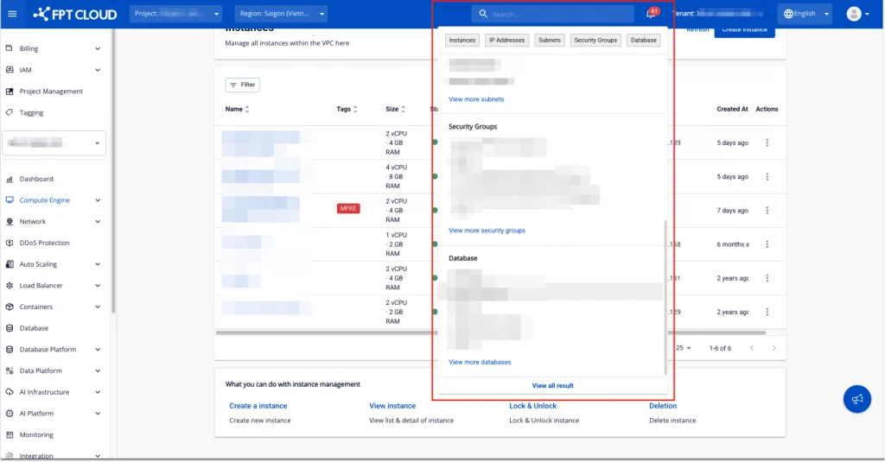
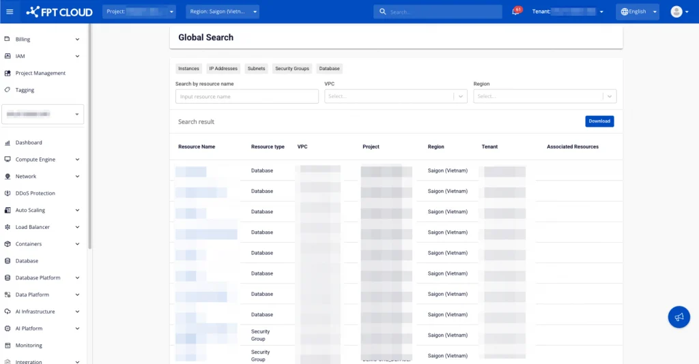
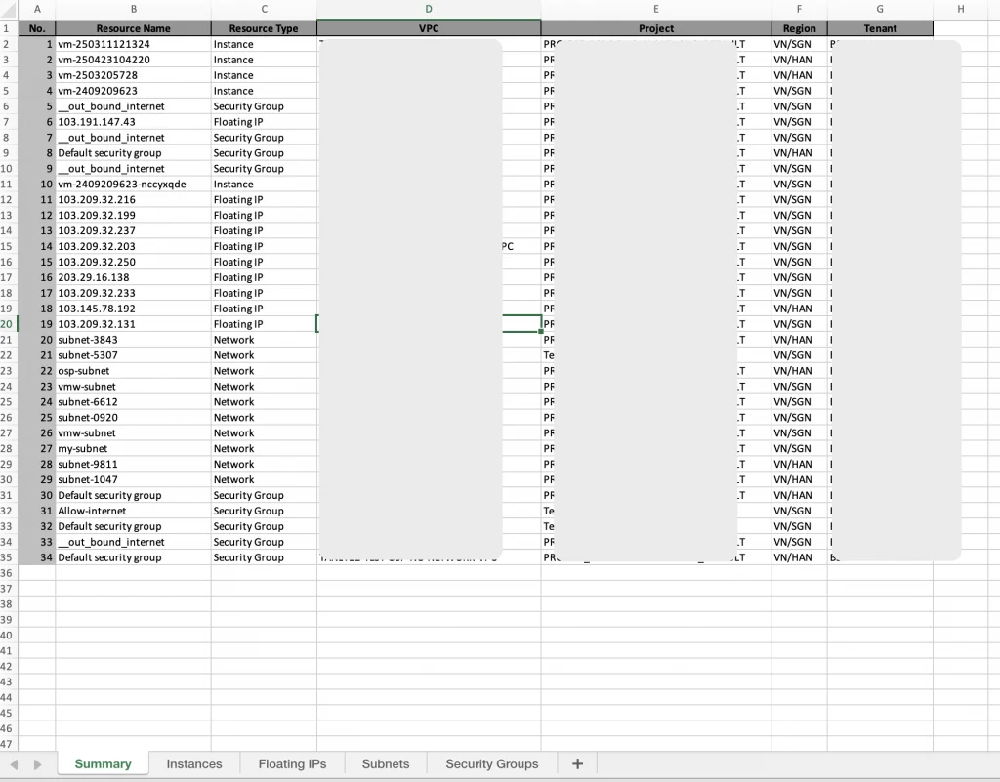
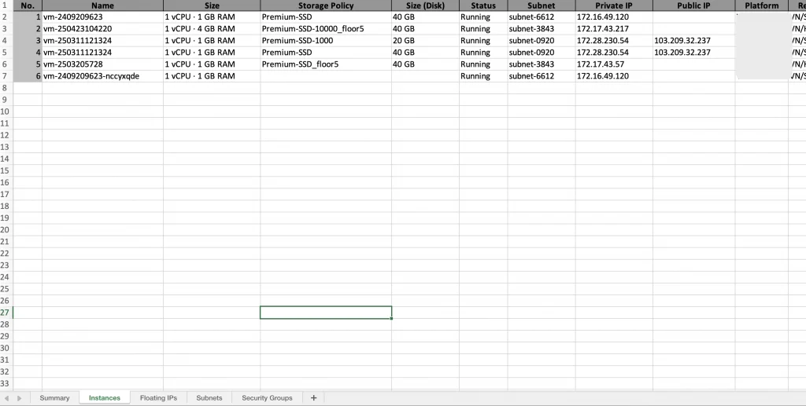

Global Search

The Global Search feature on FPT Cloud allows users to quickly search for resources within a Tenant's scope, including resource types such as **Instances, IP Addresses, Subnets, Security Groups, Database**, and more. This feature saves time and improves resource management efficiency on the FPT Cloud platform.

**Step 1.** Enter a keyword in the search box at the top of the FPT Cloud interface.

**Step 2.** Select one of the tabs — Instances, IP Addresses, Subnets, Security Groups, Database — to view results grouped by resource type.

  * Below each tab are the search results corresponding to each resource type.
    * Users can search for Public IP and Private IP addresses and apply them to VM NICs. Users can view resources attached to an IP (Associated Resource — current scope supports searching for Instances and Subnets by IP). Searching for IPs outside the described IP catalog (e.g., DHCP IPs, gateway IPs, etc.) is not supported.
  * Clicking on each result navigates to the detailed information screen for that resource. (Note: If a resource does not have a detailed information screen, the system will navigate to the list screen for that resource type.)

**Step 3.** To view all results, click **View all result**.

**Step 4.** The system will open a screen displaying all search results.

**Step 5.** Filter results using the VPC, Region filters or the "Search by resource name" search box.

**Step 6.** Click **Download** to download the result list file based on the results displayed on screen.

  * The downloaded file format is Excel with 6 sheets.

  * Sheet Summary: aggregates all search results for Instance, Floating IP, Subnet, Security Group, and Database resources.

  * Sheet Instances: groups Instances from the Summary sheet. Left blank if the Summary sheet has no data.

  * Sheet Floating IPs: groups Floating IPs from the Summary sheet. Left blank if the Summary sheet has no data.

  * Sheet Subnets: groups Subnets from the Summary sheet. Left blank if the Summary sheet has no data.

  * Sheet Security Groups: groups Security Groups from the Summary sheet. Left blank if the Summary sheet has no data.

  * Sheet Database: groups Database entries from the Summary sheet. Left blank if the Summary sheet has no data.
