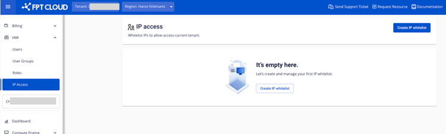

Create a new IP access record

**Step 1**: In the menu, select **IAM**, then choose the **IP access** tab. Here you can manage the list of users allowed to access.

**Step 2**: Select **Create**.

**Step 3**: On the IP access creation page, enter the IP access address information and the user list. Please read the instructions carefully before configuring. Then click "Create ip access".

  * IP Access: One or more IPs, IP ranges, or CIDR IPs can be selected.

  * Users: One or more users can be selected.

  * User groups: One or more user groups can be selected. All users in the group will be applied.

After successful creation, the record will appear in the list screen.

