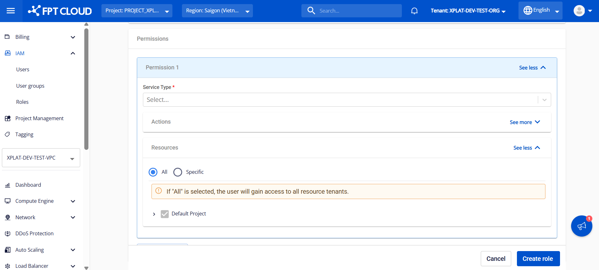
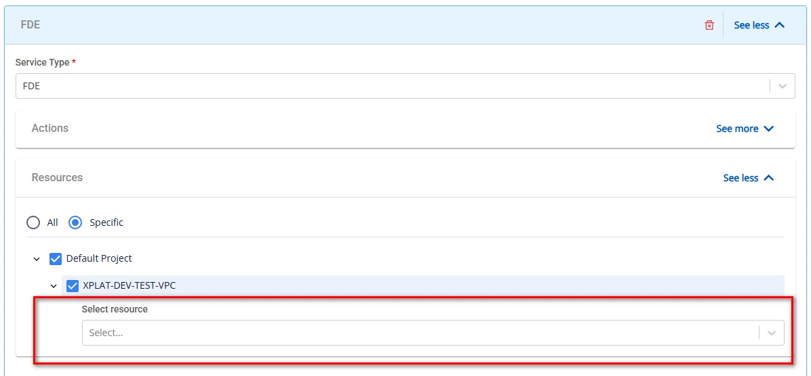

Role Management

Role is a core component of the IAM module on FPT Cloud Portal. The **Role Management** feature allows system administrators to define and assign roles with specific access permissions for users when using the FPT Database Engine service.

Using roles enhances security through detailed access control, applies the principle of least privilege, and supports separation of permissions according to individual needs and operational models.

The steps below provide detailed instructions for creating a new Role and assigning the corresponding access permissions to that role.

### Step 1: Access the Role Management page

Log in to FPT Cloud Portal. After successful login, from the main menu, select **IAM** > **Roles**. The **Role Management** interface will display the list of existing roles, along with options to create, edit, or delete a role.

### Step 2: Create a new role

On the **Role Management** page, click **Create role**. The new role creation screen appears as follows:

Enter the basic information:

  * **Role name**: The name used to identify the role in the IAM system, up to 100 characters, including: letters, numbers, underscores (_), hyphens (-), spaces, and dots (.). Required field.
  * **Description**: Describes the purpose, scope of permissions, or the user group to which it applies. This field helps make administration and auditing clearer.
  * **Permissions**: The list of permissions assigned to the Role.
    * **Permission 1**: Displays a permission that has been added to the role. Click **See more** to view permission details and edit the permission configuration.
    * **\+ Permission**: Click this button to add a new permission to the role. You can select permissions by function.

For configuration details for a Permission, see Step 3.

### Step 3: Configure permissions for the role

Click **See more** to display the information fields required for a permission:

  * **Service Type**: Select the service type corresponding to the permissions or operations you want to assign. The FPT Database Engine service uses 2 main service types: _"ManageDatabase"_ and _"FDE"_.
    * **ManageDatabase**: Provides permissions for standard database management activities, including viewing information, provisioning, operating databases, and managing add-on services.
    * **FDE**: Provides permissions for sensitive database operations, such as viewing or managing the password information of the database administrator account.

After you select a service type, the system will automatically display all corresponding actions in the **Action** section and update the permission name according to the selected service type.

  * **Action**: Defines the actions the role is permitted to perform. Click **See more** to view and select the actions granted to the role. Actions that are not selected will not be granted and will be blocked by the system.
  * **Resource**: Defines the resources the role is permitted to access. Click **See more** to view and select the resources granted to the role. Resources that are not selected will not be granted and will be blocked by the system. There are 2 options:
    * **All**: Allows access to all resources. When this option is selected, the role is granted access to all resources by default.
    * **Specific**: Grants access permissions per specific resources selected from the list.
:::warning
With this option, when assigning permission to **block viewing the admin account password** (Service Type is "FDE" and action "FDE:hide_admin_password"), you need to select the databases to block in the **Select resource** field. Only the selected databases will have password viewing restricted; unselected databases will allow password viewing.
:::

After entering all required information, click **Create role** to complete the role creation process.

After successful creation, the new role will appear in the management list with **Active** status and will be ready to assign permissions to users. For instructions on granting permissions, please refer to the [User Group Management](<https://fptcloud.com/documents/managed-fpt-database-engines-new/?doc=user-group-management>) section.

When needed, you can perform the following actions on a created role:

  * **Edit role**: This function allows you to modify the name, description, and permissions of a role when there are changes to access requirements or security policies. To use this function, on the **Role Management** page, select the **Edit role** action for the role you want to edit. Make the changes and click **Save** to apply them.

  * **Delete role**: This function allows you to remove roles that are no longer in use, keeping the access management system clean and accurate. On the **Role Management** page, select **Delete** for the role you want to delete. Confirm the action in the warning dialog to complete.
:::warning
**Deleting a role will affect the access permissions of users and user groups that are currently assigned that role**. After a role is deleted, the related permissions will be revoked immediately, which may cause interruptions in the management and operation of cloud resources and DBaaS. Ensure that this role is no longer assigned to any User Group or User before deleting it.
:::
